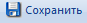
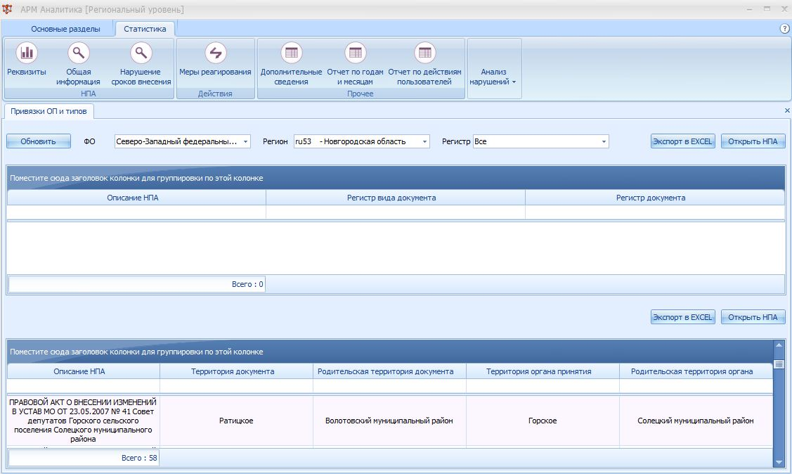
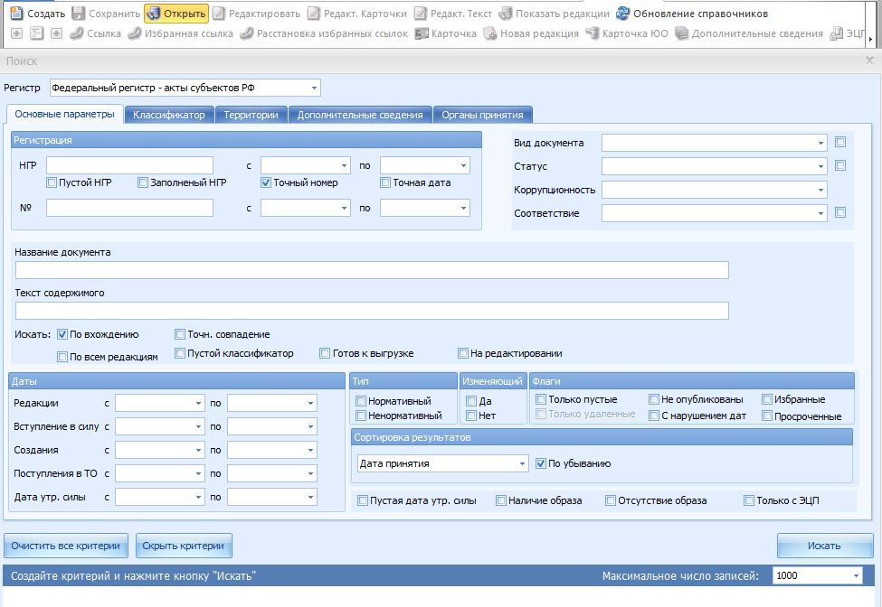
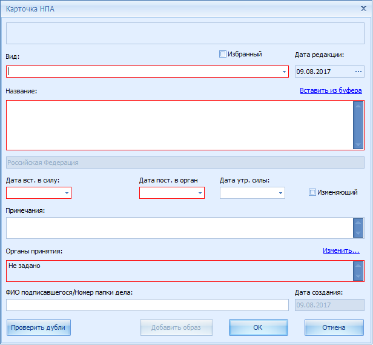
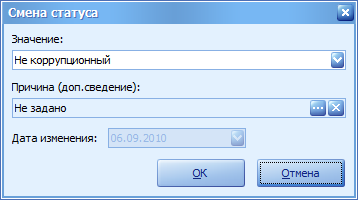
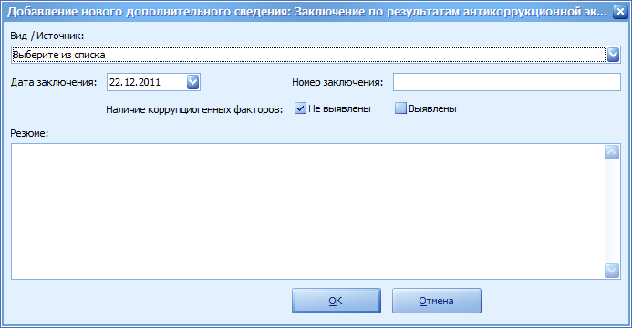
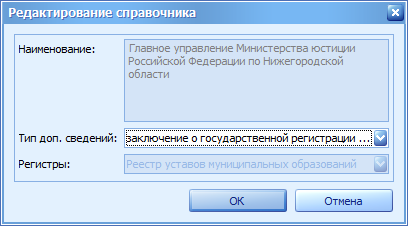
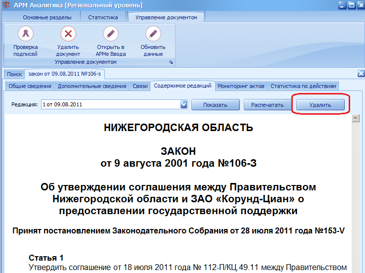
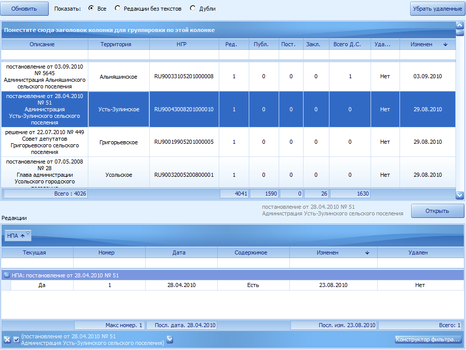
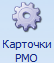

ФЕДЕРАЛЬНОЕ БЮДЖЕТНОЕ УЧРЕЖДЕНИЕ «НАУЧНЫЙ ЦЕНТР ПРАВОВОЙ ИНФОРМАЦИИ» ПРИ МИНИСТЕРСТВЕ ЮСТИЦИИ РОССИЙСКОЙ ФЕДЕРАЦИИ

Руководство пользователя

---
по работе с подсистемой «Нормативные правовые акты Российской Федерации» Единой системы информационно-телекоммуникационного обеспечения Минюста России

<!-- Оглавление

- [1. Общие положения](#1-общие-положения)
  - [1.1. Назначение системы](#11-назначение-системы)
  - [1.2. Сведения о нормативных правовых актах и документах](#12-сведения-о-нормативных-правовых-актах-и-документах)
  - [1.3. Требования к квалификации пользователей](#13-требования-к-квалификации-пользователей)
- [2. Основные характеристики программно-аппаратного обеспечения](#2-основные-характеристики-программно-аппаратного-обеспечения)
  - [2.1. Общие сведения](#21-общие-сведения)
  - [2.2. Перечень функциональных блоков](#22-перечень-функциональных-блоков)
    - [2.2.1. АРМ Ввода](#221-арм-ввода)
    - [2.2.2. АРМ Аналитика](#222-арм-аналитика)
    - [2.2.3. АРМ администрирования](#223-арм-администрирования)
    - [2.2.4. Портал «Нормативные правовые акты Российской Федерации»](#224-портал-нормативные-правовые-акты-российской-федерации)
- [3. Обзор интерфейса системы ПС НПА ЕСИТО](#3-обзор-интерфейса-системы-пс-нпа-есито)
  - [3.1. Начало работы – интерфейс Агента регистра НПА](#31-начало-работы--интерфейс-агента-регистра-нпа)
    - [3.1.1. Вход в систему для пользователей уполномоченных органов](#311-вход-в-систему-для-пользователей-уполномоченных-органов)
    - [3.1.2. Вход в систему в Минюсте России и его территориальных органах](#312-вход-в-систему-в-минюсте-россии-и-его-территориальных-органах)
  - [3.2. Общие принципы работы в системе (АРМы и их назначение, сервисы выгрузки)](#32-общие-принципы-работы-в-системе-армы-и-их-назначение-сервисы-выгрузки)
    - [3.2.1. АРМ Ввода](#321-арм-ввода)
    - [3.2.2. АРМ Аналитика](#322-арм-аналитика)
    - [3.2.3. АРМ Администрирования](#323-арм-администрирования)
    - [3.2.4. Доступ к справочной системе](#324-доступ-к-справочной-системе)
  - [3.3. Интерфейс модуля АРМ Ввода](#33-интерфейс-модуля-арм-ввода)
  - [3.4. Интерфейс модуля АРМ Аналитика](#34-интерфейс-модуля-арм-аналитика)
  - [3.5. Интерфейс модуля АРМ Администрирование](#35-интерфейс-модуля-арм-администрирование)
- [4. Поиск НПА](#4-поиск-нпа)
  - [4.1. По основным параметрам](#41-по-основным-параметрам)
  - [4.2. По правовым классификаторам](#42-по-правовым-классификаторам)
  - [4.3. По территории](#43-по-территории)
  - [4.4. По параметрам дополнительных сведений](#44-по-параметрам-дополнительных-сведений)
  - [4.5. По органам принятия](#45-по-органам-принятия)
  - [4.6. Групповые действия над документами](#46-групповые-действия-над-документами)
- [5. Внесение сведений о нормативных правовых актах в регистры](#5-внесение-сведений-о-нормативных-правовых-актах-в-регистры)
  - [5.1. Создание нового НПА](#51-создание-нового-нпа)
    - [5.1.1. Заполнение карточки НПА](#511-заполнение-карточки-нпа)
      - [5.1.1.1. Выбор территории](#5111-выбор-территории)
    - [5.1.1.2. Выбор органов принятия](#5112-выбор-органов-принятия)
      - [5.1.1.3. Прикрепление образа документа](#5113-прикрепление-образа-документа)
    - [5.1.2. Сохранение НПА](#512-сохранение-нпа)
  - [5.2. Открытие существующего НПА для редактирования](#52-открытие-существующего-нпа-для-редактирования)
  - [5.3. Редактирование текста НПА](#53-редактирование-текста-нпа)
    - [5.3.1. Стилевое оформление текста НПА с использованием встроенных стилей](#531-стилевое-оформление-текста-нпа-с-использованием-встроенных-стилей)
    - [5.3.2. Проставление ссылок в тексте НПА](#532-проставление-ссылок-в-тексте-нпа)
      - [5.3.2.1. Установка ссылки на документ в целом](#5321-установка-ссылки-на-документ-в-целом)
      - [5.3.2.2. Установка ссылки на часть документа](#5322-установка-ссылки-на-часть-документа)
      - [5.3.2.3. Установка ссылки на дополнительные сведения](#5323-установка-ссылки-на-дополнительные-сведения)
  - [5.4. Юридическая обработка НПА](#54-юридическая-обработка-нпа)
    - [5.4.1. Присвоение номера государственной регистрации](#541-присвоение-номера-государственной-регистрации)
    - [5.4.2. Установление и изменение статусов НПА](#542-установление-и-изменение-статусов-нпа)
    - [5.4.3. Привязка НПА к правовому классификатору](#543-привязка-нпа-к-правовому-классификатору)
  - [5.5. Добавление к НПА дополнительных сведений](#55-добавление-к-нпа-дополнительных-сведений)
    - [5.5.1. Правовая экспертиза](#551-правовая-экспертиза)
      - [5.5.1.1. Постановка на правовую экспертизу](#5511-постановка-на-правовую-экспертизу)
      - [5.5.1.2. Заключение правовой экспертизы](#5512-заключение-правовой-экспертизы)
    - [5.5.2. Антикоррупционная экспертиза](#552-антикоррупционная-экспертиза)
      - [5.5.2.1. Постановка на антикоррупционную экспертизу](#5521-постановка-на-антикоррупционную-экспертизу)
    - [5.5.2.2. Заключение антикоррупционной экспертизы](#5522-заключение-антикоррупционной-экспертизы)
    - [5.5.3. Опубликование и обнародование](#553-опубликование-и-обнародование)
    - [5.5.4. Иные сведения](#554-иные-сведения)
    - [5.5.5. Добавление текста к дополнительным сведениям](#555-добавление-текста-к-дополнительным-сведениям)
    - [5.5.6. Добавление новых источников дополнительных сведений](#556-добавление-новых-источников-дополнительных-сведений)
  - [5.6. Создание новой редакции существующего НПА](#56-создание-новой-редакции-существующего-нпа)
  - [5.7. Переключение между редакциями НПА](#57-переключение-между-редакциями-нпа)
- [6. Работа с реестром муниципальных образований](#6-работа-с-реестром-муниципальных-образований)
  - [6.1. Поиск карточек в реестре муниципальных образований](#61-поиск-карточек-в-реестре-муниципальных-образований)
  - [6.2. Редактирование найденных карточек](#62-редактирование-найденных-карточек)
    - [6.2.1. Сохранение карточки](#621-сохранение-карточки)
    - [6.2.2. Сохранение карточки с внесением записи об изменениях](#622-сохранение-карточки-с-внесением-записи-об-изменениях)
    - [6.2.3. Просмотр связанного с карточкой устава](#623-просмотр-связанного-с-карточкой-устава)
    - [6.2.4. Удаление карточки](#624-удаление-карточки)
    - [6.2.5. Создание связей между муниципальными образованиями](#625-создание-связей-между-муниципальными-образованиями)
    - [6.2.6. Просмотр связей между муниципальными образованиями](#626-просмотр-связей-между-муниципальными-образованиями)
  - [6.3. Создание новой карточки в реестре муниципальных образований](#63-создание-новой-карточки-в-реестре-муниципальных-образований)
- [7. Работа по контролю состояния базы данных регистра регионального уровня](#7-работа-по-контролю-состояния-базы-данных-регистра-регионального-уровня)
  - [7.1. Изменение состояния базы данных](#71-изменение-состояния-базы-данных)
    - [7.1.1. Снятие блокировок документов](#711-снятие-блокировок-документов)
    - [7.1.2. Восстановление текущих редакций документов](#712-восстановление-текущих-редакций-документов)
    - [7.1.3. Перенумерация редакций](#713-перенумерация-редакций)
  - [7.2. Удаление и восстановление НПА](#72-удаление-и-восстановление-нпа)
  - [7.3. Удаление и восстановление редакции НПА](#73-удаление-и-восстановление-редакции-нпа)
  - [7.4. Удаление дополнительных сведений](#74-удаление-дополнительных-сведений)
  - [7.5. Создание и редактирование типовых шаблонов НПА и дополнительных сведений](#75-создание-и-редактирование-типовых-шаблонов-нпа-и-дополнительных-сведений)
  - [7.6. Дополнительная обработка результатов поиска (сортировка, группировка, фильтрация по параметрам, экспорт в Excel)](#76-дополнительная-обработка-результатов-поиска-сортировка-группировка-фильтрация-по-параметрам-экспорт-в-excel)
    - [7.6.1. Сводка по реквизитам НПА](#761-сводка-по-реквизитам-нпа)
    - [7.6.2. Общая информация об НПА](#762-общая-информация-об-нпа)
    - [7.6.3. Сводка по мерам реагирования.](#763-сводка-по-мерам-реагирования)
    - [7.6.4. Сводка по дополнительным сведениям](#764-сводка-по-дополнительным-сведениям)
  - [7.7. Печать сводного отчета о выбранном НПА](#77-печать-сводного-отчета-о-выбранном-нпа)
  - [7.8. Подготовка форм статистической отчетности (№ 4, 6, 9 и др.)](#78-подготовка-форм-статистической-отчетности--4-6-9-и-др)
  - [7.9. Экспорт статистики по поиску](#79-экспорт-статистики-по-поиску)
- [8. Ведение справочников в работе со справочниками системы](#8-ведение-справочников-в-работе-со-справочниками-системы)
  - [8.1. Справочник источников дополнительных сведений](#81-справочник-источников-дополнительных-сведений)
  - [8.2. Справочник органов принятия](#82-справочник-органов-принятия)
  - [8.3. Объединение нескольких значений справочника](#83-объединение-нескольких-значений-справочника)
  - [8.4. Муниципальные образования](#84-муниципальные-образования)
    - [8.4.1. Добавление муниципального образования](#841-добавление-муниципального-образования)
    - [8.4.2. Удаление муниципального образования](#842-удаление-муниципального-образования)
    - [8.4.3. Объединение муниципальных образований](#843-объединение-муниципальных-образований)
  - [8.5. Карточки РМО](#85-карточки-рмо)
    - [8.5.1. Удаление карточки муниципального образования](#851-удаление-карточки-муниципального-образования)
    - [8.5.2. Привязка карточек к территориям](#852-привязка-карточек-к-территориям)
- [9. Порядок отправки обновлений](#9-порядок-отправки-обновлений)
  - [9.1. Выгрузка НПА из регистра регионального уровня](#91-выгрузка-нпа-из-регистра-регионального-уровня)
  - [9.2. Подтверждение доставки на федеральном уровне](#92-подтверждение-доставки-на-федеральном-уровне)
- [10. Взаимодействие участников на региональном и муниципальном уровнях.](#10-взаимодействие-участников-на-региональном-и-муниципальном-уровнях)
  - [10.1. Выгрузка уставов муниципальных образований территориальными органами Минюста](#101-выгрузка-уставов-муниципальных-образований-территориальными-органами-минюста)
  - [10.2. Загрузка уставов муниципальных образований](#102-загрузка-уставов-муниципальных-образований)
  - [10.3. Загрузка НПА, поступивших в электронном виде из муниципальных образований](#103-загрузка-нпа-поступивших-в-электронном-виде-из-муниципальных-образований)
- [11. Приложения](#11-приложения)
  - [11.1. Контроль форм статистической отчётности через АРМ Аналитики](#111-контроль-форм-статистической-отчётности-через-арм-аналитики)
  - [11.2. Восстановление панелей в АРМ Ввода](#112-восстановление-панелей-в-арм-ввода) -->

## <a id="Part1"></a>1. Общие положения
 
### <a id="Part1.1"></a>1.1. Назначение системы

Подсистема «Нормативные правовые акты Российской Федерации» Единой системы информационно-телекоммуникационного обеспечения деятельности Минюста России (далее – ПС НПА ЕСИТО) обеспечивает автоматизацию процессов ведения федеральных регистров нормативных правовых актов субъектов Российской Федерации, федерального регистра муниципальных нормативных правовых актов, а также государственных реестров уставов муниципальных образований и реестра муниципальных образований Российской Федерации и предназначена для решения следующих задач:
* формирование и ведение единого автоматизированного учета нормативных правовых (далее – НПА), подлежащих включению в федеральные регистры и государственные реестры Минюста России, а также в разделы федерального законодательства и банка данных НПА федеральных органов исполнительной власти Российской Федерации;
* обеспечение качества ведения федеральных регистров и государственных реестров за счет актуальности, полноты и достоверности информации, основанной на использовании официальных источников опубликования НПА, своевременной фиксации внесенных изменений в акты, включенные в подсистему НПА, а также оперативности пополнения баз данных;
* автоматизация основных технологических процессов ведения федеральных регистров и государственных реестров;
* обеспечение реализации услуг по предоставлению нормативной правовой информации всем категориям заинтересованных лиц, организаций и органам государственной власти;
* обеспечение консолидации аппаратных ресурсов и программных средств подсистемы НПА на базе единой программно-технической платформы;
* предоставление возможностей мониторинга НПА федерального, регионального и муниципального уровней;
* предоставление технологических условий для проведения систематизации НПА Российской Федерации;
* информационно-правовое обеспечение деятельности Министерства юстиции Российской Федерации и иных органов государственной власти Российской Федерации.

В состав федеральных регистров и государственных реестров входят:

* федеральный регистр нормативных правовых актов субъектов Российской Федерации (далее – ФР НПА);
* государственный реестр уставов муниципальных образований (далее – РУМО);
* государственный реестр муниципальных образований Российской Федерации  (далее – РМО);
* федеральный регистр муниципальных нормативных правовых актов, формируемый из регистров муниципальных нормативных правовых актов субъектов Российской Федерации (далее – ФР МНПА);
* государственный реестр соглашений об осуществлении международных и внешнеэкономических связей, заключенных органами государственной власти субъектов Российской Федерации с иностранными партнерами (далее – реестр соглашений, РМС);
* государственный реестр переданных полномочий (части полномочий) федеральных органов исполнительной власти органам исполнительной власти субъектов Российской Федерации (далее – реестр переданных полномочий, РПП).
* государственный реестр нормативных правовых актов федеральных органов исполнительной власти (далее – реестр НПА ФОИВ).

Уполномоченным органом ПС НПА ЕСИТО является Минюст России, оператором подсистемы – НЦПИ (приказ Министерства юстиции Российской Федерации от 14.04.2009 № 109 «О вводе в постоянную эксплуатацию подсистемы «Нормативные правовые акты Российской Федерации» Единой системы информационно-телекоммуникационного обеспечения Минюста России»).

Подсистема НПА зарегистрирована в федеральном реестре государственных информационных систем (электронный паспорт № ФС-77110167 от 29 ноября 2011 г., официальное сокращенное наименование – ПС НПА ЕСИТО).

Сопряженная информационная система «Федеральный регистр муниципальных нормативных правовых актов» зарегистрирована в федеральном реестре государственных информационных систем (электронный паспорт № ФС-77110168 от 29 ноября 2011 г., официальное сокращенное наименование – ФР МНПА).

ПС НПА ЕСИТО поддерживает сопряжение с системами, которые уже функционируют на объектах Минюста России и представляет собой территориально распределенную систему в составе комплексов программно-технических средств регионального уровня, расположенных в территориальных управлениях Минюста России в субъектах Российской Федерации, комплексов программно-технических средств федерального уровня, развернутых в ФБУ НЦПИ при Минюсте России.

На региональном уровне производится ведение федерального регистра нормативных правовых актов субъектов Российской Федерации, ведение реестра уставов муниципальных образований и реестра муниципальных образований. На региональном уровне производится выгрузка и формирование пакетов обновлений информации НПА, их передача для включения в базу данных федерального уровня.

На федеральном уровне производится ведение нормативных правовых актов федерального законодательства, актов федеральных органов исполнительной власти, международных документов. На этом уровне производится сбор всех сведений в интегрированную базу данных системы.

Уполномоченные органы исполнительной власти субъектов Российской Федерации осуществляют ведение регистров муниципальных нормативных правовых актов субъектов Российской Федерации (далее – регистров) с использованием программного обеспечения ПС НПА ЕСИТО, разработанного компанией «РБК-Софт» по техническому заданию Минюста России в 2009 году и переданного субъектам Российской Федерации в целях единообразия ведения регистра и полного сопряжения с федеральным регистром.

Уполномоченные органы субъектов Российской Федерации, осуществляющие ведение, передают эти сведения в интегрированную базу ПС НПА ЕСИТО для включения в федеральный регистр муниципальных нормативных правовых актов.

С 2016 года развитие информационных системы ПС НПА ЕСИТО обеспечивает ФБУ НЦПИ при Минюсте России.

Информация из центральной базы данных ПС НПА ЕСИТО также доступна на рабочих местах в Министерстве юстиции Российской Федерации и в системе web-доступа, используемой для расстановки ссылок для обеспечения ссылочной целостности единого федерального регистра.

Web-доступ позволяет обращаться к информации, хранящейся в отдельной базе данных открытого доступа, с помощью средств сети Интернет, осуществлять в оперативном режиме поиск необходимого документа. Пользователи системы имеют возможность зарегистрироваться и получить дополнительные права на доступ к информации или остаться анонимными пользователями.

Для обеспечения доступности и открытости данных для всех граждан Российской Федерации, а также для обеспечения прозрачности процессов регистрации НПА, проведения правовой экспертизы и другой дополнительной информации в ПС НПА ЕСИТО создан и функционирует портал «Нормативные правовые акты Российской Федерации».

Программное обеспечение ПС НПА ЕСИТО, развернутое в Центре обработки данных Минюста России, размещённом в ФБУ НЦПИ при Минюсте России, обеспечивает загрузку, хранение и просмотр образов нормативных правовых актов в формате pdf.

### <a id="Part1.2"></a>1.2. Сведения о нормативных правовых актах и документах

Ведение федеральных регистров и государственных реестров осуществляется в соответствии с Конституцией Российской Федерации, Положением о Министерстве юстиции Российской Федерации, утвержденным Указом Президента Российской Федерации от 13.10.2004 № 1313, Концепцией информатизации Министерства юстиции Российской Федерации, утвержденной приказом Минюста России от 21.01.2000 № 10 (далее – Концепция информатизации), а также иными правовыми актами, регулирующими вопросы ведения федеральных регистров и государственных реестров.

Перевод в электронный вид государственной учетной деятельности, такой как ведение федеральных регистров и государственных реестров, направленный на повышение качества предоставления государственных услуг, – одна из задач государственной программы Российской Федерации «Информационное общество (2011 – 2020 годы)», утвержденной постановлением Правительства Российской Федерации от 15.04.2014 № 313.

Ведение федеральных регистров и государственных реестров определяется следующим нормативными правовыми актами федерального уровня:
* Указ Президента Российской Федерации от 10.08.2000 № 1486 «О дополнительных мерах по обеспечению единства правового пространства Российской Федерации»;
* Федеральный закон от 06.10.2003 № 131-ФЗ «Об общих принципах организации местного самоуправления в Российской Федерации»;
* Федеральный закон от 21.07.2005 № 97-ФЗ «О государственной регистрации уставов муниципальных образований»;
* постановление Правительства Российской Федерации от 24.07.2000 № 552 «Об утверждении Правил государственной регистрации соглашений об осуществлении международных и внешнеэкономических связей, заключенных органами государственной власти субъектов Российской Федерации»;
* постановление Правительства Российской Федерации от 29.11.2000 № 904 «Об утверждении Положения о порядке ведения федерального регистра нормативных правовых актов субъектов Российской Федерации»;
* постановление Правительства Российской Федерации от 08.12.2008 № 924  
«О порядке заключения и вступления в силу соглашений между федеральными органами исполнительной власти и исполнительными органами государственной власти субъектов Российской Федерации о передаче ими друг другу осуществления части своих полномочий».

В соответствии с постановлением Правительства Российской Федерации от 13.08.1997 № 1009 «Об утверждении Правил подготовки нормативных правовых актов федеральных органов исполнительной власти и их государственной регистрации» Минюст России осуществляет государственную регистрацию нормативных правовых актов федеральных органов исполнительной власти и ведет ГР НПА ФОИВ.

НЦПИ ведет банк данных федерального законодательства в соответствии с постановлением Центрального Комитета КПСС и Совета Министров СССР от 25.06.1975 № 558 «О мерах по дальнейшему совершенствованию хозяйственного законодательства», а также банк данных нормативных правовых актов федеральных органов исполнительной власти в соответствии с Уставом НЦПИ.

В соответствии с Указом Президента от 26.12.2016 № 707 «О внесении изменений в Указ Президента Российской Федерации от 10 августа 2000 г. № 1486  
«О дополнительных мерах по обеспечению единства правового пространства Российской Федерации» установлен новый порядок предоставления сведений в федеральный регистра нормативных правовых актов субъектов Российской Федерации.

Для включения региональных нормативных правовых актов в соответствующий федеральный регистр и проведения правовой экспертизы высшие должностные лица регионов (руководители высших региональных исполнительных органов власти) направляют в Минюст России их копии.

Установлено, что копии направляются в течение 7 дней после дня первого официального опубликования названных актов (ранее - после их принятия).

Закреплено, что копии представляются в Министерство в электронном виде в порядке, определяемом Правительством Российской Федерации. Вместе с ними направляются сведения об источниках официального опубликования актов. Копии представляются в виде образов нормативных правовых актов в формате pdf и текстов нормативных правовых актов.

### <a id="Part1.3"></a>1.3. Требования к квалификации пользователей

Специалисты – пользователи системы, исполняющие в Системе роли оператора, оператора ФР, оператора РУМО, юриста или оператора-юристы должны обладать квалификацией, обеспечивающей, как минимум, базовые навыки:
* работы на персональном компьютере с графическим пользовательским интерфейсом:
    * клавиатура;
    * мышь;
    * управление окнами и приложениями;
    * файловая система.
    * работы с пакетами Microsoft Office Word, Microsoft Office Excel и электронной почтой.

К квалификации администратора Системы предъявляются следующие требования:
* высшее техническое образование;
* знание Microsoft Windows, Microsoft Office, Microsoft Internet Explorer, электронной почты.

В Таблице 1. приведены рекомендуемые темы обучения пользователей в той последовательности, в которой они должны проводиться для разных категорий пользователей. Обучение работе в Системе осуществляется в рамках учебных занятий, семинаров, курсов повышения квалификации, организуемых и проводимых НЦПИ на основе программы, согласованной с Минюстом России, а также в рамках консультаций в ходе клиентского сопровождения системы или самостоятельного изучения настоящего Руководства.

**Таблица 1. Основные этапы обучения пользователей**
| № п/п | Тема занятия | Аудитория |
| :--- | :--- | :--- |
| 1. | Общие сведения о системе | Все сотрудники |
| 2. | Работа с АРМ Ввода | Все сотрудники |
| 3. | Работа с АРМ Аналитика | Юристы, операторы-юристы, администраторы |
| 4. | Работа с АРМ Администрирования | Администраторы |
| 5. | Работа с порталом «Нормативные правовые акты Российской Федерации» | Все сотрудники |

## <a id="Part2"></a>2. Основные характеристики программно-аппаратного обеспечения

### <a id="Part2.1"></a>2.1. Общие сведения

Под Системой понимается совокупность функциональных блоков, поддерживающих работу с документами на всех этапах ведения регистров и реестров:
* создание НПА;
* редактирование НПА;
* формирование новых редакций НПА;
* загрузку, хранение и просмотр образов НПА в формате PDF;
* проведение юридической и антикоррупционной экспертизы;
* поиск НПА;
* поддержку базы данных НПА в актуальном виде;
* подготовку форм статистической отчетности.
* Ведения реестров в табличном виде;

Система имеет 2-х уровневую структуру (федеральную и региональные) и состоит из следующих функциональных блоков:
* АРМ Ввода;
* АРМ Аналитика;
* АРМ Администрирования.

Федеральный уровень применяется в качестве основного параметра для центральной базы данных ПС НПА ЕСИТО, содержащей все документы, включённые в федеральные регистры и государственные реестры.

На федеральном уровне обеспечивается работа с центральной базой системы, со всеми разделами базы данных ПС НПА ЕСИТО.

Региональный уровень применяется в качестве основного параметра для базы данных ПС НПА ЕСИТО территориального органа Минюста России, а также для базы данных уполномоченного органа государственной власти субъекта Российской Федерации, осуществляющего ведение регистра муниципальных нормативных правовых актов субъекта. В случае уполномоченного органа для обозначения уровня развёртывания используется значение «Муниципальный регистр».

Для ведения муниципального регистра в уполномоченных органах государственной власти система размещается непосредственно на программно-аппаратных комплексах в указанных органах.

Программно-аппаратное обеспечение для ведения баз данных регионального уровня территориальных органов Минюста России и центрального аппарата Минюста России размещается в Центре обработке данных Минюста России в ФБУ НЦПИ при Минюсте России.

Вход в систему и управление запуском функциональных блоков осуществляется с использованием программы «Агент Регистра НПА».

Для уполномоченных органов государственной власти программа «Агент Регистра НПА» и другие функциональные блоки клиентской части программного обеспечения устанавливаются непосредственно на рабочих местах пользователя.

Вход в систему пользователем в уполномоченном органе осуществляется посредством запуска программы «Агент Регистра НПА», введения имени и пароля пользователя.

Для центрального аппарата и территориальных органов Минюста России клиентское программное обеспечения установлено на выделенном терминальном сервере.

Вход в Систему для пользователей территориальных органов Минюста России и центрального аппарата Минюста России осуществляется посредством подключения к индивидуальной сессии пользователя на терминальном сервере, с последующим автоматическим запуском программы «Агент Регистра НПА», выбора домашнего или доступного региона и запуска функциональных блоков Ввода, Аналитики или Администрирования. Управление функциональными блоками осуществляется с рабочего места пользователя по технологии удалённого управления приложением.

Описание интерфейса входа в Систему приведено в разделе 3.

### <a id="Part2.2"></a>2.2. Перечень функциональных блоков

#### <a id="Part2.2.1"></a>2.2.1. АРМ Ввода

АРМ Ввода – основной АРМ Системы, позволяющий осуществлять непосредственную работу с НПА.

Данный АРМ представляет собой набор программных средств, предоставляющих пользователям следующую функциональность:
* создание, редактирование НПА, построение НПА из шаблонов;
* формирование и ведение карточек НПА;
* формирование редакций НПА;
* форматирование НПА на основании набора стилей, контроль стилей и форматов НПА;
* внесение правовой и антикоррупционной экспертизы, иных дополнительных сведений;
* интеграция с Microsoft Office Word;
* печать и экспорт данных.

#### <a id="Part2.2.2"></a>2.2.2. АРМ Аналитика

АРМ Аналитика позволяет выполнять информационно-аналитическую поддержку процессов Системы.

Данный АРМ представляет собой набор программных средств, предоставляющих пользователям следующую функциональность:
* составление статистических отчетов по запросу пользователей;
* формирование статистически по всей хранящейся в Системе информации;
* удаление документов и их редакций (для роли - администратор);
* формирование и ведение реестра муниципальных образований;
* формирование и ведение государственного реестра соглашений субъектов Российской Федерации с иностранными государствами.

#### <a id="Part2.2.3"></a>2.2.3. АРМ администрирования

АРМ Администрирования отвечает за безопасность данных, хранимых в Системе, а также за единообразие данных для последующего унифицированного подхода.

Данный АРМ обеспечивает поддержку следующей функциональности:
* регистрация, хранение и изменение данных о пользователях и назначенных им правах доступа к информационным и функциональным ресурсам Системы;
* ведение нормативно-справочной информации;
* управление межсистемным взаимодействием;
* управление публикацией информации в открытый доступ и передачей данных во внешние системы;
* управление шаблонами документов;
* технический мониторинг и диагностика Системы.

#### <a id="Part2.2.4"></a>2.2.4. Портал «Нормативные правовые акты Российской Федерации»

В целях обеспечения реализации конституционного права граждан на получение достоверной информации о нормативных правовых актах Российской Федерации Министерство Юстиции Российской Федерации через портал «Нормативные правовые акты Российской Федерации» обеспечивает доступ к сведениям о нормативных правовых актах, включенных в федеральные регистры и государственные реестры. Новая Версия портала, разработанная в 2017 году размещена на по адресу pravo.minjust.ru (см. Рис. 2.1). С главной страницы осуществляется переход к многофункциональному поиску документов в базе данных Портала (Рис. 2.1).


**Рис. 2.1 Портал pravo.minjust.ru**


**Рис. 2.2 Многофункциональный поиск на портале pravo.minjust.ru**

## <a id="Part3"></a>3. Обзор интерфейса системы ПС НПА ЕСИТО

### <a id="Part3.1"></a>3.1. Начало работы – интерфейс Агента регистра НПА

#### <a id="Part3.1.1"></a>3.1.1. Вход в систему для пользователей уполномоченных органов

Для запуска Системы в уполномоченном органе необходимо:
* запустить программу (Пуск\Все программы\ SCLI.RU - Регистры\Агент регистра НПА) и подождать появления диалогового окна Рис. 3.1.1.1.1

**Рис. 3.1.1.1**
* нажать на кнопку «Вход в домашний регион» для ввода имени пользователя и пароля (Рис. 3.1.1.2)

**Рис. 3.1.1.1.2**
* В открывшемся диалоге необходимо ввести имя пользователя и пароль для входа в Систему
После входа в систему становится доступен запуск приложений Системы (Рис. 3.1.1.3)

**Рис. 3.1.1.1.3**

#### <a id="Part3.1.2"></a>3.1.2. Вход в систему в Минюсте России и его территориальных органах

Для входа в Систему в Минюсте России и его территориальных органах в ЦОД с возможностью c прикрепления pdf-образа НПА у пользователя на рабочем столе должны находится два ярлыка:
* «Агент Регистра НПА (NNxxx).rdp»
* «ownCloud (NNxxx).rdp» (для синхронизации с сетевым ресурсом, где NN – код региона, а ххх – номер пользователя).

Агент регистра НПА используется для выбора доступного подключения, а также запуска модулей АРМ Ввода, АРМ Аналитика и АРМ Администрирования.

Агент регистра НПА в системе, развернутый в ЦОД Минюста России, обеспечивает возможность подключения пользователей к базам данных различных регионов и подключение

Для входа в систему ведения регистров необходимо:
* Запустить ярлык пример: «ownCloud (NNxxx).rdp» и ввести пароль пользователя. Также может быть запрошен пароль OWNCLOUD. В этом случае ввести пароль от OWNCLOUD для своего региона (имя пользователя )
* запустить программу Агент регистра НПА и подождать появления диалогового окна Рис. 3.1 (для запуска используется ярлык «Агент Регистра НПА (NNxxx).rdp», где NN – код региона, а ххх – номер пользователя)

**Рис. 3.1**
* выбрать/изменить (при необходимости) регистр для работы в АРМ Ввода в домашнем регионе;
* нажать на кнопку «Вход в домашний регион» для входа в базу данных, выбранную для Вас по умолчанию
* при нажатии на кнопку «Вход в доступные регионы» откроется окно «Доступные подключения» со списком подключений определенными Вам администратором Системы Рис. 3.2

**Рис. 3.2**
* выбрать из списка одно из доступных подключений
* нажать на кнопку «Выбор»

Если все прошло успешно, на окне входа станут активны кнопки выбора приложений (состав и функциональность доступных приложений зависит от роли и прав пользователя) (см. Рис. 3.3).


**Рис. 3.3**

По завершению работы с программами, необходимо выполнить следующие 3 действия (закрыть облако, закрыть Агент регистра, отключить соединения), корректно завершая работу программ (рис.3.4). :


**Рис. 3.4**

### <a id="Part3.2"></a>3.2. Общие принципы работы в системе (АРМы и их назначение, сервисы выгрузки)

Система имеет 2-х уровневую структуру (федеральный и региональный уровни) и состоит из следующих функциональных блоков:
* АРМ Ввода.
* АРМ Аналитика.
* АРМ Администрирования

#### <a id="Part3.2.1"></a>3.2.1. АРМ Ввода

АРМ Ввода – АРМ Системы, позволяющий осуществлять непосредственную работу с муниципальными нормативным правовым актами.

Данный АРМ предоставляет пользователям следующую функциональность:
* ввод и редактирование муниципальных нормативных правовых актов;
* формирование и ведение карточек муниципальных НПА;
* формирование редакций муниципальных НПА;
* контроль стилей и форматов, муниципальных НПА;
* постановка на юридическую и антикоррупционную экспертизу;
* внесение заключения о юридической и антикоррупционной экспертизе;
* заполнение карточки юридической обработки;
* печать и экспорт данных.

#### <a id="Part3.2.2"></a>3.2.2. АРМ Аналитика

АРМ Аналитика позволяет принимать документы из внешних систем, располагающихся в муниципальных образованиях, осуществлять информационно-аналитическую поддержку проведения юридической и антикоррупционной экспертизы процессов составлять статистические отчеты по запросу пользователей, структурировать и группировать хранящуюся в Системе информацию.

#### <a id="Part3.2.3"></a>3.2.3. АРМ Администрирования

АРМ администрирования позволяет контролировать безопасное хранение данных, а также поддерживает ведение нормативно-справочной информации.

Данный АРМ обеспечивает поддержку следующей функциональности:
* регистрация, хранение и изменение данных о пользователях и назначенных им правах доступа к информационным и функциональным ресурсам Системы;
* ведение нормативно-справочной информации (НСИ);
* настройка обновлений.

#### <a id="Part3.2.4"></a>3.2.4. Доступ к справочной системе

Начиная с версии 2841 в АРМ ввода, АРМ Аналитики и АРМ Администрирования добавлена встроенная справка, вызываемая по кнопке «?» (см. Рис. 3.4)


**Рис. 3.4**

### <a id="Part3.3"></a>3.3. Интерфейс модуля АРМ Ввода

Интерфейс АРМ Ввода разработан в виде надстройки над пакетом Microsoft Office Word и подразумевает наличие дополнительных панелей инструментов для работы с НПА. Панели в Microsoft Office Word 2007 и выше появляются при выборе пункта меню «Надстройки» (см. Рис. 3.5).


**Рис. 3.5**

Дополнительные панели инструментов для работы с НПА в MS Word имеют следующий набор кнопок:
* - создание нового нормативного правового акта;
* - сохранение нового нормативного правового акта (новой редакции) или сохранение изменений внесенных в процессе редактирование;
* - открытие поисковой формы;
*  - активация панели редактирования нормативного правового акта (разрешается редактирование и сохранение как карточки так и текста НПА );
*  - активация панели редактирования нормативного правового акта (разрешается редактирование и сохранение только карточки НПА);
*  - активация панели редактирования нормативного правового акта (разрешается редактирование и сохранение только текста НПА);
*  - переход между редакциями нормативного правового акта;
*  - запуск процедуры обновления справочников;
*  - вызов системной информации о программе;
*  - кнопки форматирования стилей документа (подробное описание представлено в разделе);
*  - автоматическая постановка нормативного правового акта на первичную юридическую экспертизу (подробное описание представлено в разделе;
*  - добавление гиперссылки на НПА, часть НПА или дополнительное сведение (подробное описание представлено в разделе);
*  - открытие карточки нормативного правового акта (подробное описание представлено в разделе;
*  - создание новой редакции нормативного правового акта;
*  - открытие карточки юридической обработки (подробное описание представлено в разделе);
*  - открытие карточки дополнительного сведения (подробное описание представлено в разделе);
*  - просмотр электронной цифровой подписи документа;
*  - запуск автоматического выявления ссылок в нормативном правовом акте (подробное описание представлено в разделе);
* - экспорт сведений карточки нормативного правового акта, карточки юридической обработки и карточки дополнительных сведений в новый документ (подробное описание представлено в разделе).

Работа с панелями инструментов осуществляется через нажатие левой клавишей мыши на кнопку либо путем использования горячих клавиш.

Для использования горящих клавиш нажмите сочетание клавиш Alt+Y, а затем клавишу, соответствующую одной из следующих русских букв:
* С – для создания нового документа;
* Х – для сохранения внесенных изменений;
* О – для открытия документа;
* Р – для редактирования документа;
* К – для открытия карточки документа;
* Д – для просмотра списка дополнительных сведений.

### <a id="Part3.4"></a>3.4. Интерфейс модуля АРМ Аналитика

Интерфейс АРМ Аналитика представлен:
* федеральный уровень на Рис. 3.6(Основные сведения) и Рис. 3.7(Статистика)
* региональный уровень на Рис. 3.8(Основные сведения) и Рис. 3.9(Статистика)


**Рис. 3.6**


**Рис. 3.7**


**Рис. 3.8**


**Рис. 3.9**

Вкладка «Основные разделы» Федерального уровня представляет разделы:
* Поиск
    * Поиск документов (Рис. 3.10)
    * Реестр МО (Рис. 3.13)
    * Соглашения регионов (Рис. 3.14)
* Ввод данных
    * Работа с Реестром соглашений (Рис. 3.14)
    * Реестр переданных полномочий (Рис. 3.11)
* Обращения
    * Открытие списка соглашений (Рис. 3.17)
* Отчеты
    * Формирование статистических форм
* Статистика
    * Мониторинг по тематике
    * Карта
    * Табличный вид

Вкладка «Статистика» Федерального уровня представляет разделы:
* НПА
    * Реквизиты (Рис. 3.22)
    * Общая информация (Рис. 3.20)
    * Нарушение сроков внесения (Рис. 3.21)
* Прочее
    * Дополнительные сведения (Рис. 3.17)
    * Отчет по годам и месяцам (Рис. 3.16)
* Анализ нарушений
    * Сведения об обновлении регистров (Рис. 3.29)
    * Отсутствие НГР и классификаторов (Рис. 3.26)
    * Выявление ошибок в РУМО (Рис. 3.25)
    * Наличие экспертных заключений (Рис. 3.24)
    * Сроки создания редакций (Рис. 3.25)
    * Выявление дублей (Рис. 3.21)
    * Привязки ОП и типов

Вкладка «Основные разделы» Муниципального уровня представляет разделы:
* Поиск
    * Поиск документов (Рис. 3.10)
* Импорт
    * Загрузка документов

Вкладка «Статистика» Муниципального уровня представляет разделы:
* НПА
    * Сводка по муниципалитетам (Рис. 3.28)
    * Реквизиты (Рис. 3.22)
    * Общая информация (Рис. 3.20)
    * Нарушение сроков внесения (Рис. 3.19)
* Действия
    * Меры реагирования (Рис. 3.29)
* Прочее
    * Дополнительные сведения (Рис. 3.17)
    * Отчет по годам и месяцам (Рис. 3.16)
    * Отчет по действиям пользователя (Рис. 3.18)
* Анализ нарушений
    * Отсутствие НГР и классификаторов (Рис. 3.26)
    * Выявление ошибок в РУМО (Рис. 3.25)
    * Наличие экспертных заключений (Рис. 3.24)
    * Сроки создания редакций (Рис. 3.23)
    * Выявление дублей (Рис. 3.21)
    * Привязки ОП и типов


**Рис. 3.10**


**Рис. 3.11**


**Рис. 3.12**


**Рис. 3.13**


**Рис. 3.14**


**Рис. 3.15**


**Рис. 3.16**


**Рис. 3.17**


**Рис. 3.18**


**Рис. 3.19**


**Рис. 3.20**


**Рис. 3.21**


**Рис. 3.22**


**Рис. 3.23**


**Рис. 3.24**


**Рис. 3.25**


**Рис. 3.26**


**Рис. 3.27**


**Рис. 3.28**


**Рис. 3.29**


**Рис. 3.30**

В АРМ Аналитика обеспечивается просмотр сведений о нормативных правовых актах, просмотр обеспечивается на следующих вкладках:
* общие сведения
* дополнительные сведения
* связи
* содержимое редакций
* образ акта (в формате pdf)
* сведения о мониторинге актов и статистика действий пользователей Рис. 3.31


**Рис. 3.31**

Просмотр образа нормативного осуществляется на вкладке «образ документа» (см. Рис. 3.32). Просмотр образа документа обеспечивается на рабочих местах, размещённых в Центре обработки данных Минюста России, при выполнении следующих условий:
* в Системе развернут web-сервис загрузки и просмотра образов НПА;
* путь к сервису загрузки и просмотра образов НПА указан в параметрах Системы в АРМ Администрирования (раздел «Настройки», параметр «Путь сервисам загрузки и просмотра образов НПА»)
* образ документа был загружен в АРМ Ввода при заполнении карточки НПА


**Рис. 3.32**

Форма «Выявление дублей»(Рис. 3.21)

Данная форма позволяет выявлять следующие виды нарушений:
* Дубли ОП
* Дубли НПА
* Ошибки нумерации НПА
* Ошибки привязки ОП
* Все

Для вывода информации необходимо отметить интересующий Вас вид дублей (ФО, Регион, Регистр) и нажать кнопку «Загрузить»

Форма «Привязки ОП и типов»(Рис. 3.30)

Данная форма позволяет выявлять следующие документы:
* Регистр которого не присущ регистру вида документа
* Территория которых несоответствует территории органа принятия

Для вывода информации необходимо отметить интересующий Вас регистр и нажать кнопку «Обновить»

### <a id="Part3.5"></a>3.5. Интерфейс модуля АРМ Администрирование 

[](https://youtu.be/splniDKh_Ro)
**Видео (АРМАдминистрирования Работа с настройками системы и служебными средствами)**

В качестве основных разделов меню для АРМ Администрирования представлены
* Настройки окружения
    * настройки
    * шаблоны
* Служебные средства
    * снять блокировки
    * пересоздать информацию о принятиях
    * перенумеровать редакции
    * обновить данные формы 6
    * установить текущие редакции
* Справочная информация
    * управление справочниками и классификаторами
* Органы принятия;
* Источники дополнительных сведений;
* Региональные обновления.


**Рис. 3.33**

Находящиеся в этом модуле разделы меню могут использоваться как для управления параметрами, влияющими на режим работы Системы так и для работы со справочниками органов принятия и дополнительных сведений.

В этом разделе подробно будет описано назначение пунктов меню, используемых для управления параметрами, влияющими на режимы работы Системы и предназначенных для использования в основном системными администраторами.

Остальные пункты меню, работа с которыми, как правило, выполняется обычными пользователями (операторы, юристы) будут описаны в главе 7.

## <a id="Part4"></a>4. Поиск НПА

[](https://youtu.be/F0C8fQgAE6k)
**Видео (АРМАналитика Поиск и просмотр НПА часть 1)**

[](https://youtu.be/-xvhAV_aIM0)
**Видео (АРМАналитика Поиск и просмотр НПА часть 2)**

[](https://youtu.be/QbCsGgnn_kE)
**Видео (АРМАналитика Поиск и просмотр НПА часть 3)**


Поиск НПА может выполняться как в модуле АРМ Ввода, так и в модуле АРМ Аналитика. Формы поиска, описанные в п. 4.1-4.5 в модуле АРМ Ввода вызываются при нажатии на кнопку «Открыть» на панели «Надстройки» в программе Microsoft Word (Рис. 3.5).

В модуле АРМ Аналитика эти же формы вызываются при нажатии на кнопку «Поиск документов» на закладке «Основные разделы» (Рис. 3.6).

Кроме форм поиска НПА, одинаковых для обоих модулей в модуле АРМ Аналитика доступны расширенные возможности по поиску НПА и дополнительных сведений, которые будут подробно описаны в п. 7.6.

Поиск НПА выполняется с учетом множества критериев, которые для удобства пользователей разделены на 5 групп. Каждой группе критериев поставлена в соответствие одна из закладок в диалоговом окне «Поиск» (см. Рис. 3.6): «Основные параметры», «Классификатор», «Территории», «Дополнительные сведения», «Органы принятия».

Можно одновременно задать несколько критериев поиска НПА (в том числе на разных закладках), но в результате поиска будут найдены НПА, соответствующие всем заданным критериям.

Для очистки всех заданных критериев поиска служит кнопка 

Для того, чтобы результаты поиска, показанные в нижней части окна диалога «Поиск», отображались на весь экран служит кнопка 

### <a id="Part4.1"></a>4.1. По основным параметрам

Поисковая форма документов НПА по основным параметрам показана на Рис. 4.1-1, 4.2-1 – для АРМ Ввода и на Рис. 4.1-2, 4.2-2 – в АРМ Аналитики.

Для начала поиска НПА введите необходимые параметры поиска и нажмите на кнопку «Искать». В результате на экране в нижней части окна появится список НПА, удовлетворяющих условиям поиска.


**Рис. 4.1-1 Поиск основных параметров в АРМ ввода МР**


**Рис. 4.1-2 Поиск основных параметров в АРМ Аналитики МР**


**Рис. 4.2-1 Поиск основных параметров в АРМ ввода ФР**


**Рис. 4.2-2 Поиск основных параметров в АРМ Аналитики ФР**

Для просмотра текста НПА выберите нужный документ из списка и щелкните по нему мышью для работы с документом в АРМ Ввода или в АРМ Аналитики. В АРМ Ввода, в случае если выбранный НПА имеет несколько редакций, то на экране будет представлен список всех редакций данного НПА. Выберите ту редакцию НПА, в которую предполагается вносить изменения (Рис. 4.3)


**Рис. 4.3**

### <a id="Part4.2"></a>4.2. По правовым классификаторам

Для поиска НПА по классификаторам необходимо в окне поиска переключиться на закладку «Классификаторы», выбрав ее с использованием левой кнопки мыши (Рис. 4.2).


**Рис. 4.2**

Для поиска НПА, относящихся к определенным разделам классификатора выделите эти разделы, установив напротив них «галочки» и нажмите на кнопку «Искать». В результате на экране в нижней части окна появится список НПА, удовлетворяющих условиям поиска.

### <a id="Part4.3"></a>4.3. По территории

Для поиска НПА, относящихся к определенной территории выделите эти территории, установив напротив них «галочки» и нажмите на кнопку «Искать». В результате на экране в нижней части окна «Поиск» появится список НПА, удовлетворяющих условиям поиска. (Рис. 4.3)


**Рис. 4.3**

На региональном уровне (т.е. для территориальных управлений Минюста России) список территорий будет представлен только одной территорией уровня «регион» (Рис. 4.3) поэтому обычно отсутствует необходимость использования данной закладки.

На муниципальном уровне в окне поиска представлен иерархический список территорий.

### <a id="Part4.4"></a>4.4. По параметрам дополнительных сведений

Для поиска НПА, с которыми были связаны дополнительные сведения с определенными параметрами, служит закладка «Дополнительные сведения» (Рис. 4.4). На ней можно выбрать источник или группу источников дополнительных сведений, диапазон дат дополнительных сведений, найти заключения и другие параметры.

Для фильтрации списка источников дополнительных сведений можно в поле ввода, расположенном под надписью «Источники» ввести часть строки, содержащуюся в названии источника и нажать на находящуюся рядом с полем ввода кнопку «Искать».

Например, если в поле ввода на форме поиска, показанной на Рис. 4.4 ввести слово «беда» и далее нажать на кнопку «Искать» то окно формы поиска примет вид, показанный на Рис. 4.5

Для отмены фильтрации списка источников дополнительных сведений необходимо нажать на кнопку «Убрать» (Рис. 4.5)


**Рис. 4.4**


**Рис. 4.5**

### <a id="Part4.5"></a>4.5. По органам принятия

Для поиска НПА, принятых определенными органами принятия (или группами органов принятия) которыми были связаны дополнительные сведения с определенными параметрами, служит закладка «Органы принятия» (Рис. 4.6).


**Рис. 4.6**

### <a id="Part4.6"></a>4.6. Групповые действия над документами

На форме поиска документов, открывающуюся по нажатию кнопки «Открыть» на панели АРМ Ввода, имеется кнопка «Групповые действия»(Рис. 4.8).

В форме групповых действий над НПА (Рис. 4.7) имеются следующие критерии:
* дата утрачивания силы
* изменяющий (да\нет)
* готовность к выгрузке (да\нет)

По нажатию кнопки «OK» выбранные параметры применяются ко всем, отмеченным флажком, документам в поиске.


**Рис. 4.7**


**Рис. 4.8**

## <a id="Part5"></a>5. Внесение сведений о нормативных правовых актах в регистры

### <a id="Part5.1"></a>5.1. Создание нового НПА

[](https://youtu.be/aXzGR6K8c68?si=RMCRQBqUJ8pDYqnI)
**Видео (V2 1 1 1 АРМВвода Создание НПА)**

Для создания нового НПА нажмите на кнопку «Создать» на панели инструментов в АРМ Ввода (Рис. 5.1)


**Рис. 5.1**

В появившемся окне доступны следующие способы создания:
* Текущий WORD – создание нового документа на основе того, что сейчас открыт в редакторе
* Открыть WORD – создание документа на основе файла выбранного пользователем
* Пустой WORD – открытие нового окна word с пустым содержимым


**Рис. 5.2**

При нажатии на кнопку «OK» появится диалоговое окно, в котором предлагается задать дату редакции НПА Рис. 5.3


**Рис. 5.3**

В этом диалоговом окне левой кнопкой мыши следует выбрать дату и затем нажать на кнопку ОК. Откроется новое окно Word с содержимым которое вы выбрали выше. При этом, новый НПА может свободно редактироваться с использованием всех возможностей, предоставляемых редактором Microsoft Word 2003-2010.

### <a id="Part5.1.1"></a>5.1.1. Заполнение карточки НПА
[](https://youtu.be/cJcLpNIdq-o)
**Видео (V2 1 1 4 АРМВвода Заполнение карточки реквизитов НПА)**

Карточка НПА содержит главные реквизиты акта, по которым впоследствии могут быть построены отчеты и сведена статистика. Кроме того, карточка позволяет выполнять быстрый поиск документа по реквизитам.

Пример карточки НПА для регионального уровня развертывания (режим работы «Федеральный регистр» и режим работы «Реестр уставов муниципальных образований») представлен на Рис. 5.4

Карточка НПА включает следующие поля:
* Основные сведения;
* Вид НПА (выбирается из классификатора);
* Дата текущей редакции (выставляется автоматически);
* Название НПА (можно вставить из буфера);
* Дата вступления в силу;
* Дата поступления в орган;
* Дата утрачивания силы;
* Признак изменяющего документа;
* Примечание;
* Органы принятия (выбирается из классификатора);
* ФИО и должность подписавшего;
* Дата создания (выставляется автоматически);
* Проверка на дубли (во избежание нарушения целостности и однозначности данных в Системе).

Проверка на совпадение (кнопка «Проверить дубли») осуществляется по следующим реквизитам НПА:
* Вид;
* Номер;
* Орган принятия;
* Дата принятия.


**Рис. 5.4**

Красные поля помечены как обязательные к заполнению.

Заполнение большинства из перечисленных выше полей карточки не вызывает затруднений, но на особенностях заполнения некоторых полей, таких как «Территория» и «Органы принятия» и добавление образа нормативного правового акта рассматривается далее.

##### <a id="Part5.1.1.1"></a>5.1.1.1. Выбор территории

При нажатии на кнопку «V» в карточке НПА раскрывается выпадающий список территорий, из которого можно выбрать нужную территорию (Рис. 5.5 Выбор территории)


**Рис. 5.5**

Альтернативным способом выбора территории является нажатие на кнопку […] в карточке НПА. После этого появляется окно диалога, в котором территории представлены в виде иерархического списка (Рис. 5.6 Выбор территории с использованием иерархического списка).


**Рис. 5.6 Выбор территории с использованием иерархического списка**

В окне следует выбрать территорию. Для этого нажатием левой кнопкой мыши на значок , расположенный слева от названия региона следует развернуть иерархический список и выделить выбранную территорию. После этого следует нажать на кнопку «Выбрать».

При отсутствии нужной территории в списке территорий, ее можно создать. Для создания территории следует нажать на кнопку  в карточке НПА. После этого появляется окно диалога «Новая территория» (Рис. 5.7), в котором заполняются поля «Код», «Название территории», и «Привязать к».


**Рис. 5.7**

В поле «Привязать к» из обычного (Рис. 5.5) или иерархического (Рис. 5.7) списков выбирается территория, в состав которой войдет вновь создаваемая территория.

Примечание: поле ввода со списком «Территории» доступно для изменения только в карточке НПА в режиме работы «Реестр уставов муниципальных образований» (Рис. 5.8 Пример заполненной карточки НПА)


**Рис. 5.8**

#### <a id="Part5.1.1.2"></a>5.1.1.2. Выбор органов принятия

При нажатии на кнопку «Изменить…» в карточке НПА появляется форма для выбора органа принятия (Рис. 5.9 Выбор органов принятия) в которой можно выбрать орган принятия с использованием обычного или иерархического списков органов принятия.


**Рис. 5.9 Выбор органов принятия**

При нажатии на кнопку «V» раскрывается выпадающий список органов принятия, из которого можно выбрать нужный орган

Альтернативным способом выбора территории является нажатие на кнопку […] в окне. После этого появляется окно диалога, в котором органы принятия представлены в виде иерархического списка Рис. 5.10


**Рис. 5.10**

В окне следует выбрать орган принятия. Для этого нажатием левой кнопкой мыши на значок , расположенный слева от названия региона следует развернуть иерархический список и выделить выбранный орган принятия. После этого следует нажать на кнопку «Выбрать».

При отсутствии нужного органа принятия в списке, его можно создать. Для создания органа принятия следует нажать на кнопку [+] в окне «Органы принятия». После этого появляется окно диалога «Создание нового органа принятия» (Рис. 5.11 Создание нового органа принятия), в котором заполняются поля «Вид» и «Наименование», поле чего нажимается кнопка «ОК».


**Рис. 5.11 Создание нового органа принятия**

В поле ввода со списком «Вид» (Рис. 5.12 Виды органов принятия) представлены возможные виды органов принятия, относящиеся к территории, которая ранее была выбрана в карточке НПА.


**Рис. 5.12 Виды органов принятия**

После выбора органа принятия в окне «Органы принятия» (Рис. 5.9 Выбор органов принятия) необходимо нажать кнопку «Добавить». После этого окно примет следующий вид, показанный на Рис. 5.13


**Рис. 5.13**

К одному документу можно добавить несколько органов принятия.

Для внесения номера документа необходимо выполнить двойной щелчок левой кнопкой мыши по надписи «Без номера» и ввести номер вместо нее.


##### <a id="Part5.1.1.3"></a>5.1.1.3. Прикрепление образа документа

[](https://youtu.be/zcuyXvALWRg)
**Видео (V2 1 1 7 АРМВвода Загрузка образов НПА в формате PDF)**

Подготовка для прикрепления образов для пользователей территориальных органов.

Для внесения образа нормативного акта в федеральный регистр НПА субъектов Российской Федерации требуется переместить образ НПА в формате pdf на с рабочего места пользователя на сетевой ресурс, доступных для приложения АРМ Ввода, запущенных в ЦОД Минюста России.

Доступ к сетевому ресурсу с рабочего места пользователя необходимо выполнить следующие действия:
1. Открыть в браузере сетевой ресурс (рис. 5.1.2.1) (для корректной работы на рабочем столе должен находиться ярлык OWNCLOUD с таким же номером пользователя (например, «ownCloud (67001).rdp» для пользователя 001 из 67 региона Смоленской области);
2. Войти в сетевой ресурс, указав логин и пароль (рис. 5.1.2.2)
3. Открыть в браузере папку Documents (рис. 5.1.2.3). **>Важно: Папка должна присутствовать в сетевом ресурсе и не должна менять наименование или удаляться пользователем.**
4. Переместить файл-образ НПА в формате pdf в папку Documents (рис. 5.1.2.4).

В случае возникновения проблем при переносе образ НПА в формате pdf на сетевой ресурс следует обратиться в службу технической поддержки НЦПИ по тел. (495)994-93-55 и по электронной почте support@scli.ru.


**Рис. 5.1.2.1**


**Рис. 5.1.2.2**


**Рис. 5.1.2.3**


**Рис. 5.1.2.4**

Прикрепление образа нормативного правового акта осуществляется посредством кнопки «Добавить образ» (см. Рис. 5.8 из п. 5.1.2 ).

Возможность прикрепления и просмотра образа НПА обеспечивается при следующих условиях:

в Системе развернут web-сервис загрузки и просмотра образов НПА;

путь к сервису загрузки и просмотра образов НПА указан в параметрах Системы в АРМ Администрирования (раздел «Настройки», параметр «Путь сервисам загрузки и просмотра образов НПА»).

Примечание: Сервис загрузки и просмотра образов документов для Системы разворачивается непосредственной в Центре обработки данных Минюста России, расположенном в ФБУ НЦПИ при Минюсте России.

При нажатии кнопки «Добавить образ» осуществляется проверка на наличие уже загруженного образа нормативного правового акта.

При наличии образа, связанного с нормативным правовым актом, пользователю выдаётся сообщение «У данного документа уже есть образ».

Для удаления уже загруженного образа пользователю необходимо обратиться в службу технической поддержки ФБУ НЦПИ при Минюсте России.

В случае отсутствия загруженного образа пользователю предлагается выбрать файл для загрузки образа нормативного акта в формате PDF.

По выбранному файлу осуществляется проверка:

- на соответствие требованиям формату PDF-файла (в pdf документах отсутствуют объекты, отличные от изображений отсканированных страниц документа, разрешение сканирования находится в диапазоне от 150 до 300 точек на дюйм (dpi);

- на наличие в базе данных дубля - уже загруженного такого же образа нормативного правового акта, который может быть привязанн к иному нормативному правовому акту.

В случае соответствия образа документа предъявленным требованиям осуществляется загрузка pdf-файла и выдается сообщение о загрузке образа файла в формате pdf (см. Рис. 5.14 Сообщение о загрузке образа документа).


**Рис. 5.14 Сообщение о загрузке образа документа**

После указанных действий образ документа доступен для просмотра в АРМ Аналитики (см. раздел 3.4)

#### <a id="Part5.1.2"></a>5.1.2. Сохранение НПА

[](https://youtu.be/bR0WRKKL73c)
**Видео (V2 1 1 5 АРМВвода Сохранение нового НПА)**

После создания текста НПА и его стилевого оформления необходимо сохранить документ в базе данных (БД) Системы. Для этого необходимо нажать на кнопку «Сохранить» на панели инструментов.

В открывшемся окне (Рис. 5.15) выбрать статус готовности документа к выгрузке


**Рис. 5.15**

### <a id="Part5.2"></a>5.2. Открытие существующего НПА для редактирования

Для открытия существующего НПА для редактирования необходимо в нижней части окна диалога «Поиск» в списке найденных НПА нажать на название НПА (обведено красным цветом).


**Рис. 5.16**

В случае если выбранный НПА имеет несколько редакций, то на экране будет представлен список (Рис. 5.17) всех редакций данного НПА. Выберите ту редакцию текста НПА, для которой будут вноситься соответствующие изменения.


**Рис. 5.17 Выбор редакции документа**

После этого в окне редактора Word будет открыт текст этого документа.

Для перехода в режим редактирования следует нажать на панели инструментов «Надстройки» кнопку «Редактировать», «Редактировать текст» или «Редактировать карточку».

При нажатии кнопки «Редактировать текст» пользователь сможет редактировать только текст документа, но не карточки НПА и юридической обработки.

При нажатии кнопки «Редактировать карточку» пользователь сможет редактировать карточки НПА и юридической обработки, но не сможет редактировать текст документа.

При нажатии кнопки «Редактировать» пользователю доступны все возможности по редактированию документа и дополнительных сведений.

После корректировки текста документа НПА и его стилевого оформления необходимо сохранить НПА в базе данных. Для этого нажмите на кнопку «Сохранить» на панели инструментов.

### <a id="Part5.3"></a>5.3. Редактирование текста НПА

#### <a id="Part5.3.1"></a>5.3.1. Стилевое оформление текста НПА с использованием встроенных стилей

[](https://youtu.be/Y3apt2fCrZc)
**Видео (V2 1 1 2 АРМВвода Стилевое оформление НПА)**

Документ НПА может быть отформатирован как средствами Microsoft Office Word, так и при помощи встроенных в Систему стилей.

Однако для стилевого оформления[^1] документа НПА рекомендуется использовать кнопки стилевого оформления, размещенные на панели инструментов:

 – применить стиль «Отформатировать текст параграфа». Стиль форматирования обычных абзацев документа. Данный стиль применяется для форматирования почти всех абзацев документа, за исключением следующих:
* название частей документа;
* название раздела документа;
* название глав документа;
* название статей документа;
* названия документа (шапка документа, где описывается название, вид документа, когда и кем принят и т.д., вплоть до первого параграфа документа);
* фрагменты текста, отформатированные по колонкам пропорциональным шрифтом (например, Courier), такие как текстовые таблицы (DOS), не преобразованные в таблицы Word, или схемы в псевдографике.

Следующие четыре стиля применяются для форматирования названий документа, частей, разделов, глав и статей документа, если они присутствуют в документе.
*  – применить стиль «Название части документа»;
*  – применить стиль «Название раздела документа»;
*  – применить стиль «Название главы документа»;
*  – применить стиль «Название статьи документа»;
*  «Отформатировать параграф пропорциональным шрифтом». Данный стиль используется для тех фрагментов документа, где текст отформатирован колонками без использования таблиц Word. Это могут быть таблицы, набранные и отформатированные в среде DOS или же какого-то рода схемы. Для того чтобы сохранить внешний вид таких фрагментов надо использовать данный стиль, шрифт которого имеет одинаковую ширину всех символов, в том числе и пробелы;
*  «Объединить в один параграф». Данный стиль используется для объединения нескольких параграфов текста в один. Для этого в тексте выделите параграфы, которые нужно объединить и примените данный стиль.
*  «Приложение». Данный стиль используется для выделения в правом верхнем углу титула приложения к основной части документа.
*  «Таблица». Данный стиль используется для форматирования таблицы с выделением верхней заголовочной части таблицы.
* Все вышеперечисленные стили предназначены для единообразного оформления всех текстовых документов НПА, сокращения объемов хранимой служебной информации и предоставлении в дальнейшем возможности просмотра НПА стандартными средствами просмотра документов формата XML, такими как MS Internet Explorer и другие.

Для того чтобы применить определенный стиль форматирования первоначально выделите фрагмент текстового документа, а затем в зависимости от того к какому виду он относится (текст документа, раздел, часть, статья, заголовок и т.д.) нажмите соответствующую кнопку на панели инструментов. После чего внешний вид форматируемого текста изменится в соответствии с выбранным стилем.

#### <a id="Part5.3.2"></a>5.3.2. Проставление ссылок в тексте НПА

[](https://youtu.be/B0ZfTu-cD_A)
**Видео (V2 1 1 3 АРМВвода Простановка ссылок в тексте НПА)**

Ссылки в тексте НПА можно расставить в режиме редактирования НПА.

Для этого выделите в тексте НПА строку, которая должна быть оформлена в виде ссылки и нажмите на кнопку «Ссылка» на панели инструментов. Будет представлена поисковая форма, аналогичная показанной на Рис. 4.3, позволяющая найти в базе данных Системы другой НПА, на который необходимо сделать ссылку.

В отличие от формы поиска, показанной на Рис. 4.3 в верхней части этой поисковой формы, представленной на Рис. 5.18 имеется два дополнительных поля – “регистр” и “внешняя система”, в которых необходимо выбрать значения:


**Рис. 5.18**
* Регистр – необходимо выбрать регистр, в котором следует искать документ, на который будет поставлена ссылка. Возможными вариантами, выбираемыми из поля ввода со списком будут:
    * Федеральный регистр – акты субъектов РФ
    * Федеральное законодательство
    * Реестр актов муниципальных образований
    * Реестр уставов муниципальных образований
    * Акты министерств и ведомств
    * Международные документы
* Внешняя система – необходимо выбрать из какой базы данных нужно выбирать документ для ссылки
    * Локальная база данных
    * Веб-доступ (при наличии связи с Интернет)
    * Эталон плюс (если установлена база данных «Эталон плюс»)

После заполнения формы следует нажать на кнопку «Искать».


**Рис. 5.19 Результаты поиска НПА**

В представленном списке результатов (Рис. 5.20) следует выбрать (нажать левой кнопкой мыши) вид ссылки: “НПА”, “Часть документа” или “Доп. сведение”.

##### <a id="Part5.3.2.1"></a>5.3.2.1. Установка ссылки на документ в целом

При нажатии на кнопку «НПА» появляется окно диалога, представленное на Рис. 5.21
Рис. 5.20 Выбор вида ссылки, в котором в поле со списком «Тип» можно выбрать тип ссылки на документ.

Возможны следующие варианты типов ссылок: логическая, изменяющая, отменяющая, исполняющая. Условия выбора того или иного типа ссылки на документ приведены ниже.


**Рис. 5.20 Выбор вида ссылки**

* если в [Документ1] ставится изменяющая ссылка на [Документ2] то это означает, что [Документ2] каким-либо образом изменяет содержание (смысл) [Документа1] т.е. например в Документе2 есть слова "в абзаце ... Документа1 заменить слово 3000 на 4000"
* если в [Документ1] ставится отменяющая ссылка на [Документ2] то это означает, что [Документ1] отменяет действие [Документа2]
* если в [Документ1] ставится исполняющая ссылка на [Документ2] то это означает, что [Документ1] создан на основании какого либо поручения, изложенного в [Документе2]
* если вид связи между документами отличается от трех, указанных выше то выбирается логический вид ссылки

##### <a id="Part5.3.2.2"></a>5.3.2.2. Установка ссылки на часть документа

При нажатии на кнопку «НПА» появляется окно диалога, представленное на Рис. 5.21 Выбор редакции документа, в котором необходимо выбрать редакцию документа.


**Рис. 5.21 Выбор редакции документа**

После выбора левой кнопкой мыши редакции документа и нажатия на кнопку «ОК» появляется окно диалога, представленное на Рис. 5.22 Создание ссылки на часть документа (заголовки, закладки).

В этом окне левой кнопкой мыши можно выбрать один из заголовков или закладок, имеющихся в документе, на который делается ссылка. Также можно выбрать строку «Весь документ». В этом случае будет сделана ссылка на выбранную редакцию документа. После нажатия на кнопку «ОК», диалоговое окно закрывается и создается ссылка.


**Рис. 5.22 Создание ссылки на часть документа (заголовки, закладки)**

Примечание: заголовки или закладки в документе создаются c использованием стандартных средств Microsoft Word.

#### <a id="Part5.3.2.3"></a>5.3.2.3. Установка ссылки на дополнительные сведения

При нажатии на кнопку «Доп. сведение» появляется окно диалога, представленное на Рис. 5.23 Создание ссылки на дополнительное сведение, в котором необходимо выбрать дополнительное сведение. В этом окне отображаются все дополнительные сведения, связанные с документом, однако ссылку можно установить только на дополнительное сведение, имеющее полнотекстовое содержимое.


**Рис. 5.23 Создание ссылки на дополнительное сведение**

После нажатия левой кнопкой мыши на ссылку «Выбрать», диалоговое окно закрывается и создается ссылка.

### <a id="Part5.4"></a>5.4. Юридическая обработка НПА

[](https://youtu.be/eMFUJihNX_Q)
**Видео (АРМВвода Заполнение карточки юридической обработки и сохранение НПА)**

Результаты государственной регистрации акта вносятся в карточку юридической обработки (ЮО).

Пример карточки ЮО представлен на Рис. 5.24 Пример карточки юридической обработки

Карточка юридической обработки включает следующие поля:
* Основные сведения;
* Номер и дата государственной регистрации. Для автоматической генерации номера государственной регистрации нажмите на кнопку « »;
* Статус соответствия законодательству (не соответствует ФЗ, соответствует ФЗ, правовой акт на юридической экспертизе, не требует юридической экспертизы, самостоятельной юридической экспертизе не подлежит, выявлено несоответствие ФЗ и др.);
* Статус действия (действующий, недействующий, действие приостановлено и др.);
* Тип (нормативный акт, ненормативный акт);
* Признак коррупционности (коррупционный, не коррупционный);
* Правовой классификатор (выбирается из перечня системных классификаторов).


**Рис. 5.24 Пример карточки юридической обработки**

При смене статуса документа доступна возможность установки ссылки на дополнительное сведение, на основании которого происходит смена статуса.


**Рис. 5.25 Смена статуса документа**

#### <a id="Part5.4.1"></a>5.4.1. Присвоение номера государственной регистрации

Присвоение номера государственной регистрации выполняется при нажатии на кнопку […]


Удаление существующего номера государственной регистрации выполняется при нажатии на кнопку [х].

#### <a id="Part5.4.2"></a>5.4.2. Установление и изменение статусов НПА

Установление и изменение статусов НПА (статус действия, соответствия законодательству, нормативности) выполняется при нажатии на кнопки […] соответствующих полях карточки:


при этом для всех вариантов появляется окно диалога «Смена статуса», имеющее следующий вид (для статуса действия) :


**Рис. 5.26 Изменение статуса НПА**

Для выбора дополнительного сведения необходимо нажать левой кнопкой мыши на надпись «Выбрать». Выбрать можно только те дополнительные сведения к нормативному правовому акту, у которых имеется полнотекстовое содержимое.


**Рис. 5.27 Выбор дополнительного сведения как причины смены статуса документа**

#### <a id="Part5.4.3"></a>5.4.3. Привязка НПА к правовому классификатору

Привязка НПА к правовому классификатору выполняется при нажатии на кнопку «Изменить» в карточке юридической обработки. При этом появляется диалоговое окно, в котором в виде иерархического списка представлены необходимые пункты классификации.


**Рис. 5.28**

Нажимая левой кнопкой мыши на значки [+] можно раскрывать вложенные уровни классификатора. Выбор пунктов классификатора, включаемых в карточку юридической обработки происходит при установке флажков.

### <a id="Part5.5"></a>5.5. Добавление к НПА дополнительных сведений

[](https://youtu.be/LhhM_Z7xoQ0)
**Видео (V2 1 2 1 АРМВвода Внесение дополнительных сведений)**

Дополнительные сведения включают карточку дополнительного сведения и могут иметь связанный текстовый документ. Текст дополнительного сведения доступен для редактирования подобно тексту НПА, к нему применимы все возможности MS Word. В качестве дополнительных сведений к НПА могут быть приведены экспертные заключения, судебные решения и прочее.

Пример карточки дополнительных сведений представлен на Рис. 5.29


**Рис. 5.29 Пример карточки дополнительных сведений**

* Карточка дополнительных сведений включает следующие разделы, определяемые типом дополнительного сведения:
* Правовая экспертиза (поступление на экспертизу, заключение правовой экспертизы);
Антикоррупционная экспертиза (поступление на экспертизу, заключение антикоррупционной экспертизы);
* Опубликование и обнародование;
* Иные;
* Комментарии и практика (судебные решения, комментарии к законодательству, правоприменительная практика);
* История.

Текст дополнительного сведения доступен для редактирования подобно тексту НПА, к нему применимы все возможности MS Word. При открытии или создании полнотекстового содержимого дополнительного сведения, на панели инструментов АРМ Ввода доступны к использованию стилевые кнопки форматирования текста. Можно добавить, изменить или удалить дополнительное сведение. При удалении дополнительного сведения выполняется проверка на его связь с другими данными.

#### <a id="Part5.5.1"></a>5.5.1. Правовая экспертиза

Задачей правовой экспертизы является правовая оценка формы акта, его целей и задач, предмета правового регулирования, компетенции органа, принявшего акт, содержащихся в нем норм, порядка принятия и опубликования на предмет соответствия требованиям Конституции РФ и федерального законодательства.

Данные о проведении правовой экспертизы (первичная или повторная) вносятся как дополнительные сведения к НПА, поэтому предварительно требуется перейти к форме «Дополнительные сведения», нажав соответствующую кнопку на панели инструментов. Выберите в качестве типа дополнительных сведений к НПА «Правовая экспертиза».

##### 5.5.1.1. Постановка на правовую экспертизу

Для добавления дополнительных сведений о постановке на экспертизу нажмите на кнопку «Добавить» и в выпадающем меню выберите опцию «Поступление на экспертизу».


**Рис. 5.30 Добавление поступления на правовую экспертизу**

В появившемся окне диалога (Рис. 5.31) заполните поля и нажмите кнопку «ОК».


**Рис. 5.31 Добавление поступления на правовую экспертизу**

В предложенной форме необходимо указать следующие сведения:
* Источник (выбирается из системного справочника).
* Дата поступления на экспертизу.
* Контрольный срок.
* Причина поступления на правовую экспертизу.

В случае поступления документа на первичную экспертизу постановка документа на экспертизу возможна в автоматическом режиме. Для этого предназначена кнопка, расположенная на панели инструментов.

По нажатию на кнопку осуществляется автоматическое добавление поступления на экспертизу в карточке дополнительных сведений. В карточке заполняются следующие данные:
* Дата поступления – текущая дата;
* Контрольный срок – 30 дней со дня поступления на экспертизу.
* При необходимости все данные могут быть откорректированы пользователем.

##### 5.5.1.2. Заключение правовой экспертизы

Для добавления заключения правовой экспертизы нажмите на кнопку «Добавить» и в выпадающем меню выберите опцию «Правовая экспертиза». Заполните предложенную форму (Рис. 5.32 Добавление заключения правовой экспертизы) и сохраните запись.


**Рис. 5.32 Добавление заключения правовой экспертизы**

В предложенной форме необходимо указать следующие сведения:
* Вид/Источник экспертизы (выбирается из системного справочника).
* На основании поступления на экспертизу - определение поступления устанавливает связь между заключением и этим поступлением.
* Дата заключения;
* Номер заключения;
* Заключение о соответствии - данное заключение является решением о государственной регистрации;
* Резюме.

#### <a id="Part5.5.2"></a>5.5.2. Антикоррупционная экспертиза

Данные о проведении антикоррупционной экспертизы вносятся как дополнительные сведения к НПА, поэтому предварительно требуется перейти к форме «Дополнительные сведения», нажав соответствующую кнопку на панели инструментов. В появившемся окне (Рис. 5.33) выберите в качестве типа дополнительных сведений к НПА «Антикоррупционная экспертиза».


**Рис. 5.33 Вход в режим поступления на антикоррупционную экспертизу документа НПА**

##### <a id="Part5.5.2.1"></a>5.5.2.1. Постановка на антикоррупционную экспертизу

Нажмите на кнопку «Добавить» и в выпадающем меню выберите опцию «Поступление на экспертизу».


**Рис. 5.34**

Заполните все поля в открывшемся диалоговом окне и нажмите на кнопку ОК.


**Рис. 5.35 Добавление сведения о поступлении на антикоррупционную экспертизу**

В предложенной форме необходимо указать следующие сведения:
* Источник (выбирается из системного справочника).
* Дата поступления на экспертизу.
* Контрольный срок.
* Причина поступления на антикоррупционную экспертизу.

#### 5.5.2.2. Заключение антикоррупционной экспертизы

Для добавления заключения антикоррупционной экспертизы нажмите на кнопку «Добавить» и в выпадающем меню выберите опцию «Антикоррупционная экспертиза». Заполните предложенную форму и сохраните запись.


**Рис. 5.36 Добавление заключения по результатам антикоррупционной экспертизы**

В предложенной форме необходимо указать следующие сведения:
* Вид/Источник экспертизы (выбирается из системного справочника).
* На основании поступления на экспертизу - определение поступления устанавливает связь между заключением и этим поступлением.
* Дата заключения;
* Номер заключения;
* Наличие коррупциогенных факторов: выявлены, не выявлены;
* Резюме.

#### <a id="Part5.5.3"></a>5.5.3. Опубликование и обнародование

Данные об опубликовании НПА вносятся как дополнительные сведения к НПА, поэтому предварительно требуется перейти к форме «Дополнительные сведения», нажав соответствующую кнопку на панели инструментов «АРМ ввода. Панель редактирования». Выберите в качестве типа дополнительных сведений к НПА «Опубликование» и нажмите на кнопку «Добавить» на панели инструментов формы.


**Рис. 5.37 Добавление опубликования**

Заполните предложенную форму
* В предложенной форме необходимо указать следующие сведения:
* Источник;
* Дата опубликования;
* Номер;
* Заголовок;
* Резюме.


**Рис. 5.38 Добавление опубликования**

По умолчанию вводимое опубликование относится ко всему НПА. Если его необходимо привязать к конкретной редакции документа, выставите маркер «Применить к редакции» и выберите редакцию из перечня возможных.

#### <a id="Part5.5.4"></a>5.5.4. Иные сведения

Для добавления иных дополнительных сведений выберите в качестве типа дополнительных сведений «Иные» и нажмите на кнопку «Добавить» на панели инструментов формы.


**Рис. 5.39 Вход в режим добавления иных дополнительных сведений**

Заполните предложенную форму (Рис. 5.40) для добавления нового «иного» дополнительного сведения.

В предложенной форме необходимо указать следующие сведения:
* Источник;
* Дата;
* Номер;
* Заголовок;
* Резюме;
* Меры реагирования:
* Статус соответствия;
* Статус документа;
* Статус нормативности.


**Рис. 5.40. Добавление иного дополнительного сведения**

По умолчанию вводимые дополнительные сведения относятся ко всему НПА. Если данные необходимо привязать к конкретной редакции документа, выставите маркер «Применить к редакции» и выберите редакцию из перечня возможных.

#### <a id="Part5.5.5"></a>5.5.5. Добавление текста к дополнительным сведениям

Для добавления текста к дополнительным сведениямнеобходимо после добавления дополнительного сведения любого вида (кроме поступлений на правовую и антикоррупционную экспертизу) в диалоговом окне «Дополнительные сведения» нажать левой кнопкой мыши на кнопку «Создать» рядом с тем дополнительным сведением, к которому необходимо добавить текст ().


**Рис. 5.41 Добавление текста к дополнительным сведениям**

После нажатия на эту кнопку открывается новое окно редактора Microsoft Word, в которое можно добавить текст дополнительного сведения. Для сохранения текста на панели инструментов «Надстройки »следует нажать кнопку «Сохранить».

#### <a id="Part5.5.6"></a>5.5.6. Добавление новых источников дополнительных сведений

Для добавления нового источника дополнительных сведений необходимо запустить модуль АРМ Администрирования (Рис. 5.42 Главное меню модуля АРМ Администрирования) и нажать на кнопку «Источники дополнительных сведений» в меню «Дополнительные сведения».


**Рис. 5.42 Главное меню модуля АРМ Администрирования**

Появившееся окно (Рис. 5.43) содержит справочник источников дополнительных сведений к НПА.


**Рис. 5.43 Справочник источников дополнительных сведений**

Для добавления новой записи в справочник нажмите на панели инструментов на кнопку «Добавить» (или выберите в контекстно-зависимом меню аналогичную опцию), заполните поля в появившемся окне «Редактирование справочника» (Рис. 5.44) и нажмите на кнопку «ОК».


**Рис. 5.44 Создание нового элемента справочника**

Для изменения записи в справочнике выберите ее левой кнопкой мыши, нажмите на кнопку «Изменить» на панели инструментов, отредактируйте и сохраните запись в окне, аналогичном показанному на Рис. 5.44.

Для удаления записи из справочника выберите запись и нажмите на кнопку «Удалить». Если данная запись не используется в Системе т.е. с удаляемым источником не связано ни одно дополнительное сведение, то источник будет удален безвозвратно. Если данный источник применяется в Системе, то удаление будет запрещено.

Кроме того, для справочника источников дополнительных сведений допустимо копирование и перемещение элементов. Выберите необходимый элемент в справочнике


**Рис. 5.45**

и нажмите на кнопку «Переместить» или «Скопировать». Выберите в поле со списком «Тип доп. сведений» в предложенной форме (Рис. 5.46) другой тип дополнительных сведений и нажмите на кнопку «ОК».


**Рис. 5.46 Перемещение или копирование источников дополнительных сведений (изменение типа)**

В зависимости от выбранной операции источник дополнительных сведений будет перемещен или скопирован в другой тип дополнительных сведений.

На рисунках Рис. 5.45, Рис. 5.46 показано, что источник «Главное управление Министерства юстиции по Нижегородской области», ранее имевший тип «Заключение по антикоррупционной экспертизе» будет отнесен к типу «Заключение о государственной регистрации устава»

### <a id="Part5.6"></a>5.6. Создание новой редакции существующего НПА

[](https://youtu.be/HRkioEOhDyk)
**Видео (АРМВвода Создание новой редакции и редактирование НПА)**

Новая редакция НПА создается в модуле АРМ Ввода на основе уже существующего НПА. Поэтому вначале необходимо выполнить поиск и открытие для редактирования НПА, для которого предполагается создать новую редакцию.

Для создания новой редакции НПА нажмите на кнопку «Новая редакция» на панели инструментов «Надстройки» (Рис. 5.47).

**Рис. 5.47 Панель инструментов «Надстройки» редактора Microsoft Word**


После этого появится окно диалога «Внимание», с предложением перенести текст из текущей редакции в новую, от которого вы не сможете отказаться


В появившемся окне «Создание новой редакции» (Рис. 5.48) следует указать дату редакции и, возможно, изменяющий документ.


**Рис. 5.48 Создание новой редакции документа**

Изменяющий документ можно выбрать при нажатии на кнопку […]. После этого открывается окно диалога «Поиск» (Рис. 5.49) в котором можно указать необходимые параметры и нажать кнопку «Искать». После того, как в нижней части окна появится список найденных документов левой кнопкой мыши нужно выбрать документ, который будет считаться изменяющим.

Примечание: в окне «Поиск» для поиска изменяющих документов следует установить флажок «Изменяющий».

Подробнее работа с окном «Поиск» описана в разделе 4. Поиск НПА

Для завершения работы с окном «Создание новой редакции документа» нужно нажать кнопку «ОК»


**Рис. 5.49 Поиск НПА**

### <a id="Part5.7"></a>5.7. Переключение между редакциями НПА

Для переключения между несколькими редакциями НПА в модуле АРМ Ввода необходимо нажать на кнопку «Показать редакции» на панели инструментов «Надстройки»


После этого откроется окно диалога, в котором следует выбрать редакцию, к работе с которой необходимо приступить (Рис. 5.50).


**Рис. 5.50 Выбор активной редакции**

## <a id="Part6"></a>6. Работа с реестром муниципальных образований

[](https://youtu.be/13gEe1kkBqk)
**Видео (АРМАналитика Ведение РМО создание и заполнение карточки МО с изменениями)**

Для работы с реестром муниципальных образований необходимо выполнить вход в систему в модуле Агент регистра НПА должен быть выполнен в режиме «Реестр уставов муниципальных образований» (Рис. 6.1).


**Рис. 6.1**

### <a id="Part6.1"></a>6.1. Поиск карточек в реестре муниципальных образований

Для выполнения поиска карточек в реестре муниципальных образований следует запустить модуль АРМ «Аналитика» и на закладке «Основные разделы» (Рис. 6.2) нажать на кнопку «Поиск МО».


**Рис. 6.2 Главное меню модуля АРМ Аналитика**

После этого появится окно (закладка), имеющее следующий вид:


**Рис. 6.3**

Далее следует выбрать территорию. Для этого нажатием левой кнопкой мыши на значок , расположенный слева от названия региона следует развернуть иерархический список и поставить  напротив выбранной территории. После этого следует нажать на кнопку «Найти».

Пример выбора территории после выполнения указанных действий приведен ниже на Рис. 6.4:


**Рис. 6.4**

В нижней части окна диалога показана найденная карточка МО «Город Дзержинск».

Двойной щелчок мышью на найденной карточке МО или выделение строки в нижней части окна диалога и нажатие кнопки «Изменить» позволяет открыть выбранную карточку для редактирования.

В правой части закладки, показанной на Рис. 6.3, Рис. 6.4возможно задать дополнительные условия для поиска карточек МО (Рис. 6.5):


**Рис. 6.5 Дополнительные условия для поиска карточек МО**

В частности, возможен поиск карточек по видам муниципальных образований (городское поселение, городской округ, внутригородская территория федерального значения, муниципальное образование, муниципальный район, сельское поселение), а также карточек действующих или исключенных муниципальных образований.

Для поиска и, возможно, последующего восстановления ранее удаленных карточек МО необходимо установить флажок «Удаленные».

Если необходимо выполнить поиск карточек МО сразу по нескольким или по всем территориям (возможно, с учетом дополнительных условий поиска) то можно ускорить процесс выбора территорий. Например, для того, чтобы быстро отметить флажками все территории, входящие в состав Ардатовского муниципального района (Рис. 6.6)


**Рис. 6.6**

необходимо нажать правую кнопку мыши на строке  и в появившемся контекстном меню выбрать пункт «Отметить весь узел».

После этого отмеченными окажутся все территории, ходящие в состав Ардатовского муниципального района (Рис. 6.7)


**Рис. 6.7**

Начиная с версии ПС НПА ЕСИТО № 2841
* АРМ Аналитики раздел «Статистика»: отображение в табличном виде сведений государственного реестра муниципальных образований (Рис. 6.8), включая регистрационный номер, название, историю изменений;
* АРМ Аналитики раздел «Статистика»: возможность перехода в карточку муниципального образования для просмотра и редактирования сведений, а также для создания карточки муниципального образования;
* Возможности экспорта сведений в MS Excel и вывода на печать;


**Рис. 6.8 Табличный вид реестра муниципальных образований**

### <a id="Part6.2"></a>6.2. Редактирование найденных карточек

Двойной щелчок мышью на найденной карточке МО или выделение строки в нижней части окна диалога и нажатие кнопки «Изменить» (Рис. 6.4) позволяет открыть выбранную карточку для редактирования. При этом появляется окно диалога, имеющее следующий вид (Рис. 6.9):


**Рис. 6.9 Карточка муниципального образования**

Все редактируемые поля в карточке МО заполняются в соответствии с п. 19 Приказа Минюста России от 14.02.2008 №31 «Об утверждении положения об организации работы по ведению государственных реестров уставов муниципальных образований и муниципальных образований Российской Федерации в электронном виде»:

«19. В карточку муниципального образования вносятся следующие сведения о муниципальном образовании:
* наименование муниципального образования и адрес административного центра муниципального образования;
* регистрационный номер муниципального образования, автоматически формируемый в соответствии с пунктом 11 Приказа Минюста России от 19.08.2005 N 136; НГР:В0501751 "Об утверждении Инструкции о ведении государственного реестра муниципальных образований Российской Федерации" (зарегистрирован Минюстом России 25 августа 2005 г., регистрационный N 6944);
* ссылка на официальный текст закона субъекта Российской Федерации об установлении границ муниципального образования и наделении его статусом сельского или городского поселения, городского округа, муниципального района или внутригородской территории города федерального значения;
* список поселений в составе муниципального образования
* дата регистрации муниципального образования (дата внесения сведений в государственный реестр муниципальных образований Российской Федерации на бумажном носителе);
* сведения об изменениях в муниципальном образовании»

Изменить территорию, с которой связана карточка можно с использованием поля «Территория» в которой представлен список всех территорий региона.

Указать «Закон субъекта Российской Федерации об установлении границ муниципального образования … » можно в поле карточки «Документы основания». Если текст этого закона имеется в локальной базе данных или в системе web-доступа то на него можно добавить ссылку, нажав на кнопку «Добавить ссылку» рядом с полем «Документы основания». При нажатии на эту кнопку появляется диалоговое окно поиска, аналогичное описанному в разделе 4.1 позволяющее найти необходимый НПА.

В 2016 году добавлена возможность внесения и сохранения кода «ОКТМО»/

#### <a id="Part6.2.1"></a>6.2.1. Сохранение карточки

Сохранение отредактированной карточки МО выполняется при нажатии на кнопку «Сохранить» на закладке «Работа с РМО».

#### <a id="Part6.2.2"></a>6.2.2. Сохранение карточки с внесением записи об изменениях

Сохранение отредактированной карточки МО с внесением записи об изменениях выполняется при нажатии на кнопку «Сохранить с записью об изменении» на закладке «Работа с РМО». После этого появляется окно «Внести запись об изменениях МО», показанное на Рис. 6.10


**Рис. 6.10 Внесение записи об изменениях МО**

В этом окне поле «Документы-основания» заполняется аналогично одноименному полю в карточке МО (Рис. 6.9 Карточка муниципального образования)

Все редактируемые поля в карточке МО заполняются в соответствии с п. 20 Приказа Минюста России от 14.02.2008 №31 «Об утверждении положения об организации работы по ведению государственных реестров уставов муниципальных образований и муниципальных образований Российской Федерации в электронном виде»:

«20. В карточку муниципального образования в поле "Сведения об изменениях в данном МО" включаются следующие сведения об изменениях в регистрационных данных муниципального образования: дата внесения изменений, описание изменений с указанием вида, номера и даты акта, которым вносятся изменения, фамилия должностного лица, вносившего сведения»

и в соответствии с разделом III (пункты 12-13) Приказа Минюста России от 19.08.2005 № 136 «Об утверждении инструкции о ведении государственного реестра муниципальных образований Российской Федерации»:

«III. Внесение изменений в государственный реестр

12. Для внесения изменений в государственный реестр глава муниципального образования в течение десяти рабочих дней с даты внесения этих изменений представляет комплект документов, содержащий:

1) заявление о внесении изменений в регистрационные данные муниципального образования, подписанное главой муниципального образования и составленное по установленной форме;

2) официальный текст закона субъекта Российской Федерации об установлении границ муниципального образования и наделении его соответствующим статусом (городское или сельское поселение, городской округ, муниципальный район), а для городов федерального значения - официальный текст закона об установлении границ внутригородских муниципальных образований;

3) копию устава муниципального образования, официально опубликованного (обнародованного) после его государственной регистрации;

4) копию свидетельства о государственной регистрации устава муниципального образования.

13. В месячный срок со дня поступления документов, предусмотренных пунктом 12 настоящей Инструкции, территориальный орган в субъекте (субъектах) рассматривает их на соответствие требованиям, установленным Правилами ведения государственного реестра и настоящей Инструкцией. При соблюдении указанных требований:

1) производится запись о внесении изменений в соответствующей графе журнала для ведения государственного реестра;

2) изменения вносятся в журнал сведений о муниципальных образованиях;

3) рассмотренные документы помещаются в номенклатурное регистрационное дело территориального органа в субъекте (субъектах);

<В ред. приказа Министерства юстиции РФ от 16 сентября 2008 г. N 208; НГР:В0802960 >

4) необходимые сведения вносятся в государственный реестр на электронных носителях;

<В ред. приказа Министерства юстиции РФ от 14 февраля 2008 г. N 30; НГР:В0800277 >

5) обеспечивается отправка документов о внесении изменений в государственный реестр заявителю почтовой связью либо вручение их уполномоченному представителю муниципального образования.

<Абзац первый в ред. приказа Министерства юстиции РФ от 16 сентября 2008 г. N 208; НГР:В0802960 >

IV. <Исключена: приказ Министерства юстиции РФ от 14 февраля 2008 г. N 30; НГР:В0800277»

Полный текст приказа от 19.08.2005 № 136 приведен в разделе 1.2.3 настоящего Руководства.

После заполнения всех необходимых полей следует нажать на кнопку «ОК»

Для просмотра внесенной записи об изменениях необходимо нажать левой кнопкой мыши на закладку «История изменений» в окне «Работа с РМО» (Рис. 6.9 Карточка муниципального образования). После этого откроется окно, показанное на Рис. 6.10 Внесение записи об изменениях МО


**Рис. 6.11 Просмотр истории изменений к карточке МО**

#### <a id="Part6.2.3"></a>6.2.3. Просмотр связанного с карточкой устава

Нажатие на кнопку «Просмотр устава» позволяет выполнить просмотр в новом окне текста устава, с которым связана редактируемая карточка МО.

#### <a id="Part6.2.4"></a>6.2.4. Удаление карточки

Нажатие на кнопку «Удалить карточку» на закладке «Работа с РМО» позволяет выполнить удаление редактируемой карточки МО. Процесс удаления является обратимым т.е. удаленная карточка может быть снова найдена и затем, по желанию пользователя восстановлена (подробности – см. раздел 6.1, Рис. 6.5 Дополнительные условия для поиска карточек МО).

#### <a id="Part6.2.5"></a>6.2.5. Создание связей между муниципальными образованиями

При создании, объединении, разделении муниципальных образований а также изменении статуса или включении одного муниципального образования в состав другого может потребоваться сохранить данную информацию.

Для внесения этой информации необходимо нажать на кнопку «Создать связь» на закладке «Работа с РМО», появится окно с заголовком «Создание связи между МО» (Рис. 6.12)


**Рис. 6.12 Создание связи между МО**

Поле со списком «Вид связи» позволяет выбирать вид связи между МО: «Объединение», «Разделение», «Включение», «Выделение», «Изменение статуса».

Поле «Связь с МО» содержит название МО, который участвует в связи (заданной в поле «Вид связи») с тем МО, карточка которого редактируется в настоящее время. Название МО выбирается из иерархического списка территорий, который появляется при нажатии на кнопку […]. В открывшемся окне диалога с заголовком «Выберите территорию» (Рис. 6.13 Выбор территории) необходимо нажатием левой кнопки мыши выделить нужную территорию и нажать кнопку «Выбрать»


**Рис. 6.13 Выбор территории**

Поле «Дата» служит для внесения даты установления связи.

#### <a id="Part6.2.6"></a>6.2.6. Просмотр связей между муниципальными образованиями

Для просмотра связей между муниципальными образованиями необходимо перейти на закладку «Связи» (Рис. 6.14).


**Рис. 6.14 Просмотр связей между муниципальными образованиями**

### <a id="Part6.3"></a>6.3. Создание новой карточки в реестре муниципальных образований

Для создания карточки муниципального образования необходимо запустить АРМ «Аналитика» и найти (см. раздел 4) устав или акт о внесении изменений в устав, аналогично показанному на Рис. 6.15 Создание карточки МО на основе Устава МО.) и нажать кнопку «Работа с РМО».


**Рис. 6.15 Создание карточки МО на основе Устава МО.**

После нажатия на надпись «Работа с РМО» карточка муниципального образования будет открыта (Рис. 6.9 Карточка муниципального образования) или создана (в случае ее отсутствия). В карточке заполняются необходимые поля, а затем нажимается кнопка «Сохранить карточку»

## <a id="Part7"></a>7. Работа по контролю состояния базы данных регистра регионального уровня

В настоящем разделе описаны возможности работы по контролю состояния баз данных с использованием АРМ Администрирования и существенным использованием прав Администратора в АРМ Аналитики. Для пользователей Минюста России и территориальных органов для использования возможностей необходимо обращение в службу технической поддержки НЦПИ, осуществляющей администрирование системы ПС НПА ЕСИТО в ЦОД Минюста России.

### <a id="Part7.1"></a>7.1. Изменение состояния базы данных

#### <a id="Part7.1.1"></a>7.1.1. Снятие блокировок документов

В случае, если в процессе работы пользователя с документом в АРМ Ввода возникает аварийное завершение работы программы, то документ будет заблокирован для работы с ним для других пользователей до тех пор, пока данный пользователь не войдет снова в систему и не откроет «сбойный» документ.

Для принудительного снятия блокировок со всех заблокированных документов служит кнопка «Снять блокировки», которая находится в главном меню модуля АРМ Администрирования.

### <a id="Part7.1.2"></a>7.1.2. Восстановление текущих редакций документов

Для исправления ошибок, иногда возникающих, если была удалена редакция документа являвшаяся текущей служит кнопка «Установить текущие редакции», которая находится в главном меню модуля АРМ Администрирования.

#### <a id="Part7.1.3"></a>7.1.3. Перенумерация редакций

Обычно редакция с меньшим порядковым номером имеет более раннюю дату создания. При добавлении новой редакции с датой создания более ранней, чем другие даты редакций документа эта новая редакция получает максимальный по порядку номер.

Для автоматической перенумерации редакций в соответствии с их датами (т.е. чем меньше дата редакции, тем меньше ее порядковый номер) служит кнопка «Перенумеровать редакции», которая находится в главном меню модуля АРМ Администрирования.

### <a id="Part7.2"></a>7.2. Удаление и восстановление НПА

Удаление и восстановление НПА выполняется в модуле АРМ «Аналитика».

Для удаления НПА сначала выполняется его поиск путем нажатия на кнопку «Поиск документов». В появившемся окне диалога «Поиск» (внешний вид окна и методы работы с ним подробно описаны в разделах настоящего Руководства, посвященных поиску) следует нажать кнопку «Искать».

В списке найденных документов следует открыть подлежащий удалению документ, нажав на ссылку с его названием.


**Рис. 7.1**

Далее откроется окно с текстом текущей редакции выбранного документа


**Рис. 7.2**

Для удаления НПА следует нажать на кнопку «Удалить документ».

### <a id="Part7.3"></a>7.3. Удаление и восстановление редакции НПА

Процесс удаления редакции НПА аналогичен процессу удаления НПА в целом, описанному выше. Для удаления редакции НПА следует после поиска и открытия выбранного НПА в окне модуля АРМ Аналитика (Рис. 7.1) сначала выбрать удаляемую редакцию в поле ввода со списком «Редакция» а затем нажать на кнопку «Удалить».



**Рис. 7.3 Открытие редакции документа**

### <a id="Part7.4"></a>7.4. Удаление дополнительных сведений

Поиск и удаление дополнительных сведений выполняется в модуле АРМ Аналитика.

Для удаления дополнительных сведений к НПА сначала выполняется его поиск НПА, в котором следует необходимо выполнить удаление дополнительного сведения. Он выполняется путем нажатия на кнопку «Поиск документов». В появившемся окне диалога «Поиск» (внешний вид окна и методы работы с ним подробно описаны в разделах настоящего Руководства, посвященных поиску документов) следует нажать кнопку «Искать».

В списке найденных документов следует открыть документ, нажав на ссылку с его названием.

В появившемся окне диалога (Рис. 7.3) следует переключиться на закладку «Дополнительные сведения» (Рис. 7.4 Список дополнительных сведений), на которой будет отображен список всех дополнительных сведений, связанных с НПА.


**Рис. 7.4 Список дополнительных сведений**

В списке необходимо левой кнопкой мыши выделить удаляемое дополнительное сведение после чего нажать на кнопку «Удалить».

### <a id="Part7.5"></a>7.5. Создание и редактирование типовых шаблонов НПА и дополнительных сведений

В АРМ Администрирования пользователь может настроить шаблоны документов, на основании которых возможно создание НПА, и при этом определить поля, которые будут заполняться по умолчанию в карточке документа, созданной на основании такого шаблона.

Для создания нового шаблона необходимо нажать на кнопку «Шаблоны» на панели инструментов. В открывшейся закладке «Управление шаблонами НПА» отобразится список уже установленных в Сисиеме шаблонов (Рис. 7.5 Управление шаблонами НПА).


**Рис. 7.5 Управление шаблонами НПА**

После нажатия на кнопку «Создать», появится окно, показанное на Рис. 7.6 Создание или редактирование шаблона. В этом окне форме необходимо указать наименование создаваемого шаблона, выбрать на компьютере файл редактора Microsoft Word, который будет использован в качестве шаблона и нажать на кнопку «ОК».


**Рис. 7.6 Создание или редактирование шаблона**

Для редактирования шаблона следует в окне «Управление шаблонами НПА» (Рис. 7.5 Управление шаблонами НПА) выделить шаблон, который необходимо отредактировать, нажать на кнопку «Редактировать» на панели инструментов, внести необходимые изменения в шаблон в окне, представленном на Рис. 7.6 Создание или редактирование шаблона и нажать на кнопку «ОК».

Для просмотра содержимого шаблона следует выделить шаблон, содержимое которого необходимо просмотреть, и нажать на кнопку «Открыть» на панели инструментов.

Для удаления шаблона необходимо выделить шаблон, предназначенный для удаления и нажать на кнопку «Удалить» на панели инструментов.

Для редактирования шаблона карточки нормативного правового акта необходимо выделить в списке (Рис. 7.5 Управление шаблонами НПА) шаблон типа «Карточка документа» и нажать на кнопку «Редактировать» на панели инструментов.

В отобразившейся форме (Рис. 7.7 Редактирование шаблона карточки документа) следует задать параметры по умолчанию для вновь создаваемого документа и нажать на кнопку «ОК».


**Рис. 7.7 Редактирование шаблона карточки документа**

Шаблон «Карточка документа» удалению не подлежит.

### <a id="Part7.6"></a>7.6. Дополнительная обработка результатов поиска (сортировка, группировка, фильтрация по параметрам, экспорт в Excel)

Расширенные функции поиска НПА могут быть вызваны в модуле АРМ Аналитика при нажатии на одну из четырех кнопок, показанных на Рис. 7.8 Расширенные функции поиска и фильтрации списка НПА и дополнительных сведений


**Рис. 7.8 Расширенные функции поиска и фильтрации списка НПА и дополнительных сведений**

#### <a id="Part7.6.1"></a>7.6.1. Сводка по реквизитам НПА

Для получения сводки по реквизитам следует нажать на кнопку «Реквизиты», показанную на Рис. 7.8 Расширенные функции поиска и фильтрации списка НПА и дополнительных сведений. После этого откроется окно (закладка) «Сводка по реквизитам», показанная на Рис. 7.9 Сводка по реквизитам

В верхней части этого окна диалога (отмеченной цифрой 1), открывающемся при нажатии на кнопку «Реквизиты» показан список всех представленных в базе данных документов. При выборе любого документа из списка (левой кнопкой мыши или путем использования клавиш ↑ или ↓ клавиатуры) в остальных частях окна диалога можно видеть различные виды информации, связанной с выбранным документом.


**Рис. 7.9 Сводка по реквизитам**

Кнопка «Открыть» позволяет открыть выбранный документ в АРМ Ввода.

В части окна, обозначенной цифрой 2 показан все исходящие ссылки из документа, выбранного в верхней части окна, включая типы этих ссылок. В этой части окна также приведен список дополнительных сведений, связанных с документом.

В части окна, обозначенной цифрой 3 показаны все входящие ссылки на документ, выбранный в верхней части окна.

В правой части окна, обозначенной цифрой 4 показаны сведения о всех органах принятия документа и связанных с документом классификаторах.

Кроме сведений, описанных выше окно диалога, показанное на Рис. 7.9 Сводка по реквизитампозволяет разделить все хранимые в базе данных документы на группы в зависимости от выбранного критерия группирования. Для каждой группы подсчитывается количество документов в ней.

Возможными критериями группирования могут быть:
* Вид документа (закон, положение инструкция и др.) – группировка по столбцу 
* Статус соответствия (соответствует ФЗ, на юридической экспертизе и др.) – группировка по столбцу 
* Статус действия (действующий, недействующий, действие приостановлено) - группировка по столбцу 
* Признаку коррупционности документа (Да, Нет) - группировка по столбцу 

Для того, чтобы выполнить группировку по одному из приведенных выше критериев необходимо нажать левую кнопку мыши на заголовке соответствующего столбца (Вид, Ст. соотв., Ст. действ., К.) переместить указатель мыши на область


после чего отпустить левую кнопку мыши. Например, выполним описанное выше действие для столбца . В этом случае окно диалога изменится и примет следующий вид:


**Рис. 7.10 Группировка документов по критерию «Статус действия»**

В строке рядом с названием каждого статуса действия отображается количество документов, имеющих данный статус.

Нажатие на кнопку + в окне, представленном на Рис. 7.10 Группировка документов по критерию «Статус действия» позволит перейти к просмотру сведений о документах в выбранной группе аналогично показанному на Рис. 7.9 Сводка по реквизитам.

Независимо от наличия или отсутствия группировки также существует возможность для любого столбца наложить дополнительное ограничение на список отображаемых документов. Это делается с помощью фильтра, который можно активизировать для любого столбца (вид, статус соответствия, статус действия, дата поступления, дата изменения и др.), в части 1 окна диалога, представленного на Рис. 7.9 Сводка по реквизитам.

Для включения фильтра необходимо подвести указатель мыши к заголовку столбца и нажать левой кнопкой мыши на появившийся маленький квадратик в левой верхней части заголовка - . После этого появится окно диалога, вид которого зависит от содержимого столбца.

Например, для столбца Статус действия окно диалога будет выглядеть так:


**Рис. 7.11 Диалог выбора статусов документа**

После того, как в диалоге (Рис. 7.11 Диалог выбора статусов документа) будут отмечены одна или несколько позиций и нажата кнопка ОК, в главном окне диалога (Рис. 7.9 Сводка по реквизитам, Рис. 7.10 Группировка документов по критерию «Статус действия») будут отображаться только документы, имеющие выбранные статусы.

Кроме фильтров по значениям столбцов можно выполнить отбор документов с отсутствующими текущими редакциями, отсутствующими классификаторами, отсутствующими органами принятия. Для этого следует выбрать один из переключателей на панели  показанной в верхней части Рис. 7.9 Сводка по реквизитам, Рис. 7.10 Группировка документов по критерию «Статус действия».

#### <a id="Part7.6.2"></a>7.6.2. Общая информация об НПА

При нажатии на кнопку «Общая информация» появится окно диалога, показанное на Рис. 7.12 Общая информация об НПА./

Использование этого окна диалога аналогично показанному на Рис. 7.9 Сводка по реквизитам и позволяет в другой форме получить дополнительную информацию о количестве имеющихся у выделенного документа редакций (столбец «Ред.»), о территории, к которой относится документ (столбец «Территория») и т.д.



**Рис. 7.12 Общая информация об НПА**

Для подсчета общего количества документов по каждой территории полезной может оказаться возможность группировки по столбцу «Территория». Группировка выполняется способом, описанным выше (см. пояснения к Рис. 7.10 Группировка документов по критерию «Статус действия»).

Кроме фильтров по значениям столбцов можно выполнить отбор документов с отсутствующими текстами редакций и дубли документов. Для этого следует выбрать один из переключателей на панели  показанной в верхней части Рис. 7.12 Общая информация об НПА.

#### <a id="Part7.6.3"></a>7.6.3. Сводка по мерам реагирования.

При нажатии на кнопку «Меры реагирования» появится окно диалога, показанное на Рис. 7.13 Сводка по мерам реагирования.


**Рис. 7.13 Сводка по мерам реагирования**

Это окно служит преимущественно для получения по каждому документу сводной информации об изменениях (во времени) его статуса действия, статуса соответствия, статуса нормативности, прикреплении к акту дополнительных сведений и другие сведения аналогичные тем, которые можно получить в АРМ Ввода при просмотре Раздела «История».

#### <a id="Part7.6.4"></a>7.6.4. Сводка по дополнительным сведениям

При нажатии на кнопку «Дополнительные сведения» появится окно диалога, показанное на Рис. 7.14 Сводка по дополнительным сведениям


**Рис. 7.14 Сводка по дополнительным сведениям**

Это окно служит для получения сводной информации о дополнительных сведениях, связанных с документом, в том числе позволяет найти документы с отсутствующими текстами дополнительных сведений (столбец «Сод.»), документы с удаленными дополнительными сведениями (столбец «Уд.»), документы у которых была выполнена постановка на юридическую экспертизу, но отсутствует заключение юридической экспертизы (переключатель на панели находится в положении «Экспертизы без заключений»).

Также доступна группировка отображаемых дополнительных сведений по столбца «Категория», «Вид», «Источник»,«Наименование», «Сод.» (наличие или отсутствие документа MS Word), «Уд.» (является ли данное доп. сведение удаленным) и др.

Группировка выполняется способом, аналогичным описанному выше (см. пояснения к Рис. 7.10 Группировка документов по критерию «Статус действия»).

Использование сводки по доп. сведениям позволяет, в частности, выполнить проверку корректности построения формы статистической отчетности № 4.

## <a id="Part7.7"></a>7.7. Печать сводного отчета о выбранном НПА

Подготовка сводного отчета об НПА выполняется в модуле АРМ Ввода.

После поиска и открытия текста найденного НПА необходимо нажать на кнопку «Просмотр сведений» на панели инструментов «Надстройки». После этого в новом окне редактора Microsoft Word будет отображен сводный отчет (Рис. 7.15 Сводный отчет о НПА), содержащий следующую информацию:
* Название – название нормативного правового акта, в соответствии с карточкой НПА;
* Свойства – свойства документа в соответствии с информацией, внесенной в карточку нормативного правового акта и карточку юридической обработки:
    * Вид документа – вид нормативного правового акта, в соответствии с информацией, внесенной в карточку НПА;
    * ◦Дата вступления в силу – дата вступления нормативного правового акта в силу, в соответствии с информацией, внесенной в карточку НПА;
    * ◦Дата утрачивания силы – дата утрачивания нормативным правовым актом силы, в соответствии с информацией, внесенной в карточку НПА;
    * Номер и дата регистрации – номер и дата государственной регистрации нормативного правового акта, в соответствии с информацией, внесенной в карточку юридической обработки;
    * Тип документа – тип нормативного правового акта, в соответствии с информацией, внесенной в карточку юридической обработки;
    * Признак нормативности – признак нормативности нормативного правового акта, в соответствии с информацией, внесенной в карточку юридической обработки;
    * Статус действия – статус действия нормативного правового акта, в соответствии с информацией, внесенной в карточку юридической обработки;
    * Статус соответствия – статус соответствия нормативного правового акта, в соответствии с информацией, внесенной в карточку юридической обработки.
* Информация о принятии – информация о принятии нормативного правового акта в соответствии с информацией, внесенной в карточку НПА:
    * № - номер нормативного правового акта;
    * Дата – дата принятия нормативного правового акта;
    * ◦Орган – орган принятия нормативного правового акта.
* Набор признаков классификатора – набор признаков правового классификатора нормативного правового акта в соответствии с информацией, внесенной в карточку юридической обработки:
    * Код – код записи правового классификатора;
    * ◦Наименование – наименование записи правового классификатора.
* Информация об опубликовании – сведения об опубликовании нормативного правового акта, в соответствии с информацией, внесенной в карточку дополнительных сведений:
    * № - номер опубликования нормативного правового акта;
    * Дата – дата опубликования нормативного правового акта;
    * Источник – источник опубликования нормативного правового акта.
* Редакции – сведения о редакциях нормативного правового акта (порядковый номер и дата принятия).
* Дополнительные сведения – информация о дополнительных сведениях нормативного правового акта:
    * Вид – вид дополнительного сведения;
    * Дата – дата дополнительного сведения;
    * Описание – описание дополнительного сведения.

**Название**
***
О внесении изменений в перечень главных администраторов доходов областного бюджета

**Свойства**
***
| Вид документа | |
| :--- | :--- |
| приказ | |
| Дата вступления в силу | - |
| Дата утрачивания силы | - |
| Номер и дата регистрации | RU52000201100896 от 05.08.2011 |
| Тип документа | Изменяющий |
| Признак нормативности | Нормативный |
| Статус действия | Действующий |
| Статус соответствия | Правовой акт на юридической экспертизе |

***
**Информация о принятии**

| № | Дата | Орган |
| :--- | :--- | :--- |
| 86 | 13.07.2011 | Министерство финансов Нижегородской области |

**Набор признаков классификатора**
***
| Код | Наименование |
| :--- | :--- |
| 080.060.010 | Общие положения |
| 080.060.020 | Доходы бюджетов субъектов Российской Федерации |
| 080.060.030 | Расходы бюджетов субъектов Российской Федерации |

**Информация об опубликовании**
***
| № | Дата | Источник |
| :--- | :--- | :--- |
| 85 (25405) | 09.08.2011 | Нижегородская правда |

**Редакции**
***
| № | Дата | Связан |
| :--- | :--- | :--- |
| 1 | 09.07.2011 | |

***
**Рис. 7.15 Сводный отчет о НПА**

### <a id="Part7.8"></a>7.8. Подготовка форм статистической отчетности (№ 4, 6, 9 и др.)

Для подготовки форм статистической отчетности необходимо в модуле АРМ «Аналитика» перейти на закладку «Основные разделы» и нажать на кнопку «Формирование статистических форм». Появится новая закладка «Отчеты», имеющая вид, представленный на Рис. 7.16 Окно «Отчеты»:


**Рис. 7.16 Окно «Отчеты»**

В этом окне следует нажать кнопку «Добавить в очередь». В появившемся окне диалога «Добавление отчета в очередь» (Рис. 7.17 Добавление отчета в очередь) следует задать параметры (начало и конец периода) и далее левой кнопкой мыши выполнить щелчок на форме отчетности, которую необходимо построить.


**Рис. 7.17 Добавление отчета в очередь**

После нажатия на кнопку «ОК» отчет по выбранной форме отчетности будет построен и открыт в программе Microsoft Excel.

### <a id="Part7.9"></a>7.9. Экспорт статистики по поиску

Список документов, найденных в АРМ Аналитика с использованием основной формы поиска (см. раздел 4) может быть экспортирован в Microsoft Excel.

Для проведения экспорта следует нажать кнопку «Статистика по поиску» на закладке «Основные разделы» (Рис. 7.18 Панель инструментов «Основные разделы»)


**Рис. 7.18 Панель инструментов «Основные разделы»**

В новом окне на закладке «Статистика по поиску» будет представлен список документов, найденных в результате выполнения последнего поискового запроса (Рис. 7.19 Список документов, полученный как результат последнего запроса на поиск).

Для выполнения экспорта полученного списка в Excel необходимо нажать на кнопку «Экспорт» на панели инструментов.


**Рис. 7.19 Список документов, полученный как результат последнего запроса на поиск**

## <a id="Part8"></a>8. Ведение справочников в работе со справочниками системы

В настоящем разделе описаны возможности работы по контролю состояния баз данных с использованием АРМ Администрирования и существенным использованием прав Администратора в АРМ Аналитики. Для пользователей Минюста России и территориальных органов для использования возможностей необходимо обращение в службу технической поддержки НЦПИ, осуществляющей администрирование системы ПС НПА ЕСИТО в ЦОД Минюста России.

### <a id="Part8.1"></a>8.1. Справочник источников дополнительных сведений

Справочник источников дополнительных сведений доступен с помощью модуля АРМ Администрирование и содержит список наименований источников дополнительных сведений к НПА.

Для входа в режим управления справочником источников дополнительных сведений нажмите на кнопку «Источники дополнительных сведений» в меню «Дополнительные сведения» (Рис. 8.1 Вход в режим редактирования источников дополнительных сведений).


**Рис. 8.1 Вход в режим редактирования источников дополнительных сведений**

После этого в нижней части текущего окна модуля АРМ Администрирования будет отображен список источников дополнительных сведений и дополнительная панель инструментов для работы с ними (Рис. 8.2 Список источников дополнительных сведений)


**Рис. 8.2 Список источников дополнительных сведений**

Для добавления нового элемента в справочник нажмите на панели инструментов на кнопку «Добавить» (или выберите в контекстно-зависимом меню аналогичную опцию) и введите в представленной форме (Рис. 8.3 Добавление нового источника дополнительных сведений) новую запись.


**Рис. 8.3 Добавление нового источника дополнительных сведений**

Для изменения записи в справочнике выберите запись из списка источников дополнительных сведений (Рис. 8.2 Список источников дополнительных сведений) (выделите запись левой кнопкой мыши), и нажмите кнопку «Изменить».

В открывшемся окне «Редактирование справочника» отредактируйте необходимые поля и нажмите кнопку «ОК» для сохранения изменений.

Для удаления записи из справочника выберите запись и нажмите на кнопку «Удалить» на панели инструментов. Если данная запись не используется в Системе, то она будет удалена безвозвратно. Если данная запись применяется в Системе, то Система заблокирует ее удаление.

Кроме того, для справочника источников дополнительных сведений допустимо копирование и перемещение элементов. Выберите необходимый элемент в справочнике и нажмите на кнопку «Переместить» или «Скопировать». Заполните поля предложенной формы и нажмите на кнопку «ОК».

### <a id="Part8.2"></a>8.2. Справочник органов принятия

Справочник органов принятия доступен с помощью модуля АРМ Администрирование и содержит список наименований органов принятия.

Для входа в режим управления справочником органов принятия нажмите на кнопку «Органы принятия» в меню «Иерархический список» (Рис. 8.4 Вход в режим редактирования органов принятия).


**Рис. 8.4 Вход в режим редактирования органов принятия**

После этого в нижней части текущего окна модуля АРМ Администрирования будет отображен список органов принятия и дополнительная панель инструментов для работы с ними (Рис. 8.5 Список органов принятия)


**Рис. 8.5 Список органов принятия**

Работа со справочником органов принятия организована аналогично работе со справочником источников дополнительных сведений, подробно описанная в предыдущем разделе.

### <a id="Part8.3"></a>8.3. Объединение нескольких значений справочника

Для справочников видов документов, источников дополнительных сведений и органов принятия существуют функции, включающие в себя возможность объединения нескольких значений справочников, копирование значений справочника между регистрами и перенос значений справочника между регистрами.

Для объединения нескольких значений справочника необходимо выбрать один из перечисленных выше справочников на панели инструментов. После нажатия на одну из кнопок «Привязки: Виды документов», «Привязки: Источники доп. сведений», «Привязки: Органы принятия» на экране отобразится форма, показанная на Рис. 8.6 Объединение нескольких значений справочника

В правой части этой форма откроется список значений выбранного справочника. В этом списке следует выбрать (использованием левой кнопки мыши и одновременно удерживая нажатой клавишу Shift) несколько значений, которые требуется объединить в одно. При выделении строк последняя выделенная строка всегда имеет цвет, отличающийся от остальных выделенных строк.


**Рис. 8.6 Объединение нескольких значений справочника**

После нажатия на кнопку «Объединить» все выбранные строки будут объединены в одну, причем в этой строке будет отображаться текст, из строки, которая была выделена последней.

Если требуется сохранить внесенные изменения, то следует нажать на кнопку «Сохранить изменения» (до нажатия на кнопку «Сохранить изменения», никаких реальных изменений в базе данных выполнено не будет). После нажатия этой кнопки появится окно диалога для подтверждения операции. В этом окне следует поставить галочку напротив надписи «Выполнять в одной транзакции» после чего нажать на кнопку «Применить». После этого процесс объединения записей будет завершен.

Если требуется отменить внесенные изменения, то вместо кнопки «Сохранить изменения» следует нажать на кнопку «Отменить».

### <a id="Part8.4"></a>8.4. Муниципальные образования

Для доступа к администрированию реестра муниципальных образований необходимо нажать на кнопку «Муниципальные образования» раздела Справочная информация.

На экране отобразится форма для работы с реестром муниципальных образований (Рис. 8.7 Реестр муниципальных образований).

Для просмотра и изменения в данном окне предназначены следующие основные сведения о муниципальном образовании:
* Актуальный;
* Код ВКМО;
* Название.

Управление элементами справочника заключается в добавлении, удалении и объединении муниципальных образований.


**Рис. 8.7 Реестр муниципальных образований**

#### <a id="Part8.4.1"></a>8.4.1. Добавление муниципального образования

Для добавления муниципального образования следует выделить нажатием на левую клавишу мыши в правой области экрана муниципальный район, в состав которого, входит добавляемое муниципальное образование, либо в левой области экрана – субъект федерации, и нажать на кнопку «Добавить» на панели управления элементами справочника./

Созданное муниципальное образование будет иметь имя «(Новая запись)». Для изменения наименования, необходимо выделить вновь созданное муниципальное образование, нажатием на левую клавишу мыши и в области просмотра основных сведений заменить наименование муниципального образования в поле «Название».

Для сохранения внесенных сведений следует нажать на кнопку «Сохранить изменения» (до нажатия на кнопку «Сохранить изменения», никаких реальных изменений в базе данных выполнено не будет). После нажатия этой кнопки появится окно диалога для подтверждения операции. В этом окне следует поставить галочку напротив надписи «Выполнять в одной транзакции» после чего нажать на кнопку «Применить». После этого процесс объединения записей будет завершен.

Если требуется отменить внесенные изменения, необходимо нажать на кнопку «Отменить».

#### <a id="Part8.4.2"></a>8.4.2. Удаление муниципального образования

Для удаления муниципального образования следует выделить удаляемое муниципальное образование нажатием на левую клавишу мыши и нажать на кнопку «Удалить» на панели управления элементами справочника.

Для сохранения внесенных сведений следует нажать на кнопку «Сохранить изменения» (до нажатия на кнопку «Сохранить изменения», никаких реальных изменений в базе данных выполнено не будет). После нажатия этой кнопки появится окно диалога для подтверждения операции. В этом окне следует поставить галочку напротив надписи «Выполнять в одной транзакции» после чего нажать на кнопку «Применить». После этого процесс объединения записей будет завершен.

Если требуется отменить внесенные изменения, необходимо нажать на кнопку «Отменить».

#### <a id="Part8.4.3"></a>8.4.3. Объединение муниципальных образований

Объединение муниципальных образований осуществляется по правилам объединения нескольких значений справочника, описанным в разделе Объединение нескольких значений справочника.

### <a id="Part8.5"></a>8.5. Карточки РМО

Для доступа к администрированию карточек реестра муниципальных образований необходимо нажать на кнопку «Карточки РМО» раздела Справочная информация модуля АРМ Администрирование.

На экране отобразится форма для работы с реестром муниципальных образований, показанная на Рис. 8.8 Работа реестром муниципальных образований


**Рис. 8.8 Работа реестром муниципальных образований**

Управление элементами справочника заключается в удалении карточек муниципальных образований и привязке карточек к территориям.

#### <a id="Part8.5.1"></a>8.5.1. Удаление карточки муниципального образования

Для удаления карточки муниципального образования следует выделить удаляемую карточку муниципального образования нажатием на левую клавишу мыши и нажать на кнопку «Удалить» на панели управления элементами справочника.

Для сохранения внесенных сведений следует нажать на кнопку «Сохранить изменения» (до нажатия на кнопку «Сохранить изменения», никаких реальных изменений в базе данных выполнено не будет). После нажатия этой кнопки появится окно диалога для подтверждения операции. В этом окне следует поставить галочку напротив надписи «Выполнять в одной транзакции» после чего нажать на кнопку «Применить». После этого процесс объединения записей будет завершен.

Если требуется отменить внесенные изменения, необходимо нажать на кнопку «Отменить».

#### <a id="Part8.5.2"></a>8.5.2. Привязка карточек к территориям

1. Для начала работы с карточками необходимо нажать на кнопку «Карточки РМО», при этом появится окно диалога, разделенное на 3 части. В левой части окна будет выделен регион, а справа будут отображаться карточки, привязанные к уровню региона.
2. В левой части окна следует раскрыть иерархический список территорий так, чтобы было видно название муниципального образования, к которому мы хотим привязать карточку
3. В правой верхней части окна должна отображаться строка (название карточки МО) которую мы хотим привязать к муниципальному образованию. Для поиска нужной строки можно воспользоваться полосой прокрутки.
4. Установить указатель мыши на строку, выбранную в п.3., нажать клавишу Shift и левую кнопку мыши.
5. Переместить указатель мыши на строку с названием муниципального образования, выбранного в п. 2. Отпустить левую кнопку мыши и клавишу Shift.
6. Нажать на кнопку «Сохранить изменения», и далее в окне диалога на кнопку «ОК».

**<ins>Детальное описание действий по привязке карточек (пример)</ins>**

Рассмотрим действия по привязке карточек к правильному муниципальному образованию на примере Республики Башкортостан.

Для начала работы нажмем на кнопку  , при этом появится окно, показанное ниже (Рис. 8.9 Список муниципальных образований). В правой верхней части окна (она обведена красным цветом) показаны карточки муниципальных образований имеющие привязку к уровню региона.

Например, Уфимский сельсовет Хайбуллинского района Республики Башкортостан в настоящий момент привязан к уровню региона т.е. к самой Республике Башкортостан а должен быть привязан к поселению Уфимское, находящемуся в Хайбуллинском муниципальном районе.

Для исправления данной ситуации необходимо выполнить следующие действия:

нажимая левой кнопкой мыши на кнопку  последовательно разворачивать иерархический список до тех пор, пока не станет видимым нужное нам поселение «Уфимское», которое в свою очередь находится в составе Хайбуллинского муниципального района. Если список поселений слишком длинный то для поиска придется воспользоваться появившейся в правом окне полосой прокрутки. В конечном счете, экран примет вид, показанный на Рис. 8.10:


**Рис. 8.9 Список муниципальных образований**

в нижней части левого окна (Рис. 8.10) стало видно поселение «Уфимское»


**Рис. 8.10**

Нажатием на левую клавишу мыши и удерживая клавишу Shift выделить в правой части окна название органа принятия, который будет перемещен .
В нашем примере это будет «Уфимский сельсовет Хайбуллинского района Республики Башкортостан»

Не отпуская клавишу Shift и левую кнопку мыши переместить указатель мыши на строку «Уфимское» в левой части окна. Свидетельством правильного выполнения данной операции является перемещение в левой части окна стрелочки синего цвета ( ). Как только стрелочка расположилась рядом с нужным поселением, следует отпустить левую кнопку мыши (Рис. 8.11).


**Рис. 8.11**

теперь можно увидеть, что строка «Уфимский сельсовет Хайбуллинского района Республики Башкортостан» исчезла из правой части окна и переместилась в левую. Для того, чтобы ее увидеть необходимо установить курсор мыши в левую часть окна на строку «Уфимское» и нажать на левую кнопку мыши (Рис. 8.12).


**Рис. 8.12**

Нажать на кнопку «Сохранить изменения» в верхней части окна программы. После этого появится окно диалога (Рис. 8.13) в котором необходимо нажать на кнопку «Применить».


**Рис. 8.13**

## <a id="Part9"></a>9. Порядок отправки обновлений

### <a id="Part9.1"></a>9.1. Выгрузка НПА из регистра регионального уровня

Запустить на исполнение файл SR.SenderService.exe и дождаться сообщения «INFO - Окончил проверку обновлений документов».

Если выгрузка обновлений проводилась в локальную папку, то загрузить полученные .zip и .check файлы в соответствующий ftp-каталог выгрузки обновлений из региона на выделенном ftp-сервере fregister.scli.ru или mregister.scli.ru.

### <a id="Part9.2"></a>9.2. Подтверждение доставки на федеральном уровне

Необходимо запустить на исполнение файл SR.SenderService.exe и дождаться обработки квитанции. После этого запустить АРМ «Администрирования», нажать кнопку «Статистика» и проверить, что значение в столбце «Состояние» для выбранного обновления должно быть «Завершено»


**Рис. 9.1 Проверка статуса успешной доставки обновления в центральную БД**

## <a id="Part10"></a>10. Взаимодействие участников на региональном и муниципальном уровнях.

В настоящем разделе описаны возможности работы по контролю состояния баз данных с использованием АРМ Администрирования и существенным использованием прав Администратора в АРМ Аналитики. Для пользователей Минюста России и территориальных органов для использования возможностей необходимо обращение в службу технической поддержки НЦПИ, осуществляющей администрирование системы ПС НПА ЕСИТО в ЦОД Минюста России.

### <a id="Part10.1"></a>10.1. Выгрузка уставов муниципальных образований территориальными органами Минюста
1. Загрузите с ftp.scli.ru/mr/lastversion/SenderService/ сервис выгрузки обновлений версии 2.5.2268.48
2. В файле конфигурации присвойте параметру "SenderMode" значение Regulations

    ```xml
    <setting name="SenderMode" serializeAs="String">
    <value>Regulations</value>
    </setting>
    ```

    а параметру " GetDocumentChangedFrom" значение 1900-01-01T00:00:01

    ```xml
    <setting name="GetDocumentChangedFrom" serializeAs="String">
    <value>1900-01-01T00:00:01</value>
    </setting>
    ```
    
    Остальные параметры файла конфигурации установите аналогично с предыдущей версией сервиса выгрузки.

3. Загрузите из каталога ftp.scli.ru/MR/FR_Distrib/Server/Database/ пустую базу данных minjust.update и присоедините её в среде SQL Server Management Studio как minjust.update.ustav ()
    
    **Рис. 10.1**

4. Предоставте пользователю fruser полные права на эту базу.
    
    **Рис. 10.2**

5. Выполните скрипт MinJust.Update.sql для этой базы.
6. В АРМ-Администрирования в строке подключения к базе данных обработки обновлений измените Initial Catalog на minjust.update.ustav
7. Запустите сервис выгрузки и дождитесь завершения.
8. В АРМ-Администрирования в строке подключения к базе данных обработки обновлений измените Initial Catalog на minjust.update
9. Выгрузка обновлений уставов закончена.

### <a id="Part10.2"></a>10.2. Загрузка уставов муниципальных образований

1. Обновите ПС НПА ЕСИТО до версии 2.5.2273.1
2. На сервере клиентскую версию необходимо обновить при помощи zip архива 2.5.2273.1.zip, распаковав его содержимое в каталог программы.
3. Обязательно выполните на сервере update.exe или current.sql/
4. Удалите из базы данных старые уставы выполнив в SQL Server Management Studio следующий скрипт (в имени базы данных вместо ХХ укажите номер региона).

    > ```sql
    > UPDATE [MRegisterХХ].[dbo].[Document]
    >    SET [UpdateTime] = '1900-01-01 01:00:00'
    >       ,[IsDeleted] = 1
    > WHERE [RegistryId] = '910951F6-77E9-462C-8FE3-BB76215ED95A'
    > GO
    > ```
    
    Данную операцию необходимо выполнить только при первой загрузке.

5. На севере запустите клиентскую версию ПС НПА ЕСИТО, для подключения к базе данных регистра используйте windows-авторизацию.

    
    **Рис. 10.3**

6. Запустите АРМ – Аналитики нажмите на кнопку «загрузка документов» -> «Выбрать пакет» и в открывшемся окне выберите пакет.
7. Дождитесь завершения загрузки.

### <a id="Part10.3"></a>10.3. Загрузка НПА, поступивших в электронном виде из муниципальных образований

В модуле АРМ «Аналитика» на закладке «Основные параметры» необходимо нажать на кнопку «Загрузка документов». В появившемся окне диалога


**Рис. 10.4**

Необходимо нажать на кнопку «Выбрать документы». В появившемся стандартном диалоге необходимо указать папку с документами нажать кнопку «ОК». Далее следует нажать кнопку «Принять документ».

## <a id="Part11"></a>11. Приложения

### <a id="Part11.1"></a>11.1. Контроль форм статистической отчётности через АРМ Аналитики

Проверку корректности построения формы, построение которой выполняется с использованием скрипта удобно выполнять с использованием АРМ Аналитики.

Количество документов по видам в базе данных РУМО (строки со 2 по 6) проверяется с помощью задания фильтра «Статус» в основной форме поиска (меню «Основные разделы / Поиск документов»).

Например, количество действующих документов (строка 2 формы 4) можно получить, выбрав значение «Действующий» в поле ввода со списком «Статус» (Рис. 11.1 Пример подсчета количества действующих НПА в реестре уставов.):


**Рис. 11.1 Пример подсчета количества действующих НПА в реестре уставов.**

Корректность подсчета количества дополнительных сведений также выполняется с использованием АРМ Аналитики. Для этого необходимо выбрать меню «Статистика» и далее нажать кнопку «Дополнительные сведения». Окно примет вид, показанный на Рис. 11.2 Список дополнительных сведений с возможностью отбора по условиям:


**Рис. 11.2 Список дополнительных сведений с возможностью отбора по условиям**

Количество дополнительных сведений по видам в базе данных РУМО (строки со 9 по 20) проверяется с помощью задания фильтра по столбцам «Наименование» и «Категория»./

Например для того, чтобы получить количество заключений о государственной регистрации (строка 9 формы 4) следует в верхней части столбца «Наименование» (обведено красным овалом) задать условие фильтрации сведений. В данном случае мы будем искать виды дополнительных сведений, в наименовании которых встречается строка «решение представительного органа». В поле «Наименование» мы введем эту строку в виде «%решение представительного органа». Знак процента позволяет найти все наименования видов дополнительных сведений, у которых перед словосочетанием «регистрации устава» находится любой текст.

После ввода в поле «Наименование» строки «%решение представительного органа» а в поле «Категория» строки «экспертные заключения» в нижней части формы поиска будет выведено общее количество дополнительных сведений вида «Заключение о государственной регистрации» а также полный перечень этих дополнительных сведений, в т.ч. удаленные. Для того, чтобы исключить из результатов вывода удаленные дополнительные сведения, необходимо нажать кнопку «Убрать удаленные».


**Рис. 11.3 Пример задания условий для подсчета количества доп. сведений по строке 9 формы 4.**

В поле «Наименование» можно использовать в качестве фильтров и другие фразы. В приведенном примере для отбора тех же дополнительных сведений можно использовать фразу «решение органа юстиции» (знак процента тут необязателен т.к. название начинается с этой фразы).

Для того, чтобы найти решения представительного органа муниципального образования о принятии устава (строка 13 формы 4) можно ввести в поле фильтра «Наименование» строку «%о принятии устава» а в поле фильтра «Категория» ­– «иные сведения» (Рис. 11.3 Пример задания условий для подсчета количества доп. сведений по строке 9 формы 4.).

Для того, чтобы найти решения представительного органа муниципального образования о принятии устава (строка 13 формы 4) нужно ввести в поле фильтра «Наименование» строку «%о принятии устава» а в поле фильтра «Категория» ­– «иные сведения».

Если в поле фильтра «Категория» не вводить строку «иные сведения», как показано на Рис. 11.4 Пример ошибки, приводящей к неверному подсчету количества доп. сведений по строке 13то можно увидеть, что в списке дополнительных сведений появились сведения, с категорией «экспертные заключения»


**Рис. 11.4 Пример ошибки, приводящей к неверному подсчету количества доп. сведений по строке 13**

Наличие «Решений представительного органа о принятии устава …» в категории «экспертные заключения» является ошибкой, которая приводит к неверному построению формы № 4 с использованием скрипта.

Аналогично проводится проверка данных, содержащихся в остальных строках формы 4. Примерные условия для отбора дополнительных сведений в АРМ Аналитике приведены в таблице.

| № строки в форме 4 | Фраза, вводимая в поле фильтра «Наименование» | Фраза, вводимая в поле фильтра «Категория» |
| :--- | :--- | :--- |
| 9 | %решение представительного органа | экспертные заключения |
| 12 | %регистрации устава | иные сведения |
| 13 | %решение представительного органа | иные сведения |
| 14 | %акты прокурорского реагирования | акты органов прокуратуры |
| 15 | %суд | акты судебных органов |
| 16 | %письм | письма |
| 17 | %слушаний по проекту | иные сведения |
| 18 | %протокол | иные сведения |
| 19 | %опубликования устава | иные сведения |
| 20 | %опубликования проекта устава | иные сведения |

В вашем регионе название вида дополнительных сведений может несколько отличаться от приведенных в примерах, но показанный выше принцип проверки корректности построения формы 4 остается неизменным. Названия категорий, видов и источников дополнительных сведений удобно просматривать в АРМ Администрирования (кнопка «Привязки: источники доп. сведений»).

## <a id="Part11.2"></a>11.2. Восстановление панелей в АРМ Ввода

Управление отображением дополнительных панелей инструментов осуществляется выбором соответствующей опции в системном меню Microsoft Word:
* Word 2003 — Вид — Панель инструментов (Рис. 11.5 Управление отображением дополнительных панелей инструментов Word 2003);
* Word 2007 и выше — Меню —Параметры Word — Надстройки (Рис. 11.6 Управление отображением дополнительных панелей инструментов Word 2007)


**Рис. 11.5 Управление отображением дополнительных панелей инструментов Word 2003**


**Рис. 11.6 Управление отображением дополнительных панелей инструментов Word 2007**

---
[^1]: Данные стили соответствуют регламенту оформления НПА.


