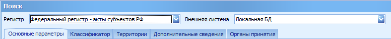
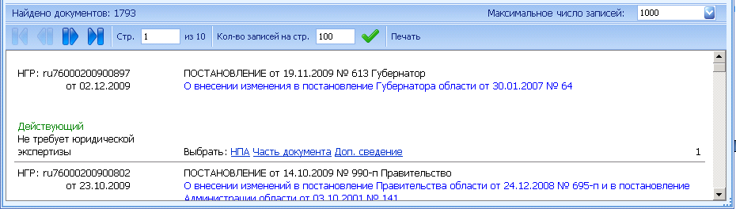
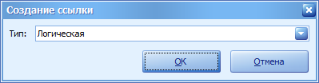
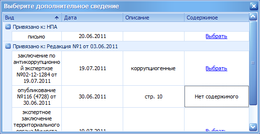

[](https://youtu.be/B0ZfTu-cD_A)

**Видео: «Простановка ссылок в тексте НПА»**

Ссылка в НПА должна вести не просто на адрес в Интернете, а на конкретную запись в системе регистров. Поэтому ссылку создают через кнопку **«Ссылка»** в АРМ Ввода.

## Самое главное

1. Выделите в тексте точное упоминание акта.
2. Нажмите **«Ссылка»**.
3. Выберите, где искать документ: регистр и внешнюю систему.
4. Найдите нужную запись и проверьте ее реквизиты.
5. Выберите, куда должен вести переход:
   - **НПА** — на документ;
   - **Часть документа** — на редакцию, заголовок или закладку;
   - **Доп. сведение** — на полнотекстовый материал.
6. Выберите тип связи, если создаете ссылку на НПА.
7. Нажмите **«ОК»** и сохраните документ.

:::tip[Правило одной строки]
Сначала выберите **куда вести**, затем — **какой смысл у связи**. «НПА», «Часть документа» и «Доп. сведение» — это место перехода. «Логическая», «Изменяющая», «Отменяющая» и «Исполняющая» — это тип связи между документами.
:::

## Перед началом

Ссылки можно создавать в режиме редактирования текста НПА. Перед началом убедитесь, что:

- открыт нужный НПА и нужная редакция;
- включен режим редактирования текста;
- в тексте выделен фрагмент, который должен стать ссылкой;
- вы знаете хотя бы один надежный реквизит искомого акта: номер, дату, вид или название.

Не выделяйте соседние слова, абзац целиком или знак препинания после названия акта. Ссылка должна покрывать только тот текст, по которому пользователь должен понимать, к какому акту ведет переход.

## Выберите нужный сценарий

| Вам нужно | Выберите в результатах поиска |
| --- | --- |
| Перейти к документу без привязки к конкретному месту | **НПА** |
| Открыть нужную редакцию, заголовок или закладку | **Часть документа** |
| Открыть заключение, опубликование, судебное решение или другой текстовый материал | **Доп. сведение** |
| Поставить одну и ту же ссылку в нескольких местах | Сначала сохраните ее как **избранную ссылку**, затем используйте **«Расстановка избранных ссылок»** |

## Создайте ссылку на НПА

### Шаг 1. Выделите текст и откройте поиск

1. Откройте НПА в АРМ Ввода.
2. Перейдите в режим редактирования текста.
3. Выделите упоминание правового акта.
4. Нажмите **«Ссылка»**.

Откроется окно **«Поиск»**. Для постановки ссылки в нем есть два ключевых поля: **«Регистр»** и **«Внешняя система»**.



### Шаг 2. Выберите регистр

**Регистр** — это раздел, в котором выполняется поиск. Выберите его по уровню и виду искомого акта:

- **Федеральный регистр** — акты субъектов Российской Федерации;
- **Федеральное законодательство** — федеральные законы, кодексы и другие федеральные акты;
- **Реестр актов муниципальных образований** — муниципальные НПА;
- **Реестр уставов муниципальных образований** — уставы и связанные с ними документы;

Если выбрать не тот регистр, нужная запись может не найтись даже при правильном номере.

### Шаг 3. Выберите внешнюю систему

**Внешняя система** определяет, из какой базы будет выбран документ:

- **Локальная БД** — подключенная локальная база данных;
- **Веб-доступ** — база, доступная через Интернет;

Для муниципальных правовых актов действует отдельное рабочее правило: выбирайте **«Локальная БД»**. Муниципальные НПА и акты об изменении муниципальных НПА не ищутся через веб-доступ.

Для федерального законодательства, законодательства субъекта Российской Федерации и уставов муниципальных образований выбирайте **«Веб-доступ»**. Этот источник используется в примерах ниже.

### Откуда берутся GUID и Word DocID

Для идентификации НПА в системе регистров используется **GUID**, который считывается из документа Word. В формате DOCX это значение хранится в элементе **`docId`**; в инструкции и технических материалах оно также называется **Word DocID**.

#### Где находится Word DocID

Файл `.docx` является ZIP-архивом. Внутри него откройте файл:

```text
word/settings.xml
```

В элементе `w15:docId` находится значение идентификатора:

```xml
<w15:docId w15:val="{E63199DC-B27A-4C23-8403-F68F22FF8F72}"/>
```

Значение атрибута `w15:val` в фигурных скобках — это Word DocID, который используется как GUID документа. В исходной инструкции указано, что Word формирует его для нового документа, а при обычном копировании файла не заменяет. Поэтому два независимо созданных документа получают разные идентификаторы, а копия может сохранить DocID исходного файла.

При добавлении текста НПА программа **Агент Регистра** считывает Word DocID из документа Word и сохраняет его в системе регистров. Пользователь не вводит GUID вручную и не должен подменять его номером акта, датой или адресом страницы.

#### Как GUID используется в ссылке

Внешний адрес строится системой из адреса сервера и Word DocID. Например, для одного и того же значения GUID система формирует разные представления:

```text
Портал:       https://pravo-search.minjust.ru/bigs/showDocument.html?id=<GUID>
Текст акта:   http://nla-service.minjust.ru:8080/rnla-links/ws/content/act/<GUID>
Локальная БД: http://<локальный-сервер>:8080/content/act/<GUID>.doc
```

`<GUID>` здесь означает значение из `word/settings.xml`, а не произвольный GUID, созданный вручную. Ссылку нужно создавать кнопкой **«Ссылка»** через поиск в АРМ Ввода. Не вставляйте эти адреса вручную: система сама выбирает нужное представление и связывает его с записью регистра.

#### Не смешивайте идентификаторы

Word DocID/GUID — это идентификатор, который приходит из файла Word и используется для внешнего адреса документа. Он не равен следующим идентификаторам базы `MRegister36`:

- `dbo.Document.Id` — идентификатор карточки документа в базе;
- `dbo.DocumentEdition.Id` — идентификатор редакции;
- `dbo.DocumentLink.SourceDocumentId` и `TargetDocumentId` — начало и конец связи;
- `dbo.Document.TypeGuid` — GUID вида объекта, а не идентификатор конкретного НПА.

Эти значения могут участвовать в технической проверке ссылки, но ни одно из них не заменяет Word DocID в адресе портала.

### Шаг 4. Задайте поиск

Введите один или несколько реквизитов и нажмите **«Искать»**. Начинайте с наиболее точного условия:

1. номер;
2. вид документа;
3. дата принятия;
4. орган принятия;
5. часть названия.

Пример: чтобы найти Земельный кодекс Российской Федерации, выберите **«Федеральное законодательство»** и задайте номер **136-ФЗ**. Если результатов слишком много, добавьте дату или название.

Не вводите сразу все возможные поля. Слишком строгий набор условий может исключить правильную запись из результатов.

## Проверьте результат до создания ссылки

После поиска в нижней части окна появится список документов. В верхней строке отображается количество найденных документов; рядом можно ограничить число записей на странице.



Перед выбором сравните запись с упоминанием в вашем НПА:

- вид документа;
- номер;
- дата принятия;
- наименование;
- орган принятия;
- статус и редакцию.

Если совпадает только номер, запись еще нельзя считать проверенной: одинаковые номера могут быть у актов разных органов или видов.

В строке найденного документа доступны три действия: **«НПА»**, **«Часть документа»** и **«Доп. сведение»**.

## Практический пример: акт о внесении изменений

Рассмотрим пару документов из рабочего реестра.

### Документы в примере

**Изменяющий акт** — постановление от 02.06.2026 № 41 Администрации Нащёкинского сельского поселения Аннинского муниципального района Воронежской области:

> «О внесении изменений в постановление администрации Нащёкинского сельского поселения от 11.12.2025 № 66 „Об утверждении административного регламента предоставления муниципальной услуги „Предоставление земельного участка, находящегося в муниципальной собственности, на торгах“ на территории Нащёкинского сельского поселения Аннинского муниципального района Воронежской области“».

**Основной акт** — постановление администрации Нащёкинского сельского поселения от 11.12.2025 № 66:

> «Об утверждении административного регламента предоставления муниципальной услуги „Предоставление земельного участка, находящегося в муниципальной собственности, на торгах“ на территории Нащёкинского сельского поселения Аннинского муниципального района Воронежской области».

Для этой пары документов активную перекрёстную ссылку нужно создать в обоих направлениях. Ниже показано, какой тип выбрать в каждом документе.

### Какая ссылка нужна в каждом документе

| Где создается ссылка | На какой документ она ведет | Тип связи |
| --- | --- | --- |
| В тексте изменяющего акта от 02.06.2026 № 41 | На основное постановление от 11.12.2025 № 66 | **Логическая** |
| В тексте основного постановления от 11.12.2025 № 66 | На изменяющее постановление от 02.06.2026 № 41 | **Изменяющая** |

Это не две одинаковые ссылки. Смысл определяется документом, из которого выполняется переход:

- в изменяющем акте основное постановление указывается как документ, с которым связан новый акт, поэтому выбирается **«Логическая»**;
- в основном акте постановление от 02.06.2026 № 41 является актом, который внес изменения в текущий документ, поэтому выбирается **«Изменяющая»**.

:::caution[Не перепутайте направление]
Тип **«Изменяющая»** выбирают в основном акте для ссылки на акт, который его изменяет. В тексте изменяющего акта ссылка на основной документ в этом примере остается **«Логическая»**. Нельзя выбирать тип только по словам «внесении изменений» в названии найденного документа.
:::

### 1. Ссылка в изменяющем акте: на основной документ

Откройте текст постановления от 02.06.2026 № 41 и выделите реквизиты основного постановления в преамбуле или пункте, где оно названо, например:

> 11.12.2025 № 66

Далее:

1. Нажмите **«Ссылка»**.
2. В поле **«Регистр»** выберите **«Реестр актов муниципальных образований»**.
3. В поле **«Внешняя система»** выберите **«Локальная БД»**. Это обязательное правило для муниципальных правовых актов.
4. Найдите постановление администрации Нащёкинского сельского поселения от 11.12.2025 № 66.
5. Сверьте номер, дату, орган принятия и название.
6. В строке найденного документа нажмите **«НПА»**.
7. В окне **«Создание ссылки»** выберите тип **«Логическая»**.
8. Нажмите **«ОК»** и сохраните изменяющий акт.

Результат: при переходе из постановления № 41 пользователь открывает постановление № 66, а связь между документами обозначена как логическая.

### 2. Ссылка в основном акте: на изменяющий документ

Откройте текст постановления от 11.12.2025 № 66 и выделите реквизиты постановления, которым в него внесены изменения, например:

> 02.06.2026 № 41

Затем выполните те же действия поиска, но выберите уже изменяющий акт:

1. Нажмите **«Ссылка»**.
2. Выберите **«Реестр актов муниципальных образований»**.
3. В поле **«Внешняя система»** выберите **«Локальная БД»**. Это обязательное правило для муниципальных правовых актов.
4. Найдите постановление от 02.06.2026 № 41 по номеру, дате и органу принятия.
5. Проверьте, что его название начинается словами **«О внесении изменений в постановление администрации Нащёкинского сельского поселения от 11.12.2025 № 66»**.
6. Нажмите **«НПА»**.
7. В поле **«Тип»** выберите **«Изменяющая»**.
8. Нажмите **«ОК»** и сохраните основной акт.

Результат: при переходе из постановления № 66 пользователь открывает постановление № 41, а система понимает, что это акт, изменяющий текущий документ.

:::tip[Сначала создайте оба документа]
Если в основном акте нет текста, в котором упоминается постановление № 41, не вставляйте реквизиты только ради обратной ссылки. Ссылку можно поставить только на существующий фрагмент текста. В таком случае достаточно создать логическую ссылку в изменяющем акте, а обратную ссылку добавить в основной акт после появления в нем соответствующего реквизита или сведения о редакции.
:::

### Что проверить в этой паре

- [ ] В изменяющем акте ссылка ведет на постановление от 11.12.2025 № 66.
- [ ] Для этой ссылки выбран тип **«Логическая»**.
- [ ] В основном акте ссылка ведет на постановление от 02.06.2026 № 41.
- [ ] Для этой ссылки выбран тип **«Изменяющая»**.
- [ ] В каждой ссылке проверены номер, дата, орган и название документа.
- [ ] Ссылки не захватывают кавычки, лишние пробелы и знаки препинания.

## Ссылка на документ целиком

Выберите **«НПА»**, если пользователь должен открыть сам документ без перехода к конкретному заголовку или материалу.

Появится окно **«Создание ссылки»**. В поле **«Тип»** выберите смысл связи.



### Как выбрать тип связи

| Выберите | Когда это правильно |
| --- | --- |
| **Изменяющая** | Найденный документ изменяет текущий НПА. Например, в нем сказано заменить пункт, слово или число в текущем акте. |
| **Отменяющая** | Текущий НПА отменяет действие найденного документа. |
| **Исполняющая** | Текущий НПА принят во исполнение найденного документа или поручения, изложенного в нем. |
| **Логическая** | Между актами есть смысловая связь, но она не является изменением, отменой или исполнением. |

### Примеры видов ссылок в системе регистров

В системе регистров вид ссылки определяется не тем, что в тексте встречается номер другого акта, а смыслом связи между **текущим документом** и найденным документом.

| Ситуация в тексте | Что выбрать | Пример смысла |
| --- | --- | --- |
| Текущий акт ссылается на федеральный или региональный акт как на правовое основание | **Логическая** | Муниципальный акт принят с учетом требований Земельного кодекса Российской Федерации или закона субъекта Российской Федерации. |
| Найденный акт вносит изменения в текущий акт | **Изменяющая** | В основном постановлении создается ссылка на постановление, которым в него внесены изменения. |
| Текущий акт прекращает действие найденного акта | **Отменяющая** | В новом акте прямо указано признать утратившим силу или отменить ранее действовавший акт. |
| Текущий акт принят во исполнение найденного акта | **Исполняющая** | В муниципальном акте прямо указано, что он принят во исполнение федерального закона, закона субъекта или иного акта. |

Для первых двух ситуаций важно учитывать направление:

- ссылка из изменяющего акта на основной акт — **«Логическая»**;
- ссылка из основного акта на акт, который внес в него изменения, — **«Изменяющая»**.

Для ссылки на конкретный объект результата поиска сначала выбирают один из трех вариантов интерфейса:

- **«НПА»** — ссылка на карточку документа целиком;
- **«Часть документа»** — ссылка на выбранную редакцию, заголовок или закладку;
- **«Доп. сведение»** — ссылка на дополнительный текстовый материал, например заключение экспертизы, опубликование, судебное решение или комментарий.

То есть **«НПА»**, **«Часть документа»** и **«Доп. сведение»** определяют объект перехода, а **«Логическая»**, **«Изменяющая»**, **«Отменяющая»** и **«Исполняющая»** — смысл связи между документами.

Проверяйте направление связи:

- найденный изменяет текущий → **изменяющая**;
- текущий отменяет найденный → **отменяющая**;
- текущий принят во исполнение найденного → **исполняющая**;
- любой другой случай → **логическая**.

После выбора типа нажмите **«ОК»**. Ссылка появится на выделенном фрагменте.

:::caution[Не путайте документ и тип связи]
Если акт просто упоминается как основание или применяется вместе с текущим актом, это обычно **логическая** связь. Не выбирайте **«изменяющая»** только потому, что в текущем документе есть ссылка на другой акт.
:::

## Примеры для федеральных, региональных актов и устава

В этих трех сценариях в поле **«Внешняя система»** всегда выбирайте **«Веб-доступ»**. Это правило действует и для устава муниципального образования, несмотря на его муниципальный уровень.

### Федеральное законодательство

В тексте муниципального акта встречается фрагмент:

> в соответствии с Федеральным законом от 20.03.2025 № 33-ФЗ «Об общих принципах организации местного самоуправления в единой системе публичной власти»

Порядок расстановки ссылки:

1. Выделите реквизиты Федерального закона.
2. Нажмите **«Ссылка»**.
3. В поле **«Регистр»** выберите **«Федеральное законодательство»**.
4. В поле **«Внешняя система»** выберите **«Веб-доступ»**.
5. Найдите Федеральный закон от 20.03.2025 № 33-ФЗ по номеру `33-ФЗ` и дате.
6. Проверьте полное название и дату принятия.
7. Нажмите **«НПА»**.
8. Если закон только упомянут как применяемое правовое основание, выберите тип **«Логическая»**.

Если муниципальный акт прямо принят во исполнение конкретного федерального акта или поручения, вместо **«Логическая»** может применяться **«Исполняющая»**. Тип выбирается по смыслу фрагмента, а не по уровню документа.

### Законодательство субъекта Российской Федерации

Пример фрагмента из муниципального акта:

> в соответствии с Законом Воронежской области от 21.03.2025 № 46-ОЗ «О внесении изменений в Закон Воронежской области „О регулировании земельных отношений на территории Воронежской области“»

Порядок расстановки ссылки:

1. Выделите реквизиты Закона Воронежской области.
2. Нажмите **«Ссылка»**.
3. В поле **«Регистр»** выберите **«Федеральный регистр»**.
4. В поле **«Внешняя система»** выберите **«Веб-доступ»**.
5. Найдите Закон Воронежской области от 21.03.2025 № 46-ОЗ.
6. Сверьте дату, номер, наименование и субъект Российской Федерации.
7. Нажмите **«НПА»**.
8. Для обычной ссылки на применяемый областной закон выберите **«Логическая»**.

Не выбирайте **«Федеральное законодательство»** только потому, что закон регулирует федеральную или муниципальную сферу. Закон субъекта Российской Федерации ищется в **«Федеральном регистре»**.

### Устав муниципального образования

Пример фрагмента:

> в соответствии с Уставом Хохольского муниципального района Воронежской области

Порядок расстановки ссылки:

1. Выделите слова **«Уставом Хохольского муниципального района Воронежской области»**.
2. Нажмите **«Ссылка»**.
3. В поле **«Регистр»** выберите **«Реестр уставов муниципальных образований»**.
4. В поле **«Внешняя система»** выберите **«Веб-доступ»**.
5. Найдите устав по полному наименованию муниципального образования.
6. Убедитесь, что выбрана карточка самого устава, а не решение о его принятии или акт о внесении изменений.
7. Нажмите **«НПА»**.
8. Выберите тип **«Логическая»**, если устав упомянут как правовое основание или акт высшей юридической силы.

Для перехода к конкретной статье или главе устава вместо **«НПА»** выберите **«Часть документа»**, затем нужную редакцию и заголовок. Внешняя система при этом остается **«Веб-доступ»**.

:::caution[Не переносите правило муниципального НПА на устав]
Для постановлений, решений и других муниципальных правовых актов из примера выше используется **«Локальная БД»**. Для ссылки именно на устав муниципального образования в этом сценарии используется **«Веб-доступ»**.
:::

## Техническая модель ссылки

Ниже приведена техническая часть для проверки результата в базе `MRegister36`. Она основана на read-only SQL-запросах и ноутбуках проекта `requests`. Эти сведения нужны для диагностики уже созданных связей, а не для ручной записи в таблицы.

### Где хранятся данные

| Объект | Что хранится | Ключевые поля |
| --- | --- | --- |
| `dbo.Document` | Карточка документа, регистр, территория и жизненный цикл | `Id`, `Name`, `RegistryId`, `TypeGuid`, `TypeId`, `RegionId`, `IsDeleted` |
| `dbo.LegalDocument` | Правовые свойства и текущая редакция | `DocumentId`, `AdoptionDescription`, `StateId`, `IsCorrection`, `EditionId` |
| `dbo.DocumentEdition` | Редакции документа | `Id`, `HolderId`, `Number`, `EditionDate`, `EffectDate`, `ContentId`, `IsDeleted` |
| `dbo.DocumentLink` | Направленная связь между документами и редакциями | `SourceDocumentId`, `TargetDocumentId`, `SourceEditionId`, `TargetEditionId`, `TargetNumber`, `Type`, `IsArchived`, `UpdateTime` |
| `dbo.DocumentContent` | Текст, на который может вести редакция или дополнительное сведение | `Id`, `Body` |

Важное правило направления:

- `SourceDocumentId` — документ, из которого поставлена ссылка;
- `TargetDocumentId` — документ, на который она ведет;
- входящие ссылки для документа `d` ищутся условием `TargetDocumentId = d.Id`;
- исходящие ссылки — условием `SourceDocumentId = d.Id`.

Запись только в `DocumentLink` не доказывает, что целевая карточка, редакция и текст доступны. Их нужно проверять отдельно: документ не удален, редакция существует и не удалена, а при ссылке на текст у редакции есть `ContentId` и непустое содержимое.

### Коды типов в `DocumentLink.Type`

| Код | Тип в интерфейсе | Когда используется |
| ---: | --- | --- |
| `1` | **Логическая** | Смысловая связь без изменения, отмены или исполнения |
| `2` | **Изменяющая** | Найденный документ изменяет текущий |
| `3` | **Дополнительная** | Связь с дополнительным материалом |
| `4` | **Исполняющая** | Текущий документ принят во исполнение найденного |
| `5` | **Отменяющая** | Текущий документ отменяет найденный |
| `-1` | Пользовательская/специальная | Специальная пользовательская связь |
| `101–105` | Структурные связи | Объединение, деление, включение, выделение и изменение статистики |

Для проверки обычных правовых ссылок используйте только `Type IN (1, 2, 3, 4, 5)`. Не заменяйте это условием `Type > 100`: коды `101–105` относятся к структурным связям и анализируются отдельно.

### Что означает редакция в записи

- `SourceEditionId` связывает ссылку с редакцией исходного документа;
- `TargetEditionId` указывает редакцию целевого документа, если переход должен открывать конкретную редакцию или часть текста;
- `TargetNumber` хранит номер цели, используемый системой при создании связи;
- для перехода на конкретный заголовок или закладку дополнительно проверяется структура и содержимое выбранной редакции.

Поэтому при аудите пары «изменяющий акт — основной акт» проверяйте не только `SourceDocumentId`, `TargetDocumentId` и `Type`, но также обе редакции и флаг `IsArchived`.

## Скрипты проверки из проекта `requests`

Все перечисленные SQL-файлы находятся в `requests/sql/`, а одноименные ноутбуки — в `requests/notebooks/`. Запросы предназначены для чтения данных из `MRegister36`; исторические файлы с префиксом `legacy-` нельзя выполнять целиком.

### Проверка перекрестных ссылок изменяющих актов

`amending-acts-link-edition-audit.sql` и `amending-acts-link-edition-audit.ipynb`:

- находят изменяющие акты через `LegalDocument.IsCorrection = 1`;
- считают активные и архивные ссылки;
- отбирают обычные типы `1–5`;
- показывают `SourceDocumentId`, `TargetDocumentId`, обе редакции, `TargetNumber` и числовой тип;
- расшифровывают `Type = 1` как «Логическая», `Type = 2` как «Изменяющая» и остальные типы;
- проверяют наличие целевой карточки, текущей редакции и редакции, указанной в связи.

Минимальный фрагмент проверки активной связи:

```sql
SELECT
    link.Id,
    link.SourceDocumentId,
    link.SourceEditionId,
    link.TargetDocumentId,
    link.TargetEditionId,
    link.TargetNumber,
    link.Type,
    link.IsArchived,
    link.UpdateTime
FROM dbo.DocumentLink AS link
WHERE link.TargetDocumentId IS NOT NULL
  AND link.Type IN (1, 2, 3, 4, 5)
  AND ISNULL(link.IsArchived, 0) = 0;
```

### Проверка направления и истории

`document-history-and-link-graph.sql` и `document-history-and-link-graph.ipynb` выводят связь как два разных события:

- **исходящая** — текущий документ является `SourceDocumentId`;
- **входящая** — текущий документ является `TargetDocumentId`.

Это удобно для проверки примера с актом о внесении изменений: из изменяющего акта должна быть исходящая логическая связь на основной акт, а из основного акта — исходящая изменяющая связь на изменяющий акт.

## Ссылка на дополнительное сведение

Используйте **«Доп. сведение»**, чтобы открыть материал, связанный с найденным НПА: заключение, опубликование, судебное решение, комментарий или другой текстовый документ.

В окне **«Выберите дополнительное сведение»** сведения сгруппированы по документу и редакции. Для выбора доступны только записи, у которых есть текст.



Проверьте четыре столбца:

- **Вид** — что это за материал;
- **Дата** — дата сведения;
- **Описание** — дополнительное пояснение;
- **Содержимое** — наличие текста.

Если в столбце **«Содержимое»** отображается **«Выбрать»**, материал можно использовать для ссылки. Если отображается **«Нет содержимого»**, ссылка на него не создается.

Выберите нужную запись и нажмите **«Выбрать»**.


## Проверка ссылки

Проверяйте ссылку в два этапа.

### В тексте

Убедитесь, что:

- ссылка выделяет нужный фрагмент;
- в нее не попали лишние пробелы и знаки препинания;
- выбран именно тот документ;
- тип связи соответствует направлению связи;
- для части документа выбраны правильные редакция и место;
- для дополнительного сведения выбран материал с содержимым.

### Переходом по ссылке

Проверьте переход в **АРМ Аналитика** или после выгрузки НПА на портал. В АРМ Ввода ссылка может быть видна в тексте, но это еще не подтверждает, что выбран правильный объект перехода.

:::tip[Финальная проверка]
Открывайте ссылку как пользователь: перейдите по ней и сравните открывшийся документ с тем, который должен был быть указан в тексте.
:::

## Исправление ошибки

### Документ не найден

Проверьте по порядку:

1. выбран ли правильный **регистр**;
2. выбрана ли правильная **внешняя система**;
3. правильно ли написаны номер и вид акта;
4. не требуется ли добавить дату или часть названия;
5. работает ли Интернет, если выбран веб-доступ.

Если результатов слишком много, добавьте один точный реквизит. Если результатов нет, сначала уберите часть условий, а затем повторите поиск.

### Выбрана не та запись

Не исправляйте адрес вручную. Удалите неправильную ссылку и создайте новую через **«Ссылка»**, начиная с проверки результата поиска.

### Не отображается нужная часть документа

Проверьте выбранную редакцию. Затем убедитесь, что нужный элемент оформлен в Word как заголовок или закладка. Если точного места нет, выберите **«Весь документ»**.

### Нет кнопки «Выбрать» у дополнительного сведения

У записи отсутствует полнотекстовое содержимое. Выберите другое сведение с кнопкой **«Выбрать»** или сначала создайте текст дополнительного сведения.

### Нужно удалить ссылку

Выделите текст со ссылкой и нажмите **Ctrl+Shift+F9**. Сочетание удаляет связь и оставляет текст обычным текстом.

После этого ссылку можно создать заново или восстановить из списка избранных ссылок с помощью **«Расстановка избранных ссылок»**.

:::caution[Сначала сохраните результат]
Перед массовым удалением ссылок сохраните документ и убедитесь, что нужные связи есть в списке избранных ссылок. `Ctrl+Shift+F9` удаляет связь без дополнительного подтверждения.
:::

## Готово: короткий чек-лист

Перед сохранением НПА проверьте:

- [ ] выделен только текст, который должен быть ссылкой;
- [ ] выбран правильный регистр;
- [ ] выбрана правильная внешняя система;
- [ ] запись проверена по виду, номеру, дате и названию;
- [ ] выбран правильный объект перехода: НПА, часть документа или дополнительное сведение;
- [ ] тип связи выбран с учетом направления связи;
- [ ] редакция и место перехода проверены;
- [ ] дополнительное сведение содержит текст;
- [ ] результат проверен переходом по ссылке;
- [ ] документ сохранен.
