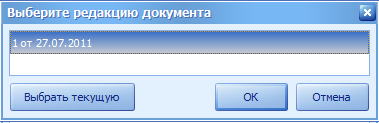
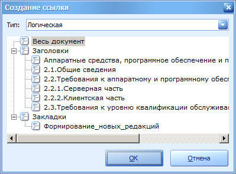

**Видео: «Простановка ссылок в тексте НПА»**

Ссылка в НПА должна вести не просто на адрес в Интернете, а на конкретную запись в системе регистров. Поэтому ссылку создают через кнопку **«Ссылка»** в АРМ Ввода.

## Самое главное

1. Выделите в тексте точное упоминание акта.
2. Нажмите **«Ссылка»**.
3. Выберите, где искать документ: регистр и внешнюю систему.
4. Найдите нужную запись и проверьте ее реквизиты.
5. Выберите, куда должен вести переход:
   - **НПА** — на документ;
   - **Часть документа** — на редакцию, заголовок или закладку;
   - **Доп. сведение** — на полнотекстовый материал.
6. Выберите тип связи, если создаете ссылку на НПА.
7. Нажмите **«ОК»** и сохраните документ.

:::tip[Правило одной строки]
Сначала выберите **куда вести**, затем — **какой смысл у связи**. «НПА», «Часть документа» и «Доп. сведение» — это место перехода. «Логическая», «Изменяющая», «Отменяющая» и «Исполняющая» — это тип связи между документами.
:::

## Перед началом

Ссылки можно создавать в режиме редактирования текста НПА. Перед началом убедитесь, что:

- открыт нужный НПА и нужная редакция;
- включен режим редактирования текста;
- в тексте выделен фрагмент, который должен стать ссылкой;
- вы знаете хотя бы один надежный реквизит искомого акта: номер, дату, вид или название.

Не выделяйте соседние слова, абзац целиком или знак препинания после названия акта. Ссылка должна покрывать только тот текст, по которому пользователь должен понимать, к какому акту ведет переход.

## Выберите нужный сценарий

| Вам нужно | Выберите в результатах поиска |
| --- | --- |
| Перейти к документу без привязки к конкретному месту | **НПА** |
| Открыть нужную редакцию, заголовок или закладку | **Часть документа** |
| Открыть заключение, опубликование, судебное решение или другой текстовый материал | **Доп. сведение** |
| Поставить одну и ту же ссылку в нескольких местах | Сначала сохраните ее как **избранную ссылку**, затем используйте **«Расстановка избранных ссылок»** |

## Создайте ссылку на НПА

### Шаг 1. Выделите текст и откройте поиск

1. Откройте НПА в АРМ Ввода.
2. Перейдите в режим редактирования текста.
3. Выделите упоминание правового акта.
4. Нажмите **«Ссылка»**.

Откроется окно **«Поиск»**. Для постановки ссылки в нем есть два ключевых поля: **«Регистр»** и **«Внешняя система»**.

### Шаг 2. Выберите регистр

**Регистр** — это раздел, в котором выполняется поиск. Выберите его по уровню и виду искомого акта:

- **Федеральный регистр** — акты субъектов Российской Федерации;
- **Федеральное законодательство** — федеральные законы, кодексы и другие федеральные акты;
- **Реестр актов муниципальных образований** — муниципальные НПА;
- **Реестр уставов муниципальных образований** — уставы и связанные с ними документы;
- **Акты министерств и ведомств** — акты федеральных органов исполнительной власти;
- **Международные документы** — документы соответствующего раздела.

Если выбрать не тот регистр, нужная запись может не найтись даже при правильном номере.

### Шаг 3. Выберите внешнюю систему

**Внешняя система** определяет, из какой базы будет выбран документ:

- **Локальная БД** — подключенная локальная база данных;
- **Веб-доступ** — база, доступная через Интернет;
- **Эталон плюс** — база «Эталон плюс», если она установлена и настроена.

Используйте **локальную БД**, если документ уже есть в рабочей базе. Используйте **веб-доступ**, если ищете акт в федеральной базе или его нет в локальной базе.

### Шаг 4. Задайте поиск

Введите один или несколько реквизитов и нажмите **«Искать»**. Начинайте с наиболее точного условия:

1. номер;
2. вид документа;
3. дата принятия;
4. орган принятия;
5. часть названия.

Пример: чтобы найти Земельный кодекс Российской Федерации, выберите **«Федеральное законодательство»** и задайте номер **136-ФЗ**. Если результатов слишком много, добавьте дату или название.

Не вводите сразу все возможные поля. Слишком строгий набор условий может исключить правильную запись из результатов.

## Проверьте результат до создания ссылки

После поиска в нижней части окна появится список документов. В верхней строке отображается количество найденных документов; рядом можно ограничить число записей на странице.

Перед выбором сравните запись с упоминанием в вашем НПА:

- вид документа;
- номер;
- дата принятия;
- наименование;
- орган принятия;
- статус и редакцию.

Если совпадает только номер, запись еще нельзя считать проверенной: одинаковые номера могут быть у актов разных органов или видов.

В строке найденного документа доступны три действия: **«НПА»**, **«Часть документа»** и **«Доп. сведение»**.

## Ссылка на документ целиком

Выберите **«НПА»**, если пользователь должен открыть сам документ без перехода к конкретному заголовку или материалу.

Появится окно **«Создание ссылки»**. В поле **«Тип»** выберите смысл связи.

### Как выбрать тип связи

| Выберите | Когда это правильно |
| --- | --- |
| **Изменяющая** | Найденный документ изменяет текущий НПА. Например, в нем сказано заменить пункт, слово или число в текущем акте. |
| **Отменяющая** | Текущий НПА отменяет действие найденного документа. |
| **Исполняющая** | Текущий НПА принят во исполнение найденного документа или поручения, изложенного в нем. |
| **Логическая** | Между актами есть смысловая связь, но она не является изменением, отменой или исполнением. |

Проверяйте направление связи:

- найденный изменяет текущий → **изменяющая**;
- текущий отменяет найденный → **отменяющая**;
- текущий принят во исполнение найденного → **исполняющая**;
- любой другой случай → **логическая**.

После выбора типа нажмите **«ОК»**. Ссылка появится на выделенном фрагменте.

:::caution[Не путайте документ и тип связи]
Если акт просто упоминается как основание или применяется вместе с текущим актом, это обычно **логическая** связь. Не выбирайте **«изменяющая»** только потому, что в текущем документе есть ссылка на другой акт.
:::

## Ссылка на часть документа

Используйте **«Часть документа»**, когда важно открыть не просто НПА, а конкретное место в его тексте.

### 1. Выберите редакцию

В окне **«Выберите редакцию документа»** выделите нужную редакцию и нажмите **«ОК»**.

Если нужна редакция, которая сейчас действует, используйте кнопку **«Выбрать текущую»**.

### 2. Выберите место перехода

В следующем окне **«Создание ссылки»** выберите один из элементов дерева:

- **Весь документ** — переход к выбранной редакции;
- **Заголовки** — переход к конкретному заголовку;
- **Закладки** — переход к сохраненной закладке.

Раскройте нужную ветку, выберите элемент и нажмите **«ОК»**.

Заголовки и закладки берутся из структуры документа Word. Если нужного места нет в списке, проверьте, что оно создано в исходном документе и существует в выбранной редакции.

:::tip[Когда выбрать «Весь документ»]
Выбирайте **«Весь документ»**, если точная часть не важна или в тексте нет подходящего заголовка или закладки. Так ссылка будет вести к выбранной редакции, а не к случайному месту.
:::

## Ссылка на дополнительное сведение

Используйте **«Доп. сведение»**, чтобы открыть материал, связанный с найденным НПА: заключение, опубликование, судебное решение, комментарий или другой текстовый документ.

В окне **«Выберите дополнительное сведение»** сведения сгруппированы по документу и редакции. Для выбора доступны только записи, у которых есть текст.

Проверьте четыре столбца:

- **Вид** — что это за материал;
- **Дата** — дата сведения;
- **Описание** — дополнительное пояснение;
- **Содержимое** — наличие текста.

Если в столбце **«Содержимое»** отображается **«Выбрать»**, материал можно использовать для ссылки. Если отображается **«Нет содержимого»**, ссылка на него не создается.

Выберите нужную запись и нажмите **«Выбрать»**.

## Массовая расстановка одинаковых ссылок

Если один акт многократно упоминается в документе, не создавайте ссылку вручную для каждого повторения. Используйте список избранных ссылок.

### Сохраните ссылку в избранное

1. Создайте и проверьте ссылку обычным способом.
2. Выделите созданную ссылку.
3. Нажмите **«Избранная ссылка»**.
4. Введите понятное описание.
5. Нажмите **«ОК»**.

Описание помогает отличать записи друг от друга и используется как всплывающая подсказка.

### Настройте запись

Чтобы открыть список избранных ссылок, снимите выделение, установите курсор в тексте и нажмите **«Избранная ссылка»**.

В списке есть три поля:

| Поле | Что в нем хранится |
| --- | --- |
| **Текст** | Точное сочетание, которое система ищет в документе. |
| **Связь** | Сохраненная ссылка на документ или материал. |
| **Описание** | Пояснение и текст всплывающей подсказки. |

Перед сохранением убедитесь, что поле **«Текст»** достаточно точное. Слишком короткая запись может совпасть с фрагментами, которые не относятся к нужному акту.

### Запустите расстановку

1. Сохраните изменения в списке избранных ссылок.
2. Поставьте курсор в документе.
3. Нажмите **«Расстановка избранных ссылок»**.
4. Просмотрите результат в тексте.
5. Исправьте неоднозначные совпадения и сохраните НПА.

:::caution[Автоматическая расстановка не понимает смысл]
Система ищет совпадение текста, а не анализирует контекст. Не добавляйте в избранное короткие или неоднозначные фразы вроде «пункт 1» или «статья 5».
:::

## Проверка ссылки

Проверяйте ссылку в два этапа.

### В тексте

Убедитесь, что:

- ссылка выделяет нужный фрагмент;
- в нее не попали лишние пробелы и знаки препинания;
- выбран именно тот документ;
- тип связи соответствует направлению связи;
- для части документа выбраны правильные редакция и место;
- для дополнительного сведения выбран материал с содержимым.

### Переходом по ссылке

Проверьте переход в **АРМ Аналитика** или после выгрузки НПА на портал. В АРМ Ввода ссылка может быть видна в тексте, но это еще не подтверждает, что выбран правильный объект перехода.

:::tip[Финальная проверка]
Открывайте ссылку как пользователь: перейдите по ней и сравните открывшийся документ с тем, который должен был быть указан в тексте.
:::

## Исправление ошибки

### Документ не найден

Проверьте по порядку:

1. выбран ли правильный **регистр**;
2. выбрана ли правильная **внешняя система**;
3. правильно ли написаны номер и вид акта;
4. не требуется ли добавить дату или часть названия;
5. работает ли Интернет, если выбран веб-доступ.

Если результатов слишком много, добавьте один точный реквизит. Если результатов нет, сначала уберите часть условий, а затем повторите поиск.

### Выбрана не та запись

Не исправляйте адрес вручную. Удалите неправильную ссылку и создайте новую через **«Ссылка»**, начиная с проверки результата поиска.

### Не отображается нужная часть документа

Проверьте выбранную редакцию. Затем убедитесь, что нужный элемент оформлен в Word как заголовок или закладка. Если точного места нет, выберите **«Весь документ»**.

### Нет кнопки «Выбрать» у дополнительного сведения

У записи отсутствует полнотекстовое содержимое. Выберите другое сведение с кнопкой **«Выбрать»** или сначала создайте текст дополнительного сведения.

### Нужно удалить ссылку

Выделите текст со ссылкой и нажмите **Ctrl+Shift+F9**. Сочетание удаляет связь и оставляет текст обычным текстом.

После этого ссылку можно создать заново или восстановить из списка избранных ссылок с помощью **«Расстановка избранных ссылок»**.

:::caution[Сначала сохраните результат]
Перед массовым удалением ссылок сохраните документ и убедитесь, что нужные связи есть в списке избранных ссылок. `Ctrl+Shift+F9` удаляет связь без дополнительного подтверждения.
:::

## Готово: короткий чек-лист

Перед сохранением НПА проверьте:

- [ ] выделен только текст, который должен быть ссылкой;
- [ ] выбран правильный регистр;
- [ ] выбрана правильная внешняя система;
- [ ] запись проверена по виду, номеру, дате и названию;
- [ ] выбран правильный объект перехода: НПА, часть документа или дополнительное сведение;
- [ ] тип связи выбран с учетом направления связи;
- [ ] редакция и место перехода проверены;
- [ ] дополнительное сведение содержит текст;
- [ ] результат проверен переходом по ссылке;
- [ ] документ сохранен.

## Подробнее о поиске НПА

Подробное описание общей формы поиска, классификаторов, территорий, дополнительных сведений и органов принятия приведено в разделе [«Поиск НПА»](../../agent-registry.md#поиск-нпа).
