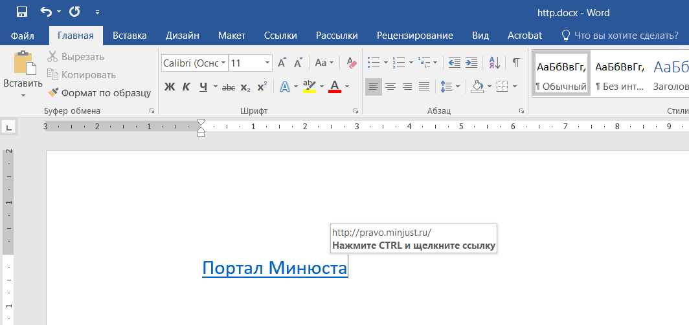

 
**Гиперссылки** (или просто «ссылки») — это один из самых мощных инструментов в Word, который превращает ваш статичный текст в интерактивный и удобный документ. 
Это руководство поможет вам понять их суть, научиться создавать и эффективно использовать.

## Что такое гиперссылка?

Представьте, что вы читаете книгу и видите сноску. Чтобы прочитать пояснение, вы переводите взгляд вниз страницы или в конец книги. Гиперссылка — это цифровая версия такой сноски, только гораздо мощнее.

Простыми словами, гиперссылка — это кликабельный элемент (текст, изображение или фигура) в документе, который при нажатии перенаправляет вас в другое место.

Этим «другим местом» может быть: 
* Веб-страница в интернете.
* Другой раздел в этом же документе.
* Совершенно другой файл на вашем компьютере.
* Окно для создания нового электронного письма.

:::tip[Совет]
В Word вы легко узнаете гиперссылку: по умолчанию она подсвечивается синим цветом и подчеркивается. При наведении курсора на нее появляется подсказка с адресом назначения и предложением нажать Ctrl + щелчок мыши для перехода.

:::

## Зачем нужны гиперссылки? Ключевые преимущества

Использование ссылок делает документ профессиональнее, удобнее и функциональнее.

**Быстрая навигация по большим документам.**

* Оглавление: Автоматическое оглавление в Word — это, по сути, набор гиперссылок. Вы можете нажать на название главы и мгновенно переместиться к ней, не прокручивая десятки страниц.

* Перекрестные ссылки: Можно связать упоминание таблицы в тексте («см. Таблицу 5») с самой таблицей. Это незаменимо в научных работах, отчетах и инструкциях.

**Связь с внешними ресурсами.**

* Источники информации: Укажите ссылку на статью, исследование или новость в интернете, чтобы читатель мог легко проверить источник.

* Дополнительные материалы: Прикрепите ссылку на видео на YouTube, онлайн-калькулятор или интерактивную карту, которые дополняют ваш текст.

**Организация связанных файлов.**

Представьте, что вы готовите годовой отчет в Word. Вы можете сделать ссылку на исходные данные в файле Excel, на презентацию PowerPoint с итогами или на PDF-файл с договором. Все нужные документы будут доступны в один клик прямо из отчета.

**Создание интерактивных документов.**

* Инструкции и чек-листы: Создайте пошаговую инструкцию, где каждый шаг является ссылкой на подробное описание с картинками.

* Анкеты и формы: Сделайте ссылку для отправки результатов на определенный e-mail.
Упрощение коммуникации.

* Добавьте в подпись ссылку mailto:, которая при нажатии откроет почтовую программу и создаст новое письмо с уже заполненным адресом получателя.

## Cсылки в регистре МНПА

Одним из ключевых элементов оформления текста при введении регистров является простановка в этом тексте ссылок на упоминаемые нормативные правовые акты. В дальнейшем эти ссылки используются в системе регистров Минюста для перехода к другому НПА в программе АРМ Аналитика и на Портале Нормативные правовые акты в Российской Федерации (http://pravo.minjust.ru).

### GUID

**Для идентификации нормативных правовых актов в системе регистров Минюста используется встроенный MS Office функционал генерации GUID.**

**GUID** - это аббревиатура, которая обозначает глобальный уникальный идентификатор , их также называют UUID или универсальные уникальные идентификаторы - между ними нет реальной разницы. Технически это 128-битные уникальные ссылочные номера, используемые в вычислениях, которые вряд ли будут повторяться при генерировании, несмотря на отсутствие центральных полномочий GUID для обеспечения уникальности.

GUID (глобальный уникальный идентификатор) - это термин, используемый Microsoft для числа, которое ее программа генерирует, чтобы создать уникальную идентичность для объекта, такого как документ Word. Идентификаторы GUID широко используются в продуктах Microsoft для идентификации интерфейсов, наборов реплик, записей и других объектов. 

**При добавлении текста нормативного правового акта в систему регистров Минюста программа Агент Регистра считывает GUID документа Word и сохраняе его значение в базе данных. **

### Как узнать GUID документа Word 

**MS Word генерирует уникальный идентификатор (GUID) при создании нового документа начиная с Office 2013.**

Если распаковать файл docx который по факту является zip-архивом то в файле '\word\settings.xml' внутри элемента <w:settings> находится имя 'docId' его значение в фигурных скобках и есть уникальный идентификатор GUID.

Например, в MS Word 2016:
```xml
<?xml version="1.0" encoding="UTF-8" standalone="yes"?>
<w:settings xmlns:w10="urn:schemas-microsoft-com:office:word" xmlns:w14="http://schemas.microsoft.com/office/word/2010/wordml" xmlns:w15="http://schemas.microsoft.com/office/word/2012/wordml" xmlns:w16se="http://schemas.microsoft.com/office/word/2015/wordml/symex" mc:Ignorable="w14 w15 w16se">
    <w15:docId w15:val="{E63199DC-B27A-4C23-8403-F68F22FF8F72}"/>
</w:settings>
```
**Таким образом веб ссылка на нормативный правовй акт в системе регистров Минюста состоит из адреса сервера и GUID документа Word.**

http://nla-service.minjust.ru:8080/rnla-links/ws/content/act/E63199DC-B27A-4C23-8403-F68F22FF8F72


:::tip[Совет]
Обратите внимание , что MS Word не изменяет docId при копировании файла. Так что, если каждый новый файл создается, а не копируется из другого, у него будет свой docId.
:::

## Как создать и настроить ссылку в тексте МНПА (пошаговая инструкция) 


### Виды ссылок

В АРМ ВВода ссылки в тексте МНПА можно расставить в режиме редактирования. Выделите в тексте строку (реквизиты НПА, на который нужно сослаться) и нажмите кнопку «Ссылка» на панели инструментов.


*(Транскрипция 00:11:55:07 - 00:12:48:02)*
Программное обеспечение АРМ ввода предоставляет для постановки ссылок следующие возможности. Кнопка ссылка обеспечивает постановку ссылки через поисковую систему. Кнопка Избранные ссылки обеспечивает возможность добавления выделенной ссылки в список избранных ссылок, а также введение самого списка избранных ссылок. Кнопка расстановка избранных ссылок обеспечивает расстановка по тексту гипер ссылок из числа тех ссылок, которые были внесены в список избранных.

*(Транскрипция 00:12:48:04 - 00:13:32:15)*
Для установки ссылки следует выделить фрагмент текста, указывающий на нормативный правовой акт, и нажать кнопку ссылка. В открывшемся окне следует указать параметры поиска правового акта. Детально возможности поиска будут рассмотрены в следующих разделах Инструкции. В этой инструкции укажем ключевые параметры. Прежде всего, необходимо определить внешнюю систему для поиска. Это либо локальная база данных. Если правовой акт, который вы ищете, находится в вашей базе данных, либо это система веб доступа.

*(Транскрипция 00:13:32:18 - 00:14:22:10)*
Если правовой акт находится на федеральном уровне, на портале Право. Точка. Ру или в центральной базе данных ПСН, Поясните. Соответственно, важно выбрать, выбрать раздел, соответствующий самому правовому акту. В данном случае мы осуществляем поиск Земельного кодекса Российской Федерации. Он относится к разделу Федеральное законодательство. Следует задать параметры, которые более или менее точно позволят локализовать сам правовой акт. В данном случае Земельный кодекс Российской Федерации это федеральный закон номер 136 ФЗ, принятый 25 октября 2001-го года.

*(Транскрипция 00:14:22:13 - 00:14:29:23)*
Зададим номер документа.

*(Транскрипция 00:14:29:25 - 00:14:48:24)*
Следует обратить внимание, что при поиске важно учитывать регистр букв, то есть номер 136 ФЗ. Мы задаем так, что в ФЗ указано большими буквами.

*(Транскрипция 00:14:48:27 - 00:15:02:17)*
Запускаем поиск. В результате находится 23 акта. Нажав кнопку Скрыть критерии, можно полностью открыть список. В данном случае.

*(Транскрипция 00:15:02:19 - 00:15:18:20)*
Земельный кодекс Российской Федерации это действующий нормативный правовой акт. Ссылка на него может быть проставлена путем выбора данной ссылки.

*(Транскрипция 00:15:18:22 - 00:16:13:04)*
Когда мы выбрали фрагмент текста, появляется диалог создание ссылки, который предлагает выбрать, в свою очередь, тип создаваемой ссылки. Выбор типа ссылки осуществляется по следующему правилу если искомый документ изменяет документ текущий, в котором будет эта ссылка проставлена, то выбирается ссылка, изменяющие. Если текущий документ, в котором проставляется ссылка, отменяет искомый, то тогда ставится ссылка, отменяющее. Если текущий документ издан во исполнение искомого, то тогда ставится ссылка исполняющая.

*(Транскрипция 00:16:13:06 - 00:16:39:16)*
Во всех остальных случаях ставится логическая ссылка. После выбора типа ссылки нажатие кнопки Окей. Проставляется ссылка на указанный фрагмент текста. Выделенную ссылку можно занести непосредственно в список избранных ссылок.

*(Транскрипция 00:16:39:18 - 00:16:54:10)*
Для этого выделим ссылку на Земельный кодекс Российской Федерации. Нажмите кнопку Избранное. Ссылка.

*(Транскрипция 00:16:54:12 - 00:17:26:22)*
В результате нажатия ссылки появляется диалог, в котором предлагается ввести название ссылки. Это пояснение, которое будет также добавляться при добавлении гиперссылки.

*(Транскрипция 00:17:26:24 - 00:17:35:22)*
После нажатия кнопки Окей. Данная гиперссылки добавлена в список избранных ссылок.

*(Транскрипция 00:17:35:24 - 00:17:52:20)*
Открыть список избранных ссылок можно, встав курсором на любой фрагмент текста, в котором отсутствует выделения, и нажать снова кнопку Избранные ссылки.

*(Транскрипция 00:17:52:23 - 00:18:44:09)*
По нажатию кнопки открывается диалог со списком избранных ссылок, в котором содержатся три столбца. Столбец текст указывает на уникальный фрагмент текста, который будет рассматриваться как фрагмент, необходимый при поиске ссылки на правовой акт. Столбец связь указывает непосредственно на гиперссылки, а столбец описание указывает на то описание правового акта, которое будет использоваться в качестве Всплывающие подсказки для гиперссылки. Список. Избранных ссылок может быть отредактирован, но вот, в частности, только что проставлена ссылка на с текстовым фрагментом.

*(Транскрипция 00:18:44:10 - 00:19:01:13)*
Земельного кодекса Российской Федерации. Эта ссылка будет у нас использоваться в дальнейшем при приостановке ссылок. Список можно сохранить или отменить. Сохраненные изменения.

*(Транскрипция 00:19:01:15 - 00:19:17:01)*
Проиллюстрировал работу кнопки Расстановка избранных ссылок. Для этого удалил уже составленную ссылку из поиска.

*(Транскрипция 00:19:17:04 - 00:20:07:24)*
Нажав, выделив фрагмент со ссылкой, нажав сочетание клавиш, Контур, улучшив ее в девять. Подобным сочетанием клавиш можно пользоваться при очистке текста от лишних избранных ссылок или вообще каких либо гипер ссылок, в том числе на справочные, правовые системы Консультант Гарант и Кодекс. После того, как ссылка была удалена, нажимаем кнопку Расстановка избранных ссылок. В результате выполнения процедуры, как мы видим, в тексте акта, снова появляется ссылка на Земельный кодекс Российской Федерации, которая была добавлена из списка избранных ссылок.

*(Транскрипция 00:20:07:27 - 00:20:15:02)*
А в качестве всплывающие подсказки. Тот фрагмент, который был у нас добавлен.