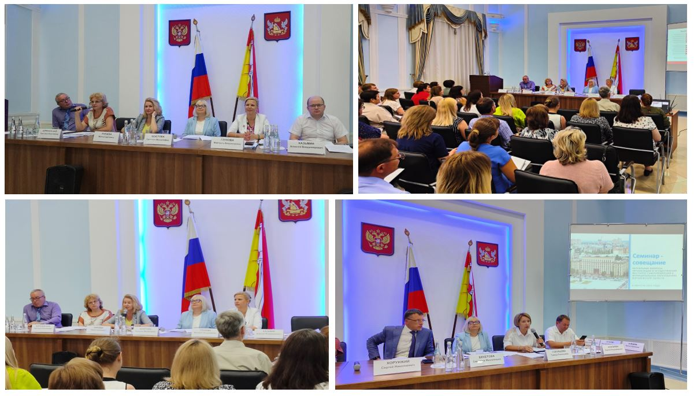

## 2024

### 20 июня 2024 года состоялось заседание Экспертного совета по мониторингу правоприменения при Управлении Минюста России по Воронежской области

24.06.2024

20.06.2024 под председательством начальника Управления Минюста России по Воронежской области А.В. Терещенко состоялось заседание Экспертного совета по мониторингу правоприменения, в которомприняли участиеруководитель правового управления Правительства Воронежской области М.Н. Зацепина, начальник отдела регистра муниципальных правовых актов М.В. Глухова, а также представители научного сообщества.

В ходе мероприятия рассматривались проблемы бюджетного законодательства и перспективы его совершенствования. Обсуждалась практика Управления Минюста Россиипо Воронежской области и правового управления за 2023 годи 1 полугодие 2024 года в сфере правовой экспертизы нормативных правовых актов Правительства Воронежской области о порядке предоставления субсидий.

В ходе совместного обсуждения участниками заседания проанализированы отдельные коллизионные вопросы постановления Правительства Российской Федерации от 25.10.2023 № 1782, которым утвержденыобщие требования к нормативным правовым актам, муниципальным правовым актам, регулирующим предоставление субсидий из региональных и местных бюджетов.

В целях выработки единообразных подходов по результатам проведенного заседания запланирована подготовка методических рекомендаций для органов государственной власти и органов местного самоуправления.

### О некоторых вопросах административной ответственности должностных лиц органов местного самоуправления

23.05.2024

По результатам проведенных в апреле 2024 года семинаров-совещаний с
должностными лицами органов местного самоуправления Воронежской области
правовым управлением совместно с кафедрой административного и
административно-процессуального права юридического факультета
Воронежского государственного университета и при содействии прокуратуры
Воронежской области подготовлен методический материал «О некоторых
вопросах административной ответственности должностных лиц органов
местного самоуправления». Указанный материал направлен для сведения и
учета в работе.

[Скачать](https://disk.yandex.ru/i/cJRHrAXO7lUc9A)

### Cеминары-совещания с должностными лицами и муниципальными служащими органов местного самоуправления муниципальных районов и городских округов

27.04.2024

4, 11 и 18 апреля 2024 года правовым управлением Правительства Воронежской области организованы и проведены семинары-совещания с должностными лицами и муниципальными служащими органов местного самоуправления муниципальных районов и городских округов (специалистами, ответственными за ведение регистра муниципальных нормативных правовых актов, начальниками юридических отделов, руководителями аппаратов глав местных администраций).

Мероприятия проходили в Верхнемамонском, Лискинском и Панинском муниципальных районах Воронежской области. В их работе приняли участие представители 31 муниципального района и 3 городских округов Воронежской области.В семинарах-совещаниях приняли участие начальник отдела регистра муниципальных правовых актов правового управления Правительства Воронежской области Глухова М.В., заместитель начальника отдела Стоволосова Т.А., главный эксперт Голубцова Т.Е.Также в мероприятиях участвовали заместитель руководителя управления по контролю и профилактике коррупционных правонарушений Правительства Воронежской области Пигунов В.В., начальник отдела по вопросам регионального законодательства и регистрации уставов муниципальных образований Управления Министерства юстиции Российской Федерации по Воронежской области Широкова Е.К., доцент кафедры административного и административного процессуального права юридического факультета Воронежского государственного университета Хорунжий С.Н.

В повестку состоявшихся семинаров-совещаний вошли вопросы практики ведения регистра муниципальных нормативных правовых актов в 2023 году и первом квартале 2024 года, обзор типичных нарушений законодательства, выявляемых при проведении их юридической экспертизы; актуальные вопросы применения законодательства о противодействии коррупции, в том числе порядка урегулирования конфликта интересов, порядка представления сведений о доходах, расходах, об имуществе и обязательствах имущественного характера муниципальными служащими; вопросы регистрации изменений в уставы муниципальных образований о порядке вступления в силу муниципальных нормативных правовых актов; административной ответственности должностных лиц органов местного самоуправления и муниципальных служащих, а также порядка проведения антикоррупционной экспертизы проектов муниципальных нормативных правовых актов.

## 2023

### Семинар-совещание на тему «Организационные вопросы реализации Закона Воронежской области от 11.11.2009 № 135-ОЗ»

29.11.2023

29 ноября 2023 г., отделом регистра муниципальных правовых актов правового управления Правительства Воронежской области совместно с АУ ВО «Информационно-технологический центр Воронежской области» проведен семинар - совещание на тему «Организационные вопросы реализации Закона Воронежской области от 11.11.2009 № 135-ОЗ «О наделении органов местного самоуправления муниципальных районов Воронежской области отдельными государственными полномочиями Воронежской области по сбору информации от поселений, входящих в муниципальный район, необходимой для ведения регистра муниципальных нормативных правовых актов Воронежской области». В совещании приняли участие муниципальные служащие администраций муниципальных районов, исполняющих отдельные государственные полномочия по сбору информации от поселений, необходимой для ведения регистра муниципальных нормативных правовых актов Воронежской области, а также сотрудники отдела регистра муниципальных правовых актов правового управления.

С докладами о новеллах и проблемных вопросах реализации законодательства в сфере ведения регистра муниципальных правовых актов на современном этапе выступили заместители начальника отдела регистра муниципальных правовых актов правового управления Правительства Воронежской области Стоволосова Т.А., и Казьмин А.В.

С докладом об особенностях использовании программного обеспечения Агент регистра НПА выступил начальник проектного отдела АУ ВО «Информационно-технологический центр Воронежской области» Шатских А.А.

В заключении участники семинара обсудили наиболее актуальные вопросы правоприменительной практики и вопросы совершенствования законодательства в области ведения регистра муниципальных нормативных правовых актов Воронежской области.

### 9 августа 2023 года состоялся семинар-совещание с должностными лицами органов местного самоуправления муниципальных образований Воронежской области

09.08.2023

В семинаре-совещании приняли участие должностные лица органов местного самоуправления муниципальных образований Воронежской области: руководители аппаратов глав муниципальных районов, городских округов Воронежской области, начальники юридических служб, а также специалисты, осуществляющие ведение регистра муниципальных нормативных правовых актов.

С докладами выступили представители правового управления, управления государственной службы и кадров, управления по профилактике коррупционных и иных правонарушений Правительства Воронежской области, департамента цифрового развития Воронежской области, представитель Воронежского государственного университета.

До сведения присутствующих доведены основные вопросы, касающиеся роли и значения органов местного самоуправления в единой системе публичной власти, реализации наградной политики на территории муниципальных образований, новых подходов к проведению аттестации и присвоению классных чинов на муниципальной службе, актуальных изменений законодательства о противодействии коррупции, итогов ведения регистра муниципальных нормативных правовых актов в первом полугодии 2023 года, порядка разработки административных регламентов по предоставлению массовых социально значимых муниципальных услуг, особенностей предоставления муниципальных услуг в электронной форме, а также порядка проведения конкурса по отбору кандидатур на должность главы муниципального образования.

### С 21 марта по 19 апреля 2023 года проведены семинары-совещания с должностными лицами и работниками органов местного самоуправления входящих в единую систему публичной власти

25.04.2023

В семинарах-совещаниях приняли участие муниципальные служащие и работники органов местного самоуправления Россошанского, Ольховатского, Подгоренского, Кантемировского. Нижнедевицкого, Хохольского, Семилукского, Рамонского, Павловского, Острогожского, Репьевского, Каменского, Новохоперского, Таловского, Бобровского, Аннинского, Лискинского муниципальных районов.

С информацией об основных измененияхи практических вопросах реализации избирательного законодательства и отдельных вопросах законодательства о противодействии коррупции на территории Воронежской области на современном этапе выступил секретарь избирательной комиссии Воронежской области С.Н. Хорунжий.

Вопросы практики ведения регистра муниципальных нормативных правовых актов Воронежской области за 2022 год и первый квартал 2023 года довели до сведения присутствующих начальник отдела регистра МНПА М.В. Глухова, заместители начальника отдела Т.А. Стоволосова, А.В. Казьмин, советники отдела Ю.В. Закурдаева, А.В. Струкова, О.С. Хрипунова, главный эксперт отдела Т.Е. Голубцова.

Также были рассмотрены наиболее часто допускаемые нарушения при принятии муниципальных нормативных правовых актов. Рассмотрен обзор экспертных заключений правового управления на муниципальные нормативные правовые акты, а также обзор протестов органов прокуратуры.

В заключение участники семинара обсудили наиболее актуальные вопросы правоприменительной практики и вопросы совершенствования законодательства в области местного самоуправления.

### Семинары-совещания состоялись в Верхнехавском, Эртильском, Новоусманском муниципальных районах, а также в Борисоглебском городском округе Воронежской области

03.03.2023

Отделом регистра муниципальных правовых актов правового управления Правительства Воронежской области совместно с избирательной комиссией Воронежской области проводятся семинары-совещания с должностными лицами и работниками органов местного самоуправления, входящих в единую систему публичной власти. Семинары-совещания состоялись в Верхнехавском, Эртильском, Новоусманском муниципальных районах, а также в Борисоглебском городском округе Воронежской области.

В совещаниях приняли участие также муниципальные служащие и работники органов местного самоуправления Грибановского, Терновского, Поворинского муниципальных районов области.

С докладом о новеллах и проблемных вопросах реализации избирательного законодательства на современном этапе выступил секретарь избирательной комиссии Воронежской области Хорунжий С.Н.С докладами о практике ведения регистра муниципальных правовых актов выступили начальник отдела регистра муниципальных правовых актов Глухова М.В., заместитель начальника отдела Казьмин А.В., советники отдела Цыбульник А.С., Прудников Г.А., Прудникова Н.А., главный эксперт отдела Голубцова Т.Е.

Были рассмотрены выявляемые отделом регистра типичные нарушения законодательства при проведении юридической экспертизы муниципальных правовых актов. Также проанализирован обзор актов реагирования органов прокуратуры за 2022 год. Кроме того, доведена информация об основных изменениях в федеральном законодательстве в 2022 и текущем году. Обсуждены проблемы повышения уровня правотворческой деятельности органов местного самоуправления, рассмотрены вопросы статуса главы муниципального образования.В заключении участники семинара обсудили наиболее актуальные вопросы правоприменительной практики и вопросы совершенствования законодательства в области местного самоуправления.

Аналогичные семинары-совещания планируются к проведению в 2023 году во всех муниципальных образованиях Воронежской области.

## 2019

### В администрации Богучарского муниципального района проведен семинар-совещание

01.11.2019

В соответствии с планом основных мероприятий правительства Воронежской области на третий квартал 2019 г., 31 октября т.г., правовым управлением совместно с управлениемпо профилактике коррупционных и иных правонарушений правительства области, избирательной комиссией Воронежской областив администрации Богучарского муниципального района для органов местного самоуправления проведен семинар-совещание на тему: «О совершенствовании муниципального нормотворчества. Об изменениях федерального и областного законодательства в 2019 г.».

В семинаре приняли участие начальники юридических служб, специалисты ответственные за ведение регистра муниципальных нормативных правовых актов администраций Богучарского, Верхнемамонского, Калачеевского, Каменского, Кантемировского, Лискинского, Ольховатского, Острогожского, Павловского, Петропавловского, Подгоренского, Репьевского, Россошанского муниципальных районов, главы поселений Богучарского муниципального района.

С информацией об изменениях, внесенных в Федеральный закон от 06.10.2003 N 131-ФЗ «Об общих принципах организации местного самоуправления в Российской Федерации", другие федеральные законы в 2019 г. и мерах по повышению уровня правотворческой деятельности органов местного самоуправления выступила Т.Е. Голубцова – начальник отдела регистра муниципальных правовых актов правового управления правительства Воронежской области. Особое внимание было уделено приведению в соответствие действующему законодательству, принимаемых и действующих нормативных правовых актов органов местного самоуправления муниципальных районов и поселений.

Об изменениях федерального законодательства по вопросам предоставления сведений о доходах должностными лицами органов местного самоуправления, о Законе Воронежской области от 13.09.2019 N 108-ОЗ «О внесении изменений в Закон Воронежской области «О представлении гражданами, претендующими на замещение отдельных муниципальных должностей и должностей муниципальной службы, и лицами, замещающими указанные должности в органах местного самоуправления муниципальных образований Воронежской области, сведений о доходах, расходах, об имуществе и обязательствах имущественного характера», об утверждении представительным органом муниципального образования Порядка принятия решения о применении к депутату, члену выборного органа местного самоуправления, выборному должностному лицу местного самоуправления мер ответственности участников совещания проинформировал В. В. Пигунов - заместитель руководителя управления по профилактике коррупционных и  иных правонарушений правительства Воронежской области.

С информацией об участии органов местного самоуправления в реализации современных требований электоральной демократии перед присутствующими выступил С.Н.Хорунжий– секретарь избирательной комиссии Воронежской области.В заключении участники семинара активно обсудили наиболее актуальные вопросов правоприменительной практики и вопросы совершенствования законодательства в области местного самоуправления.

### В администрации Новоусманского муниципального района проведен семинар-совещание

27.09.2019

В соответствии с планом основных мероприятий правительства Воронежской области на третий квартал 2019 г. 25 сентября т. г. правовым управлением совместно с управлениемпо профилактике коррупционных и иных правонарушений правительства областив администрации Новоусманского муниципального района для органов местного самоуправления проведен семинар-совещание на тему: «О совершенствовании муниципального нормотворчества. Об изменениях федерального и областного законодательства в 2019 г.».

В семинаре приняли участие начальники юридических служб, специалисты ответственные за ведение регистра муниципальных нормативных правовых актов администраций городского округа г.Нововоронеж, Верхнехавского, Каширского, Нижнедевицкого, Новоусманского, Панинского, Рамонского, Семилукского, Хохольского, Эртильского муниципальных районов.С информацией об изменениях, внесенных в Федеральный закон от 06.10.2003 N 131-ФЗ «Об общих принципах организации местного самоуправления в Российской Федерации", другие федеральные законы в 2019 г. и мерах по повышению уровня правотворческой деятельности органов местного самоуправления выступила Т.Е. Голубцова – начальник отдела регистра муниципальных правовых актов правового управления правительства Воронежской области. Особое внимание было уделено приведению в соответствие действующему законодательству, принимаемых и действующих нормативных правовых актов органов местного самоуправления муниципальных районов и поселений.

Об изменениях федерального законодательства по вопросам предоставления сведений о доходах должностными лицами органов местного самоуправления, о Законе Воронежской области от 13.09.2019 N 108-ОЗ «О внесении изменений в Закон Воронежской области «О представлении гражданами, претендующими на замещение отдельных муниципальных должностей и должностей муниципальной службы, и лицами, замещающими указанные должности в органах местного самоуправления муниципальных образований Воронежской области, сведений о доходах, расходах, об имуществе и обязательствах имущественного характера», об утверждении представительным органом муниципального образования Порядка принятия решения о применении к депутату, члену выборного органа местного самоуправления, выборному должностному лицу местного самоуправления мер ответственности участников совещания проинформировал В. В. Пигунов - заместитель руководителя управления по профилактике коррупционных и иных правонарушений правительства Воронежской области.На семинаре обсуждались проблемные вопросы нормотворческой деятельности органов местного самоуправления с участием Стоволосовой Т.А. – заместителем начальника отдела регистра муниципальных правовых актов правового управления правительства Воронежской области.

### В администрации Подгоренского муниципального района обсудили вопросы ведения регистра муниципальных нормативных правовых актов Воронежской области

22.03.2019

В соответствии с планом основных мероприятий правительства Воронежской области на первый квартал 2019 года 21 марта 2019 г. правовым управлением в администрации Подгоренского муниципального района для органов местного самоуправления проведен семинар-совещание на тему: «Текущее состояние регистра муниципальных нормативных правовых актов Воронежской области. Актуальные вопросы организации и ведения регистра муниципальных нормативных правовых актов Воронежской области».

В семинаре приняли участие руководители аппаратов, начальники юридических служб, специалисты ответственные за ведение регистра муниципальных нормативных правовых актов администраций городского округа г. Нововоронеж, Богучарского, Верхнемамонского, Каменского, Кантемировского, Нижнедевицкого, Ольховатского, Острогожского, Петропавловского, Подгоренского, Репьевского, Россошаснкого, Хохольского муниципальных районовС докладом «Текущее состояние регистра муниципальных нормативных правовых актов Воронежской области» перед участниками семинара выступила Т.Е. Голубцова – начальник отдела регистра муниципальных правовых актов правового управления правительства Воронежской области. В докладе были проанализированы основные этапы формирования регистра МНПА Воронежской области за период 2005-2018 гг., его текущее состояние по результатам 2018 года.

Особое внимание в докладе было уделено качеству включаемых в регистр актов, работе по подготовке проектов актов, по приведению их в соответствие действующему законодательству, оказанию правовой помощи ОМСУ поселений.Разработку проектов административных регламентов предоставления муниципальных услуг с участниками семинара обсудил А.В. Казьмин – заместитель начальника отдела регистра муниципальных правовых актов правового управления. Участники семинара активно обсудили проблемные вопросы ведения регистра МНПА, муниципального нормотворчества.

### В администрации Бутурлиновского муниципального района обсудили вопросы ведения регистра муниципальных нормативных правовых актов Воронежской области

14.03.2019

В соответствии с планом основных мероприятий правительства Воронежской области на первый квартал 2019 года, 14 марта 2019 г. правовым управлением в администрации Бутурлиновского муниципального района для органов местного самоуправления проведен семинар-совещание на тему: «Текущее состояние регистра муниципальных нормативных правовых актов Воронежской области. Актуальные вопросы организации и ведения регистра муниципальных нормативных правовых актов Воронежской области».

В семинаре приняли участие руководители аппаратов, начальники юридических служб, специалисты ответственные за ведение регистра муниципальных нормативных правовых актов администраций Борисоглебского городского округа, Бобровского, Бутурлиновского, Воробьевского, Грибановского, Калачеевского, Лискинского, Новохоперского, Павловского, Поворинского, Таловского муниципальных районов.

С докладом «Текущее состояние регистра муниципальных нормативных правовых актов Воронежской области» перед участниками семинара выступил В.Г.Карташов – руководитель правового управления правительства Воронежской области. В докладе были проанализированы основные этапы формирования регистра МНПА Воронежской области за период 2005-2018 гг., его текущее состояние по результатам 2018 года. Особое внимание в докладе было уделено качеству включаемых в регистр актов, работе по подготовке проектов актов, по приведению их в соответствие действующему законодательству, оказанию правовой помощи ОМСУ поселений.

Актуальные вопросы организации и ведения регистра муниципальных нормативных правовых актов Воронежской области с участниками семинара обсудила Голубцова Т.Е. -начальник отдела регистра муниципальных правовых актов правового управления. Участники семинара активно обсудили проблемные вопросы ведения регистра МНПА, муниципального нормотворчества.

### В администрации Панинского муниципального района обсудили вопросы ведения регистра муниципальных нормативных правовых актов Воронежской области

21.02.2019

В соответствии с планом основных мероприятий правительства Воронежской области на первый квартал 2019 года, 21 февраля 2019 г. правовым управлением в администрации Панинского муниципального района для органов местного самоуправления проведен семинар-совещание на тему: «Текущее состояние регистра муниципальных нормативных правовых актов Воронежской области. Актуальные вопросы организации и ведения регистра муниципальных нормативных правовых актов Воронежской области».

В семинаре приняли участие руководители аппаратов, начальники юридических служб, специалисты ответственные за ведение регистра муниципальных нормативных правовых актов администраций Аннинского, Верхнехавского, Каширского, Новоусманского, Панинского, Рамонского, Семилукского, Терновского, Эртильского муниципальных районов.С докладом «Текущее состояние регистра муниципальных нормативных правовых актов Воронежской области» перед участниками семинара выступил В.Г.Карташов – руководитель правового управления правительства Воронежской области. В докладе были проанализированы основные этапы формирования регистра МНПА Воронежской области за период 2005-2018 гг., его текущее состояние по результатам 2018 года. Особое внимание в докладе было уделено качеству включаемых в регистр актов, работе по подготовке проектов актов, по приведению их в соответствие действующему законодательству, оказанию правовой помощи ОМСУ поселений.

Актуальные вопросы организации и ведения регистра муниципальных нормативных правовых актов Воронежской области с участниками семинара обсудила Голубцова Т.Е. -начальник отдела регистра муниципальных правовых актов правового управления. Участники семинара активно обсудили проблемные вопросы ведения регистра МНПА, муниципального нормотворчества.

## 2018

### О проведении семинара – совещания 27 марта 2018 года

28.03.2018

В соответствии с планом основных мероприятий правительства Воронежской области на первый квартал 2018 года, 27 марта 2018 г. правовым управлением для органов местного самоуправления муниципальных районов проведен семинар-совещание.По вопросам: «Об итогах работы по исполнению органами местного самоуправления муниципальных районов государственных полномочий по ведению регистра муниципальных нормативных правовых актов Воронежской области в 2017 году и совершенствовании нормотворческой деятельности органов местного самоуправления» участникам семинара доложила Голубцова Т.Е. -начальник отдела регистра муниципальных правовых актов правового управления правительства Воронежской области.

Вопросы ведения регистра муниципальных нормативных правовых актов в электронном виде и официального опубликования МНПА на портале pravo.gov.ru , обсудил с участниками совещания Казьмин А.В.- заместитель начальника отдела регистра муниципальных правовых актов правового управления правительства Воронежской области.Со специалистами администраций муниципальных районов также рассмотрены вопросы исполнения экспертных заключений, подготовленных отделом регистра муниципальных правовых актов правового управления о несоответствии муниципальных нормативных правовых актов федеральному и областному законодательству по итогам 2017 года и I квартала 2018 года на основе информации, подготовленной Стоволосовой Т.А. - заместителем начальника отдела регистра муниципальных правовых актов правового управления.

Специалисты администраций муниципальных районов, ответственные за исполнение государственных полномочий по сбору от поселений информации необходимой для ведения регистра муниципальных нормативных правовых актов Рамонского муниципального района - Захаренко В.П., Верхнемамонского муниципального района - Пойманов И.В., Калачеевского муниципального района - Слепокурова С.Н. поделились с участниками совещания опытом своей работы.В ходе семинара его участники активно обсудили проблемные вопросы ведения регистра МНПА, муниципального нормотворчества, также были даны ответы на вопросы.

### О проведении семинара – совещания 1 февраля 2018 года

02.02.2018

В соответствии с планом основных мероприятий правительства Воронежской области на первый квартал 2018 года, 1 февраля 2018 г. правовым управлением совместно с управлением по профилактике коррупционных и иных правонарушений, управлением государственной службы и кадров правительства Воронежской области для органов местного самоуправления муниципальных районов и городских округов проведен семинар- совещание. По вопросам: - об итогах работы по исполнению органами местного самоуправления муниципальных районов государственных полномочий по ведению регистра муниципальных нормативных правовых актов Воронежской области за 2017 г.; - об изменениях, внесенных в Федеральный закон от 06.10.2003 N 131-ФЗ «Об общих принципах организации местного самоуправления в Российской Федерации" в 2017 г. и мерах по повышению уровня правотворческой деятельности органов местного самоуправления участникам семинара доложила Голубцова Т.Е., начальник отдела регистра муниципальных правовых актов правового управления правительства Воронежской области.Вопросы правоприменительной практики федерального и регионального законодательства в сфере противодействия коррупции, складывающейся в Воронежской области с присутствующими, обсудил Пигунов В.В.- заместитель руководителя управления по профилактике коррупционных и иных правонарушений правительства Воронежской области.

Вопросы реализации пенсионного законодательства для муниципальных служащих и правоприменительную практику обсудила со специалистами юридических и кадровых служб муниципалитетов Терещенко К.Е.– заместитель начальника отдела кадров управления государственной службы и кадров правительства Воронежской области.

В ходе семинара участникам были даны ответы на вопросы.

## 2017

### О проведении семинара – совещания в Подгоренском муниципальном районе

18.10.2017

В соответствии с планом основных мероприятий правительства Воронежской области на четвертый квартал 2017 года, 17 октября в Подгоренском муниципальном районе правовым управлением правительства Воронежской области при содействии администрации Подгоренского муниципального района проведен семинар-совещание на тему «Применение органами местного самоуправления муниципальных районов и городских округов методики формирования значений показателей правотворческой деятельности ОМСУ.

Вопросы совершенствования нормотворческой деятельности органов местного самоуправления», с руководителями юридических служб, специалистами администраций муниципальных районов и городских округов, ответственных за представление информации, необходимой для ведения регистра муниципальных нормативных правовых актов Воронежской области.В ходе семинара - совещания были рассмотрены вопросы:- о применении методики формирования значений показателей правотворческой деятельности;- об изменениях, внесенных в законодательство о местном самоуправлении;- о мерах по повышению уровня правотворческой деятельности органов местного самоуправления;- об основных моментах работы с персональными данными;- об обеспечении полноты, достоверности и единообразия при предоставлении информации для включения в регистр муниципальных нормативных правовых актов;- о соблюдении законодательства при эксплуатации программного обеспечения для ведения регистра муниципальных нормативных правовых актов.

Также участники семинаров активно обсудили вопросы правоприменения норм Федерального закона «Об общих принципах местного самоуправления в Российской Федерации» и приведения муниципальных нормативных правовых актов в соответствие действующему законодательству. Всеми участниками был отмечен высокий уровень организации мероприятия.
